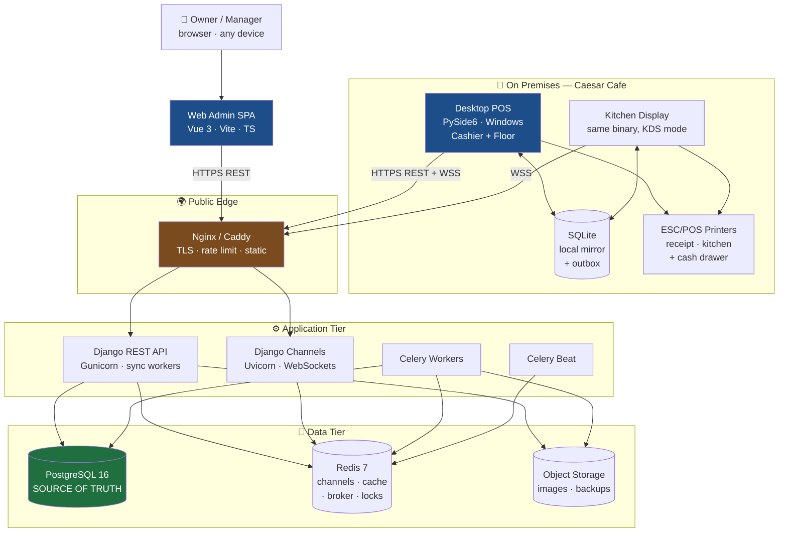
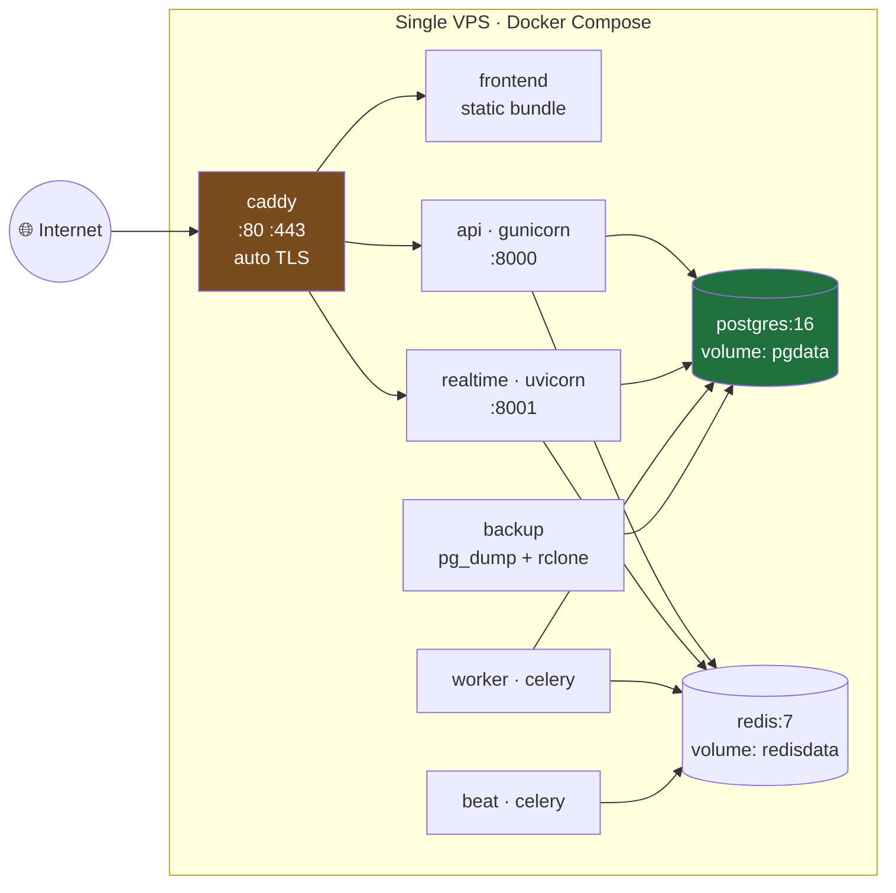

# 01 — System Architecture

Covers master prompt sections **A** (architecture), **B** (folder structure), **K** (Docker).

---

## A. Component Topology



### Reading the topology

- **PostgreSQL is the only source of truth.** SQLite is a *cache with an outbox*, never a peer
  database. Nothing is ever "merged" between two authoritative stores, because there is only one.
- **The Desktop never reaches PostgreSQL.** No direct DB connection, no DB credentials shipped in
  the `.exe`, no VPN-to-database shortcut. Every read and write is an authenticated HTTPS call.
- **Two server processes serve two protocols.** Gunicorn (WSGI) handles REST; Uvicorn/Daphne
  (ASGI) handles WebSockets. Splitting them means a slow report query can never starve the
  kitchen display's socket pool.
- **The Web Admin is a static bundle.** It is built to plain files and served by Nginx. It holds
  no secrets and has no server-side rendering, so there is no second place where business rules
  could drift out of sync with the API.

### Request paths, end to end

**Cashier takes an order (online):**
```
Cashier taps products
  → local SQLite write (order events + outbox row)  ← UI is already responsive here
  → POST /api/v1/sync/push/  (batched, ~1s debounce)
  → Django validates, folds events, writes PG in one transaction
  → publishes to Redis channel  branch.<uuid>.kitchen
  → WebSocket push → Kitchen Display renders the ticket
```
The UI never waits on the network. The kitchen typically sees the ticket in well under a second,
but a stalled network delays the kitchen, not the cashier.

**Cashier takes an order (offline):**
```
Cashier taps products
  → local SQLite write (order events + outbox row)
  → push fails, outbox retains the row with exponential backoff
  → kitchen ticket printed locally on the kitchen printer (T3 fallback path)
  → connection returns → outbox drains in order → server folds → PG consistent
```
This is why the kitchen ticket printer is not optional even when a KDS screen exists: it is the
offline path for getting an order into the kitchen.

---

## Tenancy Strategy

**Decision (C2): shared schema, row-scoped by `organization_id` and `branch_id`.**

Rejected: `django-tenants` schema-per-tenant. It multiplies migration runtime by tenant count,
makes cross-tenant reporting painful, and — decisively — complicates the sync layer, which would
need to resolve a schema before it can even parse an incoming batch.

Implementation shape:

```python
class TenantScopedModel(models.Model):
    id = models.UUIDField(primary_key=True, default=uuid4, editable=False)
    organization = models.ForeignKey("organizations.Organization", on_delete=models.PROTECT)
    branch = models.ForeignKey("organizations.Branch", on_delete=models.PROTECT)

    objects = TenantScopedManager()      # scoped by request context
    all_objects = models.Manager()       # explicit escape hatch, audited usage

    class Meta:
        abstract = True
```

Enforcement is layered, because a single layer will eventually be forgotten:

1. **Manager default** — `TenantScopedManager.get_queryset()` filters by the branch scope on the
   request. Bypassing it requires typing `all_objects`, which is greppable and code-reviewed.
2. **Serializer** — never accepts `branch` from the client payload; it is injected from the
   authenticated principal.
3. **Database** — composite `UNIQUE (branch_id, <natural key>)` constraints, and FKs that include
   the branch where a cross-branch reference would be nonsense.
4. **Test** — a shared test case that, for every registered ViewSet, asserts a request scoped to
   Branch A cannot read or mutate an object in Branch B. This runs in CI against every endpoint,
   so new endpoints are covered by default rather than by remembering.

`branch_id = 1` appears nowhere. The first deployment is simply `Organization("Caesar Cafe")` →
`Branch("Main Branch")`, created by the setup wizard.

---

## B. Project Folder Structure

```text
Caesar-cafe/
│
├── backend/                          # Django REST API — the authority
│   ├── config/
│   │   ├── settings/
│   │   │   ├── base.py
│   │   │   ├── dev.py
│   │   │   ├── prod.py
│   │   │   └── test.py
│   │   ├── urls.py
│   │   ├── asgi.py                   # Channels entrypoint
│   │   ├── wsgi.py
│   │   └── celery.py
│   │
│   ├── apps/
│   │   ├── core/                     # base models, mixins, money types, exceptions,
│   │   │                             #   pagination, envelope renderer, idempotency
│   │   ├── configuration/            # settings registry, SettingValue, scope resolution.
│   │   │                             #   named `configuration` not `settings` to avoid any
│   │   │                             #   ambiguity with django.conf.settings
│   │   ├── organizations/            # Organization, Branch
│   │   ├── accounts/                 # User, StaffProfile, PIN auth, sessions
│   │   ├── authz/                    # Role, PermissionCode, RoleAssignment, DRF classes
│   │   ├── licensing/                # License, Device, Activation, offline token signing
│   │   ├── catalog/                  # Category, Product, Variant, Modifier, ModifierGroup
│   │   ├── recipes/                  # Recipe, RecipeLine (bill of materials)
│   │   ├── inventory/                # InventoryItem, StockLevel, StockMovement, Count
│   │   ├── suppliers/                # Supplier, SupplierLedgerEntry
│   │   ├── purchasing/               # PurchaseOrder, GoodsReceipt, PurchaseReturn
│   │   ├── floor/                    # Area, Table, TableSession
│   │   ├── kids/                     # PlayArea, PlayTariff, Guardian, Child,
│   │   │                             #   PlaySession, tariff engine, incidents
│   │   ├── orders/                   # Order aggregate, OrderEvent, OrderItem projection,
│   │   │                             #   state machine, order services
│   │   ├── payments/                 # Payment, PaymentMethod, Refund, Invoice
│   │   ├── shifts/                   # Shift, CashMovement, ShiftReconciliation
│   │   ├── kitchen/                  # Station, KitchenTicket, routing rules, KDS consumers
│   │   ├── sync/                     # ChangeLog, SyncOperation, push/pull endpoints
│   │   ├── reporting/                # read-model queries, aggregates, exports
│   │   ├── notifications/            # rules engine, delivery channels
│   │   └── audit/                    # AuditLog, signals, diffing
│   │
│   ├── tests/
│   │   ├── factories/
│   │   ├── integration/
│   │   └── conftest.py
│   ├── pyproject.toml
│   ├── Dockerfile
│   └── manage.py
│
├── frontend/                         # Vue 3 Web Admin — the control plane
│   ├── src/
│   │   ├── api/                      # generated client + typed wrappers
│   │   ├── assets/
│   │   ├── components/
│   │   │   ├── ui/                   # design-system primitives
│   │   │   ├── charts/
│   │   │   └── domain/
│   │   ├── composables/
│   │   ├── layouts/
│   │   ├── locales/                  # ar.json (primary), en.json
│   │   ├── modules/                  # feature-sliced: catalog/, inventory/, reports/, ...
│   │   ├── router/
│   │   ├── stores/                   # Pinia
│   │   ├── types/                    # generated from OpenAPI
│   │   └── main.ts
│   ├── package.json
│   ├── vite.config.ts
│   ├── tailwind.config.ts
│   └── Dockerfile
│
├── desktop/                          # PySide6 POS / KDS — the operational client
│   ├── src/caesar_pos/
│   │   ├── app.py                    # bootstrap, activation gate, DI wiring
│   │   ├── ui/
│   │   │   ├── activation/
│   │   │   ├── login/
│   │   │   ├── pos/
│   │   │   ├── floor/
│   │   │   ├── kitchen/
│   │   │   ├── stock/
│   │   │   ├── shift/
│   │   │   ├── settings/
│   │   │   └── widgets/
│   │   ├── domain/                   # order events, state machine, cart math (display-only)
│   │   ├── local/                    # SQLite schema, migrations, repositories
│   │   ├── sync/                     # outbox, puller, backoff, conflict inbox
│   │   ├── api/                      # httpx client, auth, retry, envelope parsing
│   │   ├── security/                 # keyring, token store, offline token verifier
│   │   ├── printing/                 # driver abstraction, renderers, Arabic rasterizer
│   │   └── config/
│   ├── tests/
│   ├── packaging/
│   │   ├── caesar_pos.spec           # PyInstaller
│   │   └── installer.iss             # Inno Setup → CaesarPOS-Setup.exe
│   └── pyproject.toml
│
├── docs/                             # this dossier
├── ops/
│   ├── nginx/
│   ├── backup/
│   └── monitoring/
├── docker-compose.dev.yml
├── docker-compose.prod.yml
├── .env.example
├── Makefile
└── README.md
```

Rules that keep this structure honest:

- **No app may import a sibling's internals.** Cross-app access goes through a `services.py`
  public function or a signal. `orders` calling `Inventory.objects.filter(...)` directly is a
  review rejection.
- **Business logic lives in `services.py`, not in views, serializers, or `.vue` files.** A
  serializer validates shape; a service enforces rules and owns the transaction boundary.
- **No business value is a literal (C10).** Rates, thresholds, limits, labels, and lists come from
  `settings.get(key, scope)`. A magic number in a service is a review rejection — a CI check greps
  for bare numeric comparisons in `apps/*/services.py` as a backstop. See
  [11](11-configuration.md).
- **The Desktop's `domain/` mirrors the server's order state machine but has no authority.** It
  exists so the cashier sees correct totals instantly. The server recomputes everything and its
  answer wins, always.

---

## Technology Stack & Why

### Backend — Python 3.12, Django 5.x, DRF, PostgreSQL 16, Redis 7, Celery

Non-obvious choices:

| Choice | Reason | Alternative rejected because |
|---|---|---|
| **DRF** over Django Ninja | Mature permission/throttle/versioning ecosystem; the permission layer is doing heavy lifting here | Ninja's speed advantage is irrelevant at 300 orders/day |
| **drf-spectacular** | Generates the OpenAPI schema that produces the frontend's TypeScript types — one definition, no drift | Hand-written docs rot within two sprints |
| **Channels + Redis** | Kitchen display needs sub-second push | SSE can't carry the KDS's bidirectional acks; polling wastes battery on floor tablets |
| **Celery + Beat** | Backups, license expiry sweeps, report pre-aggregation, notification fan-out | `cron` in a container is invisible to monitoring and has no retry semantics |
| **`simplejwt`, short TTLs** | 15-min access / 7-day rotating refresh, with reuse detection | Long-lived tokens on a machine sitting on a cafe counter is an unacceptable exposure |

### Frontend — Vue 3, Vite, TypeScript, Tailwind, Pinia

- **RTL-first, not RTL-retrofitted.** Tailwind logical properties (`ms-*`, `me-*`, `ps-*`,
  `pe-*`) throughout; `dir="rtl"` on `<html>`. Retrofitting RTL after the fact means auditing
  every margin in the codebase — cheap now, expensive in month four.
- **Directional-neutral iconography** where meaning flips (chevrons, arrows) — bound to the
  active locale rather than hardcoded.
- **Charts:** ECharts. It ships genuine RTL support, Arabic label rendering, and canvas rendering
  that stays smooth on the low-end hardware likely to sit in the back office.
- **Numerals:** Western Arabic digits (0-9) by default — that is what Egyptian receipts and
  accounting use — with Eastern Arabic (٠-٩) available as a display setting.

### Desktop — PySide6

Chosen over Electron and .NET:

- **Shared language with the backend.** The order state machine, money rounding, and receipt
  layout rules exist once as Python and are exercised by both sides' test suites. Duplicating
  them into TypeScript is exactly how a client and server start disagreeing about a total.
- **Hardware access is first-class.** `pyserial`, `python-escpos`, and Windows spooler bindings
  are mature. Electron reaches printers and drawers through native addons that break on each
  Chromium bump.
- **Footprint.** ~60MB installed and ~80MB RAM versus Electron's ~200MB/~400MB. On the aging
  counter PC this will likely run on, that gap is felt.
- **Cost:** Qt's declarative story is weaker than Vue's, so the POS UI is more code. Accepted —
  the POS has perhaps 12 screens, and they are performance-critical rather than design-elaborate.

Licensing note: PySide6 is LGPLv3. We dynamically link and ship the unmodified Qt libraries, which
satisfies LGPL for a closed-source commercial application. No Qt commercial license is required.

---

## Printing Subsystem

**Decision (C8): Arabic receipts are rasterized, not sent as text.**

This is a practical trap worth stating plainly. Nearly all 80mm ESC/POS thermal printers have no
Arabic font, no glyph shaping, and no bidirectional layout. Sending UTF-8 Arabic yields mojibake
or blanks. The few printers with an Arabic codepage use unshaped, isolated letterforms that read
as broken to a native reader.

The pipeline:

```
ReceiptDocument (structured tree: header, lines, totals, footer)
        │
        ├─► TextRenderer      → Latin-only / debug / email
        │
        └─► RasterRenderer    → arabic_reshaper → python-bidi → PIL canvas
                                  → 1-bit dithered bitmap at 576px width
                                  → ESC/POS GS v 0 raster command
```

The `ReceiptDocument` is produced by shared logic and can be rendered identically to a printer, a
PDF, or a preview pane — so what the cashier sees on screen is what the customer receives.

Driver abstraction:

```python
class PrinterDriver(Protocol):
    def open(self) -> None: ...
    def print_document(self, doc: ReceiptDocument) -> None: ...
    def kick_drawer(self, pin: int = 2) -> None: ...
    def status(self) -> PrinterStatus: ...   # paper, cover, online
    def close(self) -> None: ...
```

Implementations: `UsbEscposDriver`, `NetworkEscposDriver`, `WindowsSpoolerDriver`,
`NullDriver` (dev/test). Printers are configured from the Web Admin and pushed to the Desktop as
branch config — the cashier never edits a driver string.

Failure handling: a failed print never rolls back a sale. The receipt is queued for reprint and
surfaced in the UI. Losing a piece of paper must not lose a financial record.

---

## K. Docker Architecture

### Production — `docker-compose.prod.yml`



| Service | Image | Notes |
|---|---|---|
| `caddy` | `caddy:2-alpine` | Automatic Let's Encrypt, HTTP/2, security headers, rate limiting. Chosen over Nginx purely because cert renewal is one line instead of a certbot sidecar. |
| `frontend` | multi-stage node → `caddy` | Built assets only; no Node in production |
| `api` | `backend/Dockerfile` | Gunicorn, `2×cores+1` sync workers |
| `realtime` | same image, different command | Uvicorn ASGI, Channels consumers |
| `worker` | same image | Celery, `--concurrency=2` |
| `beat` | same image | Scheduler, `DatabaseScheduler` |
| `postgres` | `postgres:16-alpine` | Tuned `shared_buffers`, `wal_level=replica` for PITR headroom |
| `redis` | `redis:7-alpine` | AOF **on** — it holds Channels groups and idempotency records |
| `backup` | custom alpine | Nightly `pg_dump`, 30-day retention, off-site push, restore drill monthly |

Network segmentation: `postgres` and `redis` sit on an internal-only Docker network with **no**
published ports. Only `caddy` binds to the host. A compromised container still cannot reach the
database from outside.

### Development — `docker-compose.dev.yml`

```bash
cp .env.example .env
docker compose -f docker-compose.dev.yml up -d
make migrate && make seed        # demo catalog, tables, staff, a TRIAL license
```

Backend hot-reloads via `runserver`; the frontend runs Vite dev server with HMR proxying `/api`.
The Desktop runs natively on Windows (not containerized — it needs real USB printers) and points
at `http://localhost:8000` via `.env`.

`make seed` produces a working cafe: 6 categories, ~40 products with Arabic and English names,
12 tables across 2 areas, 3 kitchen stations, staff for each role, and a pre-activated dev
license — so a new developer has something to click within minutes of cloning.

---

**Next:** [02 — Data Model & ERD](02-data-model.md)
