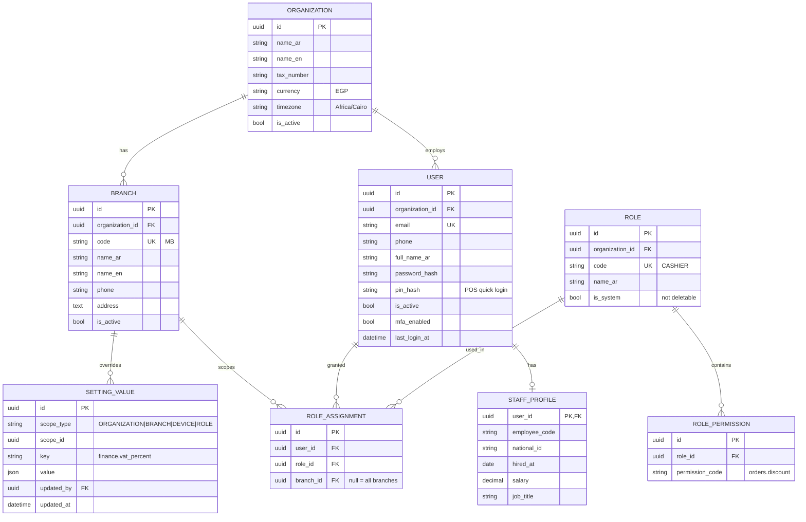
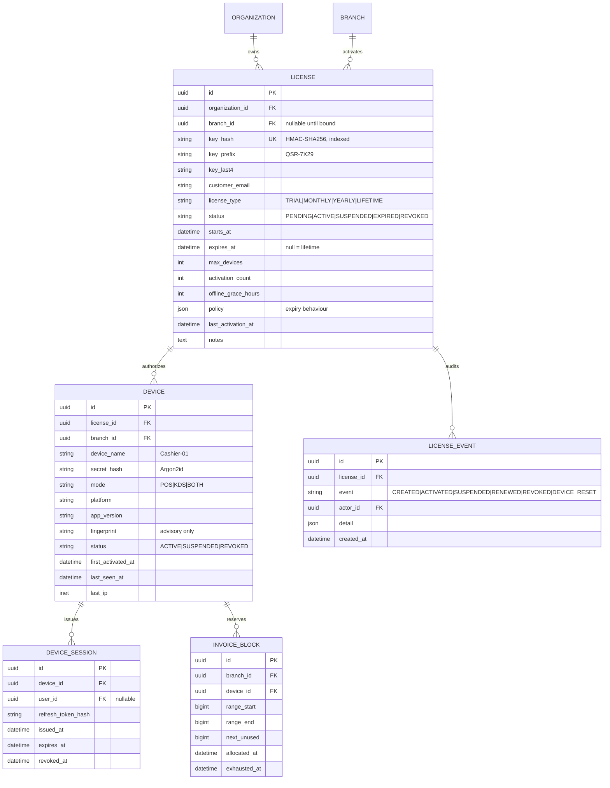
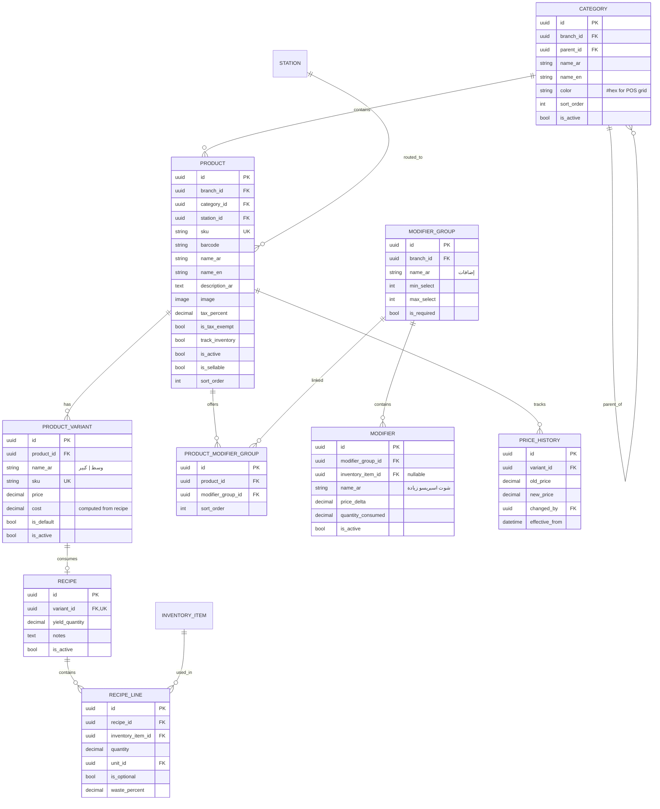
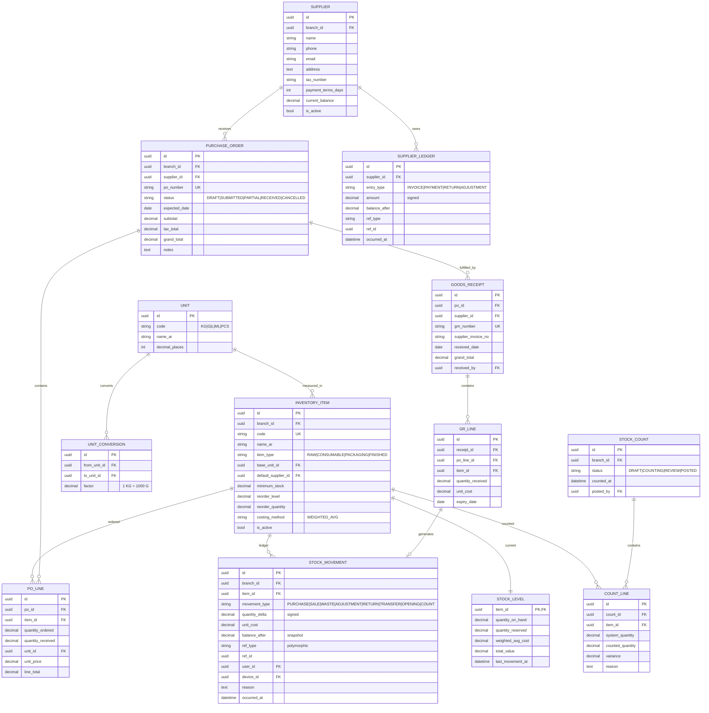
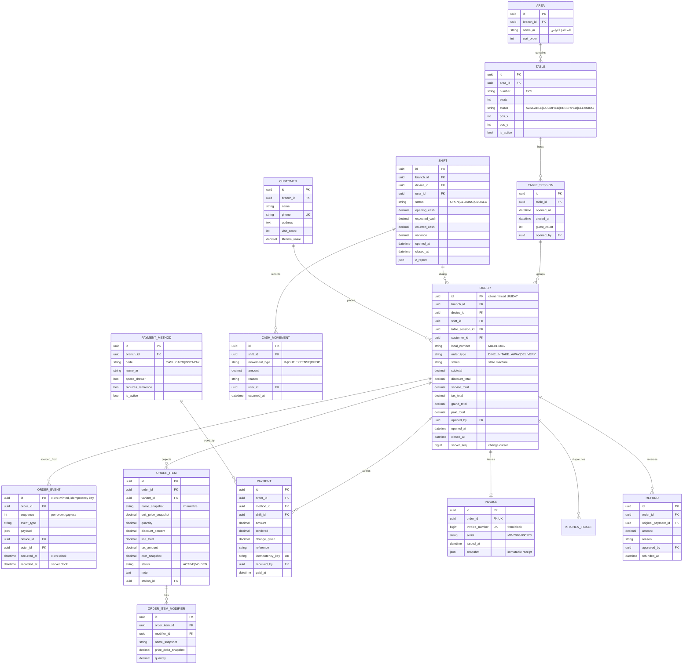
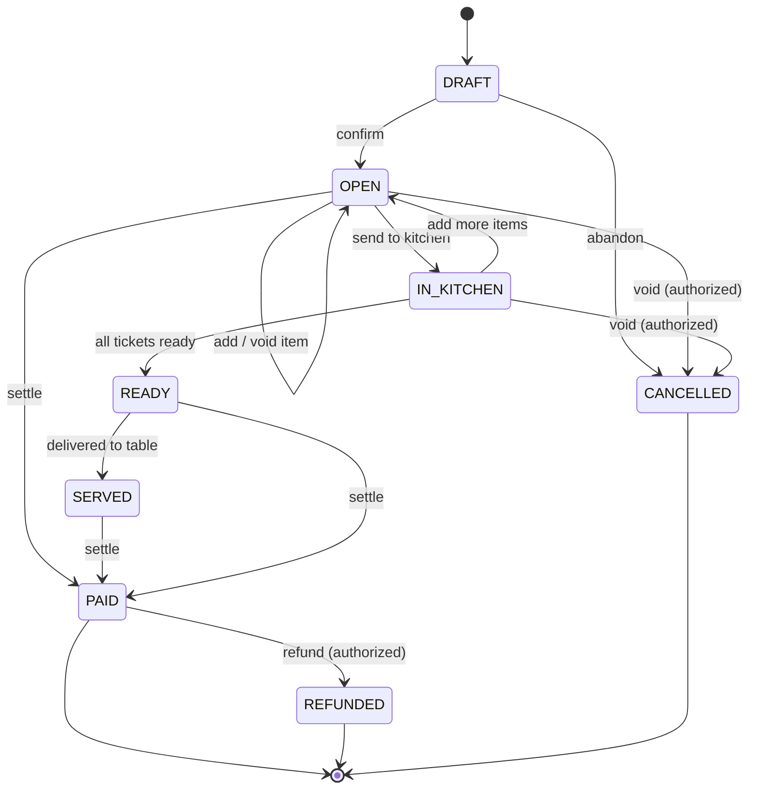
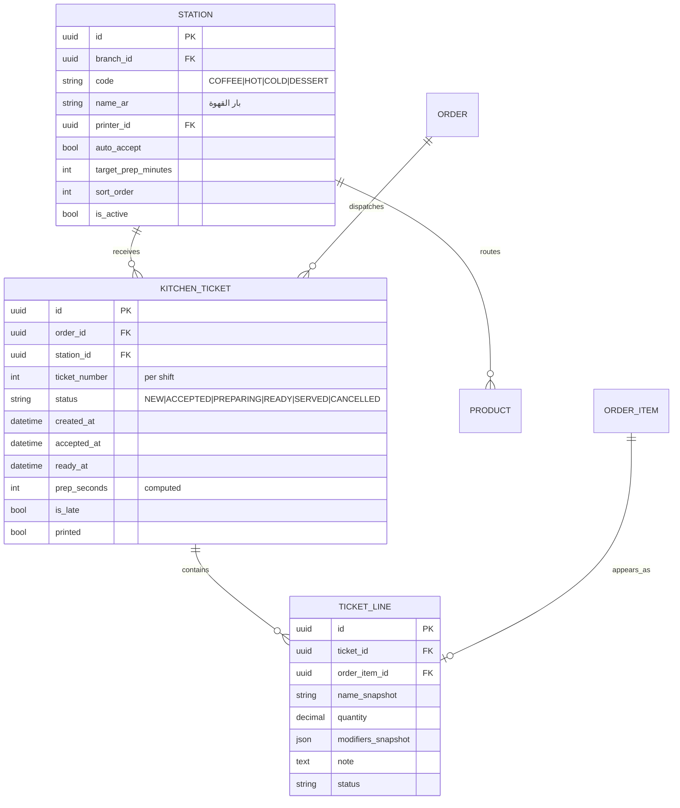
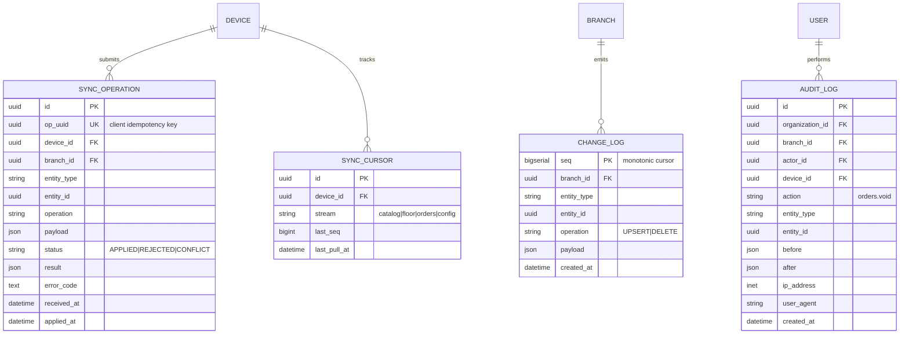

# 02 — Data Model & ERD

Covers master prompt sections **C** (ERD) and **D** (main models).

One ERD for the whole system would be unreadable, so it is split by bounded context. Cross-context
links are noted in prose.

---

## Global Conventions

Every business table inherits these. They are not repeated in the diagrams below.

```python
class BaseModel(models.Model):
    id          = UUIDField(primary_key=True, default=uuid4, editable=False)
    created_at  = DateTimeField(auto_now_add=True, db_index=True)
    updated_at  = DateTimeField(auto_now=True)
    created_by  = ForeignKey(User, null=True, on_delete=PROTECT, related_name="+")
    updated_by  = ForeignKey(User, null=True, on_delete=PROTECT, related_name="+")

class TenantScopedModel(BaseModel):
    organization = ForeignKey(Organization, on_delete=PROTECT)
    branch       = ForeignKey(Branch, on_delete=PROTECT, db_index=True)
```

**UUID primary keys everywhere.** Non-negotiable for this system: an offline Desktop must mint an
order's identity before it has ever spoken to the server. Sequential integers make that impossible
without a coordination round-trip, which is exactly what we cannot have during a network outage.
UUIDv7 (time-ordered) is used where index locality matters — orders, events, movements — so we get
distributed identity without shredding B-tree insert performance.

**Deletion is soft, or forbidden.** Financial records use `on_delete=PROTECT` and are never
deleted. Master data (products, categories) uses `is_active` flags. A product that has ever been
sold can be deactivated but not removed — deleting it would orphan historical line items and
silently rewrite last quarter's reports.

### Money and quantity precision

| Concept | Type | Rationale |
|---|---|---|
| Prices, totals, payments, balances | `DecimalField(max_digits=12, decimal_places=2)` | EGP has 2 decimals; 12 digits covers 9,999,999,999.99 |
| Inventory quantities | `DecimalField(max_digits=14, decimal_places=3)` | A recipe uses 18g of beans and 150ml of milk — 2 decimals loses grams |
| Unit costs | `DecimalField(max_digits=12, decimal_places=4)` | Cost per gram is fractions of a piaster; rounding at 2dp corrupts COGS |
| Percentages (tax, discount) | `DecimalField(max_digits=5, decimal_places=2)` | 0.00–100.00 |

**`float` appears nowhere near money.** Enforced by a CI check that greps for `FloatField` in
`apps/` and fails the build.

Rounding is `ROUND_HALF_UP`, applied **once**, at the line-total and order-total boundaries — never
mid-calculation. The order of operations is fixed and shared between Desktop and server:

```
line_gross    = round(unit_price × quantity, 2)
line_discount = round(line_gross × discount_pct / 100, 2)
line_net      = line_gross − line_discount
order_net     = Σ line_net
order_discount= round(order_net × order_discount_pct / 100, 2)
taxable       = order_net − order_discount
service       = round(taxable × service_pct / 100, 2)      # dine-in only
tax           = round((taxable + service) × vat_pct / 100, 2)
order_total   = taxable + service + tax
```

Both implementations run against a **shared golden-file test fixture** of ~200 cases (including
the nasty ones: 3-way splits of odd piasters, 100% discounts, tax-exempt lines). If the Desktop
and the server ever disagree by one piaster, CI fails. This fixture is written in Phase 1, before
either implementation exists.

---

## C1. Organizations, Accounts & Authorization



**`SETTING_VALUE` replaces a fixed settings table.** A `BRANCH_SETTINGS` model with one column per
option means every new setting is a migration, and the ~180 settings in
[11](11-configuration.md) would make it an unmanageable wide table. Instead: definitions are a typed
registry in code, values are sparse rows here, and resolution walks Device → Branch → Organization →
default. Adding a setting is one registry entry with no schema change, and a branch that has
overridden nothing stores nothing.

**Two credentials per user, deliberately.** `password_hash` is a full Argon2id password used on the
Web Admin. `pin_hash` is a 4–6 digit PIN used for fast Desktop login and re-authorization
(approving a discount, voiding an item). A PIN is weak by construction — so it is only ever
accepted from an **activated device**, is rate-limited per device, locks after 5 failures, and can
never authenticate against the Web Admin. The device credential is what carries the real entropy;
the PIN identifies *which human* is standing at an already-trusted terminal.

---

## C2. Licensing & Devices



Detailed in [06 — Licensing & Activation](06-licensing.md). `INVOICE_BLOCK` is explained in
[07 — Sync](07-sync.md#invoice-numbering-under-partition).

---

## C3. Catalog & Recipes



**Why variants exist even though the cafe may not use them yet.** Coffee shops add sizes
constantly (وسط / كبير). Retrofitting a variant layer after 3,000 orders reference `product_id`
directly is a painful migration touching every historical line item. A product with one default
variant costs almost nothing today and removes that migration entirely. The POS UI hides the
variant selector when a product has exactly one.

**`waste_percent` on recipe lines** captures real shrinkage — beans lost in grinding, milk left in
the pitcher. Without it, theoretical stock drifts from counted stock and staff stop trusting the
numbers, which is how inventory systems die.

---

## C4. Inventory, Suppliers & Purchasing



### The ledger rule

`STOCK_LEVEL` is a **projection**, never the truth. Truth is the ordered sequence of
`STOCK_MOVEMENT` rows. Any code path that changes stock does so by appending a movement inside the
same transaction that updates the level:

```python
@transaction.atomic
def apply_movement(item, delta, movement_type, ref, actor, unit_cost=None):
    level = StockLevel.objects.select_for_update().get(item=item)   # row lock
    level.quantity_on_hand += delta
    if delta > 0 and unit_cost is not None:
        level.weighted_avg_cost = weighted_average(level, delta, unit_cost)
    level.save()
    return StockMovement.objects.create(
        item=item, quantity_delta=delta, movement_type=movement_type,
        balance_after=level.quantity_on_hand,
        unit_cost=unit_cost or level.weighted_avg_cost,
        ref_type=ref.__class__.__name__, ref_id=ref.pk, user=actor,
    )
```

`select_for_update()` is what makes concurrent sales of the same product safe. Without it, two
simultaneous cappuccino sales both read 500g of beans and both write 482g — losing 18g silently,
every time it races. A nightly Celery task recomputes each item's level by replaying its movements
and alarms on any drift; that reconciliation is how we find out if a code path ever bypassed
`apply_movement`.

**`quantity_reserved`** covers items on open (unpaid) orders, so the low-stock alert reflects what
is actually committed rather than what has been paid for.

### Purchasing rule (§25)

A `PURCHASE_ORDER` moves no stock. Only a `GOODS_RECEIPT` does. This separation matters because a
PO is an intention and a GRN is a fact, and cafes routinely receive partial deliveries at prices
that differ from what was ordered. Receiving at the *actual* invoiced cost is what keeps
weighted-average cost — and therefore gross profit — honest.

---

## C5. Orders, Payments & Shifts



### Snapshot columns are not denormalization sloppiness

`name_snapshot`, `unit_price_snapshot`, `cost_snapshot` on `ORDER_ITEM` exist because a receipt is
a legal record of what was sold at what price. If the manager raises the cappuccino price on
Tuesday, Monday's receipt must still print Monday's price, and Monday's gross-profit report must
still use Monday's cost. Joining live to `PRODUCT_VARIANT` would silently rewrite history every
time a price changes. `INVOICE.snapshot` goes further and freezes the entire rendered receipt as
JSON, so a reprint two years later is byte-identical even if the product was long since deleted.

### Order state machine (§50)



Transitions live in one table, checked in one place, on the server:

```python
ALLOWED = {
    "DRAFT":      {"OPEN", "CANCELLED"},
    "OPEN":       {"IN_KITCHEN", "PAID", "CANCELLED"},
    "IN_KITCHEN": {"OPEN", "READY", "PAID", "CANCELLED"},
    "READY":      {"SERVED", "PAID", "CANCELLED"},
    "SERVED":     {"PAID"},
    "PAID":       {"REFUNDED"},
    "CANCELLED":  set(),
    "REFUNDED":   set(),
}
```

An invalid transition raises `InvalidStateTransition` and returns HTTP 409 with the current state,
so the Desktop can reconcile rather than retry blindly. Terminal states have no outbound edges —
`PAID → OPEN` is unreachable by construction, which is the point. Reopening a paid order is not an
edit; it is a refund followed by a new order, and it leaves two auditable records.

---

## C6. Kitchen



**Routing.** When an order fires, its active items are grouped by `product.station_id` and one
ticket is created per station. A cappuccino and a slice of cake on the same order become two
tickets — coffee bar and dessert — because they are prepared by different people in different
places. The order is `READY` only when every one of its tickets is `READY`.

`prep_seconds` and `is_late` (measured against `station.target_prep_minutes`) are the raw material
for the kitchen-performance report and the "Kitchen Delay" notification, and they cost nothing to
capture at the moment the status changes.

---

## C7. Sync & Audit



Mechanics in [07 — Sync](07-sync.md).

**Audit volume.** `AUDIT_LOG` only records *sensitive* actions — price changes, voids, discounts,
refunds, stock adjustments, permission changes, license operations. Logging every read would bury
the signal and balloon the table. `CHANGE_LOG` is separately pruned by Celery once every active
device's cursor has advanced past a row and 30 days have elapsed.

---

## Index Strategy

The queries that will actually be slow, and the indexes that fix them:

| Query | Index |
|---|---|
| Today's orders for a branch | `(branch_id, opened_at DESC)` partial `WHERE status != 'CANCELLED'` |
| Open orders on the floor | partial `(branch_id, status) WHERE status IN ('OPEN','IN_KITCHEN','READY','SERVED')` |
| Sync pull by cursor | `(branch_id, seq)` on `change_log` — this is the hot path, hit every few seconds per device |
| Idempotency lookup | `UNIQUE (op_uuid)` on `sync_operation` |
| Product grid in POS | `(branch_id, category_id, sort_order) WHERE is_active` |
| Stock ledger for an item | `(item_id, occurred_at DESC)` |
| Top products report | `(branch_id, variant_id)` on `order_item` + a materialized daily rollup |
| License activation | `UNIQUE (key_hash)` — single indexed lookup, no table scan |

Reports do **not** run against the transactional tables at scale. A Celery Beat job materializes
`daily_sales_summary`, `daily_product_summary`, and `daily_inventory_valuation` after the business
day closes (A5). Ad-hoc date ranges read the rollups and only touch raw tables for the current,
still-open day.

---

**Next:** [03 — API Map](03-api-map.md)
