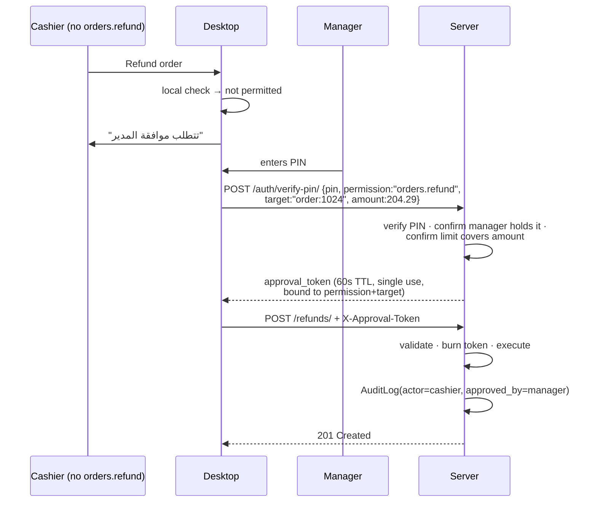
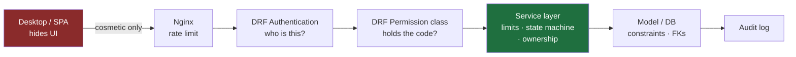

# 05 — Permission Matrix

Covers master prompt section **H**, plus §28.

---

## Why not Django's built-in permissions

Django's `auth.Permission` is model-bound: `add_order`, `change_order`, `delete_order`. That
vocabulary cannot express what this system actually needs to control:

- `orders.discount` — changing an order, but only that field, and only within a limit
- `orders.void_after_fire` — voiding is fine before the kitchen sees it, and is a loss-prevention
  event afterwards
- `shifts.close_with_variance` — closing a shift is routine; closing one that is 200 EGP short is not

These are *business capabilities*, not CRUD verbs on a table. So: a custom `Role` model holding
string permission codes, resolved to a flat `set[str]` per user per branch and cached in Redis
(invalidated on any role change). Django's `is_superuser` is retained purely for the Django admin,
which is a break-glass tool and not part of the product.

**Codes are `domain.action`.** Flat, greppable, and stable — they end up in the audit log, in
frontend guards, and in the Desktop's cached capability set, so renaming one is a migration.

---

## H. Role × Permission Matrix

Legend: **✅** granted · **⚠️** granted with a limit · **🔓** requires step-up approval from someone
who holds it · **—** denied

| Permission | Super Admin | Branch Manager | Cashier | Waiter | Kitchen | Inventory | Accountant |
|---|:--:|:--:|:--:|:--:|:--:|:--:|:--:|
| **Orders** |
| `orders.view` | ✅ | ✅ | ✅ | ⚠️ own | ⚠️ tickets | — | ✅ |
| `orders.create` | ✅ | ✅ | ✅ | ✅ | — | — | — |
| `orders.edit_items` | ✅ | ✅ | ✅ | ⚠️ pre-fire | — | — | — |
| `orders.void_item` | ✅ | ✅ | ⚠️ pre-fire | 🔓 | — | — | — |
| `orders.void_after_fire` | ✅ | ✅ | 🔓 | 🔓 | — | — | — |
| `orders.void_order` | ✅ | ✅ | 🔓 | — | — | — | — |
| `orders.discount` | ✅ | ✅ | ⚠️ ≤10% | — | — | — | — |
| `orders.discount_unlimited` | ✅ | ✅ | — | — | — | — | — |
| `orders.refund` | ✅ | ✅ | 🔓 | — | — | — | — |
| `orders.reprint` | ✅ | ✅ | ✅ | — | — | — | ✅ |
| `orders.change_price` | ✅ | 🔓 | — | — | — | — | — |
| **Payments** |
| `payments.take` | ✅ | ✅ | ✅ | — | — | — | — |
| `payments.split` | ✅ | ✅ | ✅ | — | — | — | — |
| `payments.view_all` | ✅ | ✅ | ⚠️ own shift | — | — | — | ✅ |
| **Floor** |
| `floor.view` | ✅ | ✅ | ✅ | ✅ | — | — | — |
| `floor.open_table` | ✅ | ✅ | ✅ | ✅ | — | — | — |
| `floor.transfer` | ✅ | ✅ | ✅ | ⚠️ own | — | — | — |
| `floor.merge` | ✅ | ✅ | ✅ | 🔓 | — | — | — |
| **Kitchen** |
| `kitchen.view` | ✅ | ✅ | ✅ | ✅ | ✅ | — | — |
| `kitchen.update_status` | ✅ | ✅ | ✅ | — | ✅ | — | — |
| `kitchen.recall` | ✅ | ✅ | ✅ | — | ✅ | — | — |
| `kitchen.manage_stations` | ✅ | ✅ | — | — | — | — | — |
| **Catalog** |
| `catalog.view` | ✅ | ✅ | ✅ | ✅ | ✅ | ✅ | ✅ |
| `catalog.create` | ✅ | ✅ | — | — | — | — | — |
| `catalog.edit` | ✅ | ✅ | — | — | — | — | — |
| `catalog.change_price` | ✅ | ✅ | — | — | — | — | — |
| `catalog.manage_recipes` | ✅ | ✅ | — | — | — | ✅ | — |
| **Inventory** |
| `inventory.view` | ✅ | ✅ | — | — | ⚠️ availability | ✅ | ✅ |
| `inventory.adjust` | ✅ | ✅ | — | — | — | ✅ | — |
| `inventory.waste` | ✅ | ✅ | ⚠️ ≤ limit | — | ✅ | ✅ | — |
| `inventory.count` | ✅ | ✅ | — | — | — | ✅ | — |
| `inventory.post_count` | ✅ | ✅ | — | — | — | 🔓 | — |
| **Purchasing** |
| `purchasing.view` | ✅ | ✅ | — | — | — | ✅ | ✅ |
| `purchasing.create_po` | ✅ | ✅ | — | — | — | ✅ | — |
| `purchasing.receive` | ✅ | ✅ | — | — | — | ✅ | — |
| `purchasing.manage_suppliers` | ✅ | ✅ | — | — | — | ✅ | ✅ |
| `purchasing.pay_supplier` | ✅ | ✅ | — | — | — | — | ✅ |
| **Shifts** |
| `shifts.open` | ✅ | ✅ | ✅ | — | — | — | — |
| `shifts.close` | ✅ | ✅ | ✅ | — | — | — | — |
| `shifts.close_with_variance` | ✅ | ✅ | 🔓 | — | — | — | — |
| `shifts.cash_movement` | ✅ | ✅ | ⚠️ ≤ limit | — | — | — | — |
| `shifts.view_all` | ✅ | ✅ | ⚠️ own | — | — | — | ✅ |
| **Reports** |
| `reports.sales` | ✅ | ✅ | ⚠️ own shift | — | — | — | ✅ |
| `reports.products` | ✅ | ✅ | — | — | — | ✅ | ✅ |
| `reports.inventory` | ✅ | ✅ | — | — | — | ✅ | ✅ |
| `reports.financial` | ✅ | ✅ | — | — | — | — | ✅ |
| `reports.employees` | ✅ | ✅ | — | — | — | — | ✅ |
| `reports.export` | ✅ | ✅ | — | — | — | ✅ | ✅ |
| **Staff** |
| `staff.view` | ✅ | ✅ | — | — | — | — | ✅ |
| `staff.manage_users` | ✅ | ✅ | — | — | — | — | — |
| `staff.manage_roles` | ✅ | 🔓 | — | — | — | — | — |
| `staff.reset_pin` | ✅ | ✅ | — | — | — | — | — |
| **Branch & Devices** |
| `branch.view` | ✅ | ✅ | — | — | — | — | ✅ |
| `branch.edit_settings` | ✅ | ✅ | — | — | — | — | — |
| `branch.manage_tables` | ✅ | ✅ | — | — | — | — | — |
| `branch.manage_printers` | ✅ | ✅ | — | — | — | — | — |
| `devices.view` | ✅ | ✅ | — | — | — | — | — |
| `devices.manage` | ✅ | 🔓 | — | — | — | — | — |
| **Licensing** |
| `licenses.view` | ✅ | ⚠️ own branch | — | — | — | — | — |
| `licenses.manage` | ✅ | — | — | — | — | — | — |
| **System** |
| `system.settings` | ✅ | ⚠️ branch only | — | — | — | — | — |
| `audit.view` | ✅ | ✅ | — | — | — | — | ✅ |
| `backups.manage` | ✅ | — | — | — | — | — | — |

### The three deliberate exclusions

Per §28, restated as the invariants they are:

1. **A cashier can never reach licensing.** `licenses.*` and `devices.manage` are absent from the
   Cashier role and cannot be added to it without `staff.manage_roles`, which a cashier also lacks.
2. **A waiter can never modify inventory.** No `inventory.*` code appears in the Waiter role at
   all — not even read. Stock levels are business intelligence.
3. **Kitchen staff never see financial reports.** Kitchen holds `kitchen.*` plus a narrow
   `inventory.view` for 86'ing out-of-stock items. No prices, no totals, no `reports.financial`.

---

## The ⚠️ Limits

A limit is not a UI hint. It is a server-side rule, and per **C10** every value is a setting the
admin edits — never a constant in the code:

| Limit | Default | Setting key | Scope |
|---|---|---|---|
| Max discount | 10% | `discounts.max_percent` | Role |
| Max discount amount | unset | `discounts.max_amount` | Role |
| Max waste per event | 100 EGP | `inventory.max_waste_value` | Role |
| Max cash movement | 500 EGP | `shifts.max_cash_movement` | Role |
| Max shift variance | 50 EGP | `shifts.max_variance` | Branch |
| Void grace window | 120s after firing | `orders.void_grace_seconds` | Branch |
| Own orders only | on for Waiter | `floor.waiter_sees_only_own_tables` | Branch |

### Permissions × settings

The two mechanisms answer different questions and compose:

- **A permission** answers *"is this person allowed to do this at all?"* — it belongs to a role.
- **A setting** answers *"does this cafe work this way, and within what bounds?"* — it belongs to
  the branch.

A waiter needs `payments.take` **and** `floor.waiter_can_take_payment` to settle a bill. Either one
off means no. This is why the waiter toggles in
[11](11-configuration.md#q2--cashier-vs-waiter--the-admin-chooses) are settings rather than
permissions: whether waiters handle cash is a decision about how the cafe operates, not about who
this individual person is, and the admin should be able to change it for everyone at once.

Both are enforced server-side. A toggle that only hides a button is not a control.

`void_grace_seconds` deserves comment. A cashier fat-fingering an extra cappuccino and fixing it
15 seconds later is a typo. The same action 20 minutes later, on an order about to be paid, is the
classic cash-skim pattern. Both are `orders.void_after_fire`; the grace window separates the
routine case from the one that should require a manager's PIN and land in the audit log.

---

## 🔓 Step-Up Approval

When a user lacks a permission, the Desktop does not dead-end them. It offers approval:



Properties that make this safe rather than a hole:

- The token names **one permission** and **one target object**. It cannot approve a different
  refund, or a second one.
- 60-second TTL, single use, burned server-side on redemption.
- Both identities are recorded. The audit trail shows the cashier performed it and the manager
  authorized it — neither can later disclaim it.
- The manager never logs the cashier out, so the queue keeps moving. Systems that force a full
  logout for approvals get defeated by managers sharing their PIN, which destroys accountability
  entirely.

---

## Enforcement Points

Client-side permission checks exist **only** to shape the UI. Every one is re-checked server-side.
The Desktop is a machine on a cafe counter that a determined person can decompile.



The **service layer** is the real gate, not the DRF permission class. A permission class answers
"may this user ever discount?"; only the service can answer "may this user discount *this* order by
*this* amount, given it is already fired and 40 minutes old?". Rules that need the object and its
state live in the service, inside the same transaction as the mutation.

Implementation sketch:

```python
class HasPermission(BasePermission):
    def has_permission(self, request, view):
        required = getattr(view, "required_permission", None)
        if required is None:
            raise ImproperlyConfigured(f"{view.__class__.__name__} declares no permission")
        return required in request.auth_context.permissions
```

Raising on a missing declaration — rather than defaulting to allow *or* deny — means a new endpoint
cannot silently ship unguarded. It fails loudly in the first test that touches it.

A companion CI test enumerates every registered route and asserts each declares a permission or is
on an explicit public allowlist (`/auth/login/`, `/licensing/activate/`, `/system/health/`). This
is how the matrix above stays true six months from now instead of becoming documentation of what
we once intended.

---

## Kids Area

The `kids.*` codes and the **Kids Staff** role are defined in
[12](12-kids-area.md#permissions). Two of them are unusual and worth restating here:

- `kids.release_to_other` — 🔓 for everyone below Branch Manager. Releasing a child to someone other
  than the registering guardian always requires a supervisor's PIN, and records both identities.
- `kids.override_charge` — never granted to Kids Staff. The person running the play area should not
  be able to alter what a visit costs.

---

## System Roles

Eight roles ship as `is_system=True` — editable in their permissions, but not deletable, because
deleting the Cashier role at 8am on a Friday is unrecoverable in a way nothing else in the product
is. Custom roles can be created freely (a "Shift Supervisor" between Cashier and Manager is the
common first addition).

`RoleAssignment` carries an optional `branch_id`. Null means all branches — the shape that lets a
future multi-branch owner hold one Super Admin assignment while a Branch Manager is scoped to
exactly one location. Nothing in the single-branch launch depends on it, and nothing has to be
migrated later to use it.

---

**Next:** [06 — Licensing & Activation](06-licensing.md)
