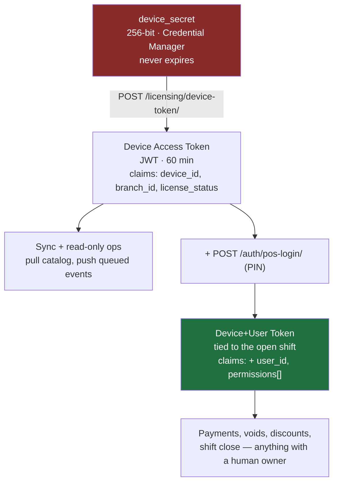
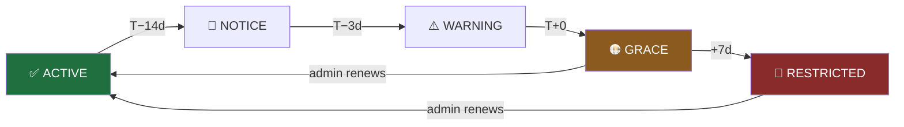

# 06 — Licensing & Activation

Covers master prompt section **I**, plus §5–§9, §59–§61.

> One of the two documents worth reading closely before Phase 1. The other is
> [07 — Sync](07-sync.md).

---

## What This System Actually Guarantees

Stating the honest threat model first, because a licensing design built on a false premise
produces false confidence.

**Guaranteed:**
- No one can activate a device without a valid key issued by the Web Admin.
- The device-seat limit is enforced server-side and cannot be exceeded.
- A revoked device loses access to the server permanently and immediately.
- A revoked or expired license cannot sync, pull the catalog, or reach any server data.
- Every activation, revocation, and renewal is auditable.
- Offline operation is time-bounded by a signature the client cannot forge.

**Not guaranteed:**
- That someone with the `.exe`, a debugger, and enough motivation cannot patch out the local
  license check and run a hollow, permanently-offline shell.

That second point is not a flaw to be engineered away — it is a property of all client-side
licensing, and any vendor claiming otherwise is selling obfuscation. Our answer is to make the
patched shell **worthless**: it has no catalog (server-supplied), no price list, no way to sync,
no reports, no multi-device coordination, and no receipt numbering. The value lives on the server,
so the license protects the value rather than protecting the binary.

Concretely, the effort allocation is: strong server-side enforcement, honest cryptographic offline
tokens, and **no** anti-debugging, packing, or obfuscation theatre. Those cost real engineering
time, break on Windows updates, trip antivirus heuristics, and delay a determined attacker by
about an afternoon.

---

## License Key Generation

**Format:** `QSR-XXXX-XXXX-XXXX-XXXX` — 16 characters of Crockford Base32.

```python
ALPHABET = "0123456789ABCDEFGHJKMNPQRSTVWXYZ"   # no I, L, O, U

def generate_license_key() -> str:
    raw = secrets.randbits(80)                   # 80 bits of entropy
    chars = "".join(ALPHABET[(raw >> (5 * i)) & 0x1F] for i in range(16))
    groups = [chars[i:i+4] for i in range(0, 16, 4)]
    return "QSR-" + "-".join(groups)
```

Design choices:

- **`secrets`, never `random`.** `random` is a Mersenne Twister — observing a few outputs lets you
  predict all the rest. This is the single most common way a homegrown license generator is broken.
- **80 bits** ≈ 1.2×10²⁴ keyspace. Brute-forcing it against a rate-limited endpoint is not a
  threat that needs further thought.
- **Crockford Base32** omits `I`, `L`, `O`, `U` — the characters people misread from a phone
  photo or a WhatsApp message, which is how these keys will actually be delivered. It also treats
  `0`/`O` and `1`/`I`/`L` as equivalent on input, so a mistyped key still activates.
- **Grouped in fours** because that is how humans transcribe long strings without losing their
  place.
- **No sequence, no timestamp, no customer id encoded in the key.** Any structure is a foothold for
  a keygen.

### Storage

```python
license.key_hash   = hmac.new(settings.LICENSE_PEPPER, key.encode(), hashlib.sha256).hexdigest()
license.key_prefix = key[:8]      # "QSR-7X29" — for admin display
license.key_last4  = key[-4:]     # "3F1A"
# the plaintext key is never persisted
```

**HMAC-SHA256, not Argon2/bcrypt** — a deliberate exception to the usual password-hashing rule.
Activation must find a license *by its key*, which requires a deterministic hash to index. A slow
per-record hash would force a full table scan comparing every row. The properties that make fast
hashes dangerous for passwords do not apply here: an 80-bit random key has no dictionary to attack
and no human-chosen patterns. The pepper (`LICENSE_PEPPER`, env-only, never in Git) means a stolen
database dump alone does not yield working keys.

**The plaintext key is displayed exactly once**, at creation, in the Web Admin, with a copy button
and an explicit warning. Thereafter the admin sees `QSR-7X29-••••-••••-3F1A`. If it is lost, the
admin regenerates — which revokes the old key and forces re-activation. Making recovery impossible
but regeneration easy is the right trade: it removes any pathway where a leaked database or a
compromised admin session yields usable keys.

---

## I. Activation Flow

```mermaid
sequenceDiagram
    autonumber
    participant U as Staff
    participant D as Desktop
    participant KS as Windows Credential<br/>Manager
    participant API as Django API
    participant DB as PostgreSQL

    U->>D: launch CaesarPOS.exe
    D->>KS: read device credential
    KS-->>D: none → not activated
    D->>U: Activation screen

    U->>D: server URL, email, key,<br/>device name, mode
    D->>D: generate device_uuid (v4, persisted)
    D->>D: collect fingerprint (advisory)
    D->>API: POST /licensing/activate/

    API->>API: throttle 5/hr/IP
    API->>DB: SELECT ... WHERE key_hash = HMAC(key)
    alt not found
        DB-->>API: none
        API-->>D: 404 LICENSE_NOT_FOUND
        Note over API: constant-time compare;<br/>same latency as a hit
    else email mismatch
        API-->>D: 403 LICENSE_EMAIL_MISMATCH
    else status ≠ ACTIVE / PENDING
        API-->>D: 403 LICENSE_SUSPENDED | LICENSE_REVOKED
    else expired
        API-->>D: 403 LICENSE_EXPIRED (+ expires_at)
    else seats full
        API-->>D: 409 DEVICE_LIMIT_REACHED (+ used/max)
    else ok
        API->>DB: BEGIN
        API->>DB: SELECT license FOR UPDATE
        API->>DB: re-check seats under lock
        API->>DB: INSERT Device(secret_hash = Argon2id(secret))
        API->>DB: license.activation_count += 1
        API->>DB: status PENDING → ACTIVE (first activation)
        API->>DB: INSERT LicenseEvent(ACTIVATED)
        API->>DB: INSERT AuditLog
        API->>DB: COMMIT
        API->>API: sign offline token (Ed25519)
        API-->>D: 201 {device_id, device_secret,<br/>offline_token, branch_config}
    end

    D->>KS: store device_id + secret (DPAPI-backed)
    D->>D: write offline_token to local store
    D->>API: GET /sync/bootstrap/
    API-->>D: catalog, floor, stations, staff, settings
    D->>U: ✅ Activated → Login
```

**Step 20 — `SELECT ... FOR UPDATE` — is the one that matters.** Without a row lock, three
simultaneous activations against a 3-seat license each read `activation_count = 2`, each conclude
there is room, and each insert. The license ends up with 5 devices on a 3-seat plan. The lock makes
the check-and-increment atomic. This is the same class of bug as the inventory race in
[02](02-data-model.md#the-ledger-rule), and it is worth noticing that both live in a
check-then-write over a shared counter.

The constant-time comparison and uniform latency on the not-found path prevent an attacker from
distinguishing "this key prefix exists" from "it does not" by timing the response — which would
otherwise turn 80 bits of entropy into a much shorter search.

---

## Why Not MAC-Address Binding

**Decision (C4): hardware fingerprints are telemetry, not authentication.**

Per §8, binding a license to a MAC address, CPU ID, or machine name is a common design and a bad
one:

| Problem | Consequence |
|---|---|
| MAC addresses are trivially spoofable | One `ip link set` and the "binding" is defeated |
| Fingerprints change legitimately | A Windows update, new NIC, or docking station de-activates a working terminal at 7am |
| Virtual adapters (VPN, Hyper-V, Docker) come and go | Non-deterministic fingerprints, false failures |
| Multiple NICs enumerate in arbitrary order | The same machine yields different fingerprints across boots |
| The client computes it | Therefore the client can lie about it |

Instead: **the server issues the credential.**

```python
device_secret = secrets.token_urlsafe(32)          # 256 bits, server-generated
device.secret_hash = argon2.hash(device_secret)     # slow hash — this one IS a password
# plaintext returned exactly once, in the activation response
```

The Desktop stores it in the **Windows Credential Manager** via `keyring`, which is backed by DPAPI
and encrypted with the Windows user account's key. It is not in a JSON file, not in the registry
in cleartext, and not recoverable by copying the app directory to another machine.

The hardware fingerprint is still collected and stored — as a `fingerprint` column that is **never
used for authorization**. Its value is diagnostic: if one device's fingerprint changes every day,
the credential has probably been copied across machines, and the admin gets a flag. Detection, not
prevention.

Note this is exactly the properties list for `secret_hash` versus `key_hash`: the device secret is
long-lived, checked at a low rate, and never used for lookup — so Argon2id is correct there and
HMAC is correct for the license key. Same system, opposite choices, for reasons that are specific
rather than stylistic.

---

## Authentication After Activation

Three-layer token model:



A device token alone can keep the outbox draining and the catalog fresh even when nobody is logged
in — which is what you want at 3am when the terminal is idle but still needs to receive tomorrow's
price change. It cannot take money. Attaching a human is what unlocks financial actions, and that
human's id is what lands in the audit log.

Refresh tokens rotate on every use with **reuse detection**: presenting an already-rotated refresh
token means the token store was copied, so the entire device session family is revoked and the
admin is notified. That converts a silent credential theft into a loud, visible event.

---

## The Offline License Token

**Decision (C5): startup authorization offline is an Ed25519 signature.**

The Desktop must start and sell during an outage (§10). But if the local check is just "read a
JSON file and see if it says `valid: true`", the whole system is defeated with Notepad — the
explicit failure mode §9 warns about.

The server issues a signed, self-contained token:

```jsonc
{
  "v": 1,
  "license_id": "0193f4…",
  "branch_id":  "0193f5…",
  "device_id":  "0193f6…",
  "status":     "ACTIVE",
  "license_expires_at": "2027-01-15T00:00:00Z",
  "token_expires_at":   "2026-08-09T14:00:00Z",   // ~72h, the grace window
  "grace_hours": 72,
  "expiry_policy": "READ_ONLY",
  "issued_at":  "2026-08-06T14:00:00Z",
  "server_time":"2026-08-06T14:00:00Z"
}
// signed with Ed25519; signature appended
```

- The **private key lives only on the server** (`LICENSE_SIGNING_KEY`, env-only). It never ships.
- The **public key is embedded in the Desktop binary**. Verification is local and needs no network.
- Every successful heartbeat returns a fresh token, sliding the window forward. A terminal that is
  online daily never notices the mechanism exists.
- Forging a token requires the private key. Editing the JSON breaks the signature. Clearing the
  file just means "not activated" — it cannot mean "valid forever".

### Clock-rollback defence

The obvious attack on any offline expiry is setting the system clock backwards. Three cheap
countermeasures, layered:

1. **Monotonic high-water mark.** The Desktop persists the highest `server_time` it has ever seen.
   If the system clock reads earlier than that mark, the app refuses to start and asks for a
   connection. Time only moves forward from the app's perspective.
2. **Sequence-based ratchet.** Every issued token carries an incrementing sequence. A token whose
   sequence is lower than the stored one is rejected, so an old token cannot be replayed after a
   newer one has been seen.
3. **Server reconciliation.** On the next successful sync, the server compares each pushed event's
   client timestamp against its own clock. Events dated implausibly in the past are flagged, and
   the device is marked for review in the admin. Tampering leaves a trail even if it briefly works.

---

## §60 — Expiry Behaviour

**Never hard-kill a running cafe.** A POS that goes black mid-service because a renewal was
forgotten is a worse outcome than a few days of unpaid usage, and it is the fastest way to lose a
customer permanently.

Graduated policy, configured server-side per license:



| Stage | Cafe experience |
|---|---|
| **NOTICE** (T−14d) | Small banner on the Web Admin only. Staff see nothing. |
| **WARNING** (T−3d) | Dismissible banner on the Desktop at login. Sales unaffected. |
| **GRACE** (T+0 → +7d) | Persistent banner. **All operations still work.** Daily email to the owner. |
| **RESTRICTED** (T+7d) | New orders blocked. Still permitted: closing open orders, taking payment on them, closing the shift, viewing and exporting history, printing reports. |

RESTRICTED is deliberately not "locked". A cafe with eight open tables when the license lapses must
be able to finish serving and settle those tables. Blocking *new* orders applies commercial
pressure without stranding customers mid-meal or destroying access to the owner's own financial
records — which are their data, not ours.

`expiry_policy` in the token supports `READ_ONLY`, `GRACE_ONLY`, and `BLOCK_NEW_ORDERS`, so the
behaviour can be softened or hardened per customer without shipping a new build.

---

## §59 — Admin Controls

From `/licensing/licenses/:id`:

| Action | Effect | Reversible |
|---|---|---|
| **Create** | Generate key, show once | — |
| **Renew** | Extend `expires_at`; new tokens issued on next heartbeat | yes |
| **Suspend** | Devices reach a `LICENSE_SUSPENDED` wall at the next heartbeat; offline tokens still run out their remaining window | yes |
| **Revoke** | Immediate. All device sessions revoked, all secrets invalidated | no |
| **Change seats** | Raise freely; lowering requires revoking devices down to the new count first | yes |
| **Reset device** | Frees one seat; that device must re-activate | yes |
| **Regenerate key** | New key shown once, old key dead, devices keep working until re-activation | no |

Suspend not taking effect instantly offline is an accepted consequence of offline operation — you
cannot both work without a network and be revocable within it. The bound is the grace window
(default 72h), and it is configurable per license for customers where tighter control matters.

Every one of these writes a `LicenseEvent` and an `AuditLog` row with the acting admin, IP, and
before/after state.

---

## §61 — Version Management

Each heartbeat reports `app_version`. The server returns:

```jsonc
{ "min_supported_version": "1.2.0",
  "latest_version": "1.4.1",
  "update_url": "https://…/CaesarPOS-1.4.1-Setup.exe",
  "update_required": false,
  "release_notes_ar": "…" }
```

Below `min_supported_version`, the API refuses everything except the heartbeat and returns
`CLIENT_TOO_OLD` — a client that predates a breaking sync change must not be allowed to corrupt
data by guessing at the new contract.

**Auto-update is explicitly out of the MVP.** A silent updater that fails halfway leaves a cafe
with a non-functioning till and no technician on site. v1 notifies and links to the installer;
a human runs it after close. Automatic updates come later with staged rollout, signature
verification, and rollback — or not at all.

---

## Failure Messages

Every failure gets a specific, actionable Arabic message. A cashier at 7am needs to know whether to
call the manager or check the wifi:

| Code | Arabic message shown |
|---|---|
| `LICENSE_NOT_FOUND` | مفتاح الترخيص غير صحيح. تأكد من كتابته بشكل صحيح. |
| `LICENSE_EMAIL_MISMATCH` | البريد الإلكتروني لا يطابق الترخيص. |
| `LICENSE_EXPIRED` | انتهت صلاحية الترخيص بتاريخ ٢٠٢٦/٠٩/٠١. تواصل مع مدير النظام. |
| `LICENSE_SUSPENDED` | الترخيص موقوف مؤقتاً. تواصل مع مدير النظام. |
| `LICENSE_REVOKED` | تم إلغاء الترخيص. |
| `DEVICE_LIMIT_REACHED` | عدد الأجهزة المسموح بها مكتمل (٣/٣). يمكن للمدير إلغاء تفعيل جهاز آخر. |
| `DEVICE_REVOKED` | تم إلغاء تفعيل هذا الجهاز. |
| `CLIENT_TOO_OLD` | إصدار البرنامج قديم (١.١.٠). الحد الأدنى ١.٢.٠. |
| `NETWORK_UNREACHABLE` | تعذر الاتصال بالخادم. تحقق من الإنترنت ثم أعد المحاولة. |

Note `DEVICE_LIMIT_REACHED` names both the count and the remedy. "Activation failed" would send
someone to the phone; this sends them to the right screen.

---

**Next:** [07 — Offline & Sync Engine](07-sync.md)
