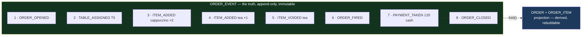
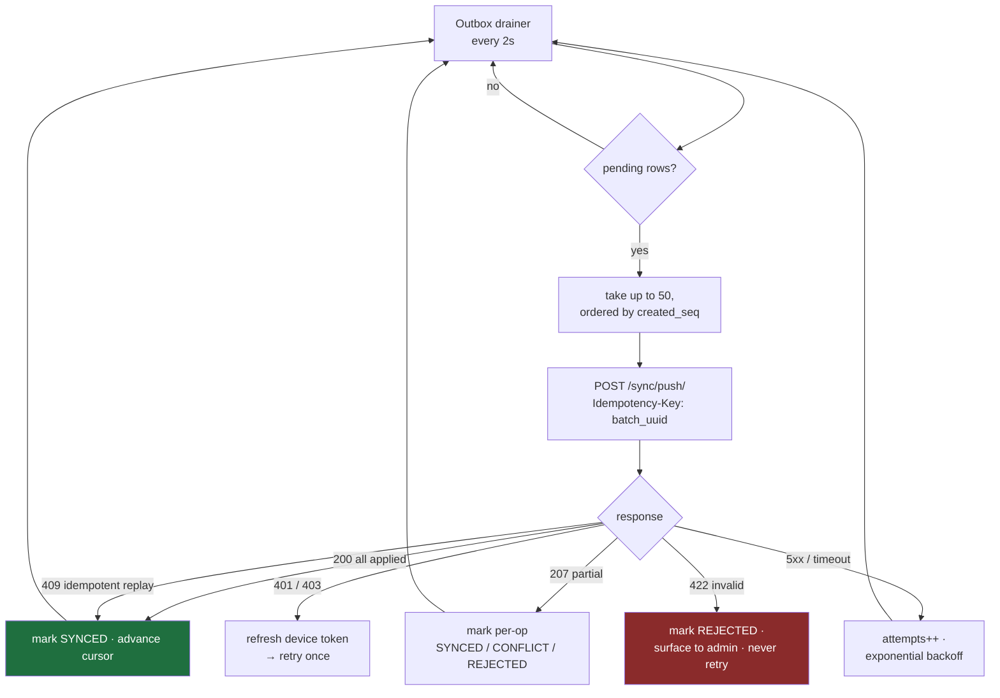

# 07 — Offline Operation & Synchronization Engine

Covers master prompt section **J**, plus §10–§12, §51–§53.

> The other document worth reading closely before Phase 1. This is where a wrong decision becomes
> structurally expensive rather than merely annoying.

---

## The Central Decision: Orders Are Events

**Commitment C1.** This single choice determines how hard every other sync problem is.

Consider the naive design — sync order *rows*. Two devices are open on Table 5:

```
14:32  Cashier terminal:  order.total = 160    (adds a cappuccino)
14:32  Floor tablet:      order.total = 200    (adds a tea)
14:33  both push
```

The server now has two conflicting versions of one row. Every available resolution is wrong:

- **Last-write-wins** → one drink is silently deleted. The customer is served something they are
  not charged for, and nobody ever finds out.
- **Reject the second** → the waiter's item vanishes, and they re-enter it, sometimes twice.
- **Merge fields** → merging two totals is meaningless. There is no correct arithmetic on "160"
  and "200" without knowing what produced them.

The problem is that a row is a *fold* of history and the history has been thrown away. So we don't
throw it away:

```
Device A:  {seq:4, ITEM_ADDED, cappuccino ×1}
Device B:  {seq:4, ITEM_ADDED, tea ×1}
```

Two facts. Both true. Both append. The server orders them, folds them, and the order contains a
cappuccino **and** a tea — which is what physically happened at the table. **The conflict simply
does not exist**, because the operations commute.



Consequences that fall out for free:

- **Idempotency is structural.** Each event carries a client-minted UUID with a unique constraint.
  Replaying a batch is a no-op — not because retry logic is clever, but because a duplicate insert
  is impossible.
- **The audit trail is the data**, not a parallel log that can drift from it.
- **Voiding is an event, not a deletion.** `ITEM_VOIDED` records who removed what and when. §12's
  "never silently delete financial records" is enforced by the shape of the storage rather than by
  developer discipline.
- **Projections are rebuildable.** A bug in the fold is fixed by correcting the code and replaying.
  With mutable rows, a fold bug is permanent corruption.
- **Disputes are answerable.** "Why is this bill 40 EGP more than we ordered?" has a timestamped,
  per-actor answer.

The cost is real: more storage (trivial at this volume), a fold step on read (mitigated by the
`ORDER_ITEM` projection), and developers must think in events. Worth it — this is the hardest
problem in the system and events dissolve it rather than manage it.

**Scope discipline:** only *orders* are event-sourced. Products, suppliers, and stock use ordinary
CRUD. Event-sourcing an entire system is a well-known way to make everything harder; using it for
the one aggregate that is genuinely concurrent and genuinely financial is the sweet spot.

---

## Local Storage (§52)

SQLite in the Windows user's AppData directory, in WAL mode (concurrent reads during writes, and a
crash-safe journal — a POS *will* lose power mid-transaction).

```text
%LOCALAPPDATA%\CaesarPOS\local.db

── Mirror (pull-only, server-authoritative, replaced not merged) ──
   m_products · m_variants · m_categories · m_modifiers · m_modifier_groups
   m_tables   · m_areas    · m_stations   · m_payment_methods
   m_users    · m_permissions · m_settings · m_sync_meta (cursors, ETags)

── Local transactions (write-here-first, then push) ──
   l_orders · l_order_events · l_order_items · l_payments
   l_shifts · l_cash_movements · l_kitchen_tickets
   l_stock_counts · l_waste_events

── Machinery ──
   sync_outbox · sync_conflicts · print_queue · app_log
```

The prefixes are a constant reminder of direction. `m_` tables are never written by the UI — a
price change is a server fact that arrives; the Desktop has no authority to alter one. `l_` tables
are written locally first and pushed. Mixing the two is how a "cache" quietly becomes a second
source of truth.

**Retention:** `l_*` rows are purged 30 days after their sync is confirmed. The local database
stays a few hundred MB rather than growing without bound on a counter PC nobody maintains. History
lives on the server, which is what the server is for.

**Encryption:** SQLCipher is available behind a config flag but **off by default**. The local DB
holds no credentials (those are in Credential Manager) and no card data (we never touch PANs).
It holds today's orders — the same information printed on receipts sitting in the drawer. Paying
a permanent performance cost and a much harder debugging story for that is not a good trade; the
flag exists for a future customer whose compliance regime demands it.

---

## Push: Desktop → Server

The **outbox pattern**. Every local mutation writes its data and its outbox row in *one* SQLite
transaction:

```python
with local_db.transaction():                      # atomic — both or neither
    local_db.insert("l_order_events", event)
    local_db.execute(*apply_to_projection(event))
    local_db.insert("sync_outbox", {
        "op_uuid": event["id"],
        "entity_type": "order_event",
        "entity_id": event["order_id"],
        "payload": json.dumps(event),
        "status": "PENDING",
        "attempts": 0,
        "created_seq": next_local_seq(),           # preserves causal order
    })
```

This is the crux. If the app writes the event and crashes before queueing it, the sale exists
locally and never reaches the server — a lost sale that reconciles to nothing. One transaction
makes that window zero. It is the same reason the server pairs a stock movement with its level
update inside `transaction.atomic()`.

A background worker drains the outbox:



**Backoff (§53):** `min(2^attempts, 300)` seconds with ±20% jitter — 2s, 4s, 8s … capped at 5
minutes. Jitter matters because four terminals in one cafe lose wifi simultaneously and would
otherwise retry in perfect lockstep, hammering the server the instant it returns.

**A `422` is never retried.** A structurally invalid operation will be invalid forever, and
retrying it every 5 minutes for a week accomplishes nothing except burying real failures. It goes
to `sync_conflicts`, raises a Desktop indicator and a Web Admin notification, and waits for a human.

**Ordering is preserved per aggregate.** Events for one order push in `sequence` order; the server
rejects a gap with `SEQUENCE_GAP` and the client backfills. Different orders push independently and
concurrently — there is no reason for table 3 to wait on table 8.

### Server-side push handler

```python
@transaction.atomic
def apply_push(device, operations):
    results = []
    for op in operations:
        try:
            record, created = SyncOperation.objects.get_or_create(
                op_uuid=op["op_uuid"],                    # UNIQUE — the idempotency gate
                defaults={"device": device, "branch": device.branch,
                          "payload": op, "status": "PENDING"},
            )
            if not created:                                # replay
                results.append({"op_uuid": op["op_uuid"],
                                "status": record.status, "result": record.result,
                                "replayed": True})
                continue

            with transaction.atomic():                     # savepoint: one bad op
                result = HANDLERS[op["entity_type"]](device, op)   # doesn't poison the batch
            record.status, record.result = "APPLIED", result
            record.applied_at = timezone.now()
            record.save()
            results.append({"op_uuid": op["op_uuid"], "status": "APPLIED", "result": result})

        except ConflictError as e:
            record.status, record.error_code = "CONFLICT", e.code
            record.save()
            results.append({"op_uuid": op["op_uuid"], "status": "CONFLICT",
                            "code": e.code, "server_state": e.server_state})
        except ValidationError as e:
            record.status, record.error_code = "REJECTED", e.code
            record.save()
            results.append({"op_uuid": op["op_uuid"], "status": "REJECTED", "code": e.code})

    return results   # 207 Multi-Status when mixed
```

The nested savepoint is what makes a batch resilient: one malformed operation out of fifty is
rejected on its own and the other forty-nine still apply. An all-or-nothing batch means a single
poisoned row blocks a terminal indefinitely.

---

## Pull: Server → Desktop

**Decision (C3): a monotonic server-side cursor, never `updated_at`.**

Timestamp-based sync (`?since=2026-08-06T14:00:00Z`) is the standard approach and it is subtly
broken:

1. **Clock skew** — the client's clock differs from the server's, so the window is wrong in a
   direction nobody can predict.
2. **Transaction visibility** — a row written at 13:59:59 inside a transaction that commits at
   14:00:01 becomes visible *after* a client has already asked for "everything since 14:00:00".
   That row is skipped forever. This is a genuinely nasty bug: rare, silent, and unreproducible.
3. **Resolution ties** — several rows sharing a millisecond force a choice between skipping some
   and re-sending some.

A `BIGSERIAL` change log has none of those properties:

```sql
CREATE TABLE change_log (
    seq         BIGSERIAL PRIMARY KEY,
    branch_id   UUID NOT NULL,
    entity_type TEXT NOT NULL,
    entity_id   UUID NOT NULL,
    operation   TEXT NOT NULL,        -- UPSERT | DELETE
    payload     JSONB NOT NULL,
    created_at  TIMESTAMPTZ DEFAULT now()
);
CREATE INDEX ON change_log (branch_id, seq);
```

```
GET /sync/pull/?stream=catalog&cursor=48213&limit=500
→ { "changes": [...], "cursor": 48731, "has_more": false }
```

One caveat, stated because it is easy to get wrong: `BIGSERIAL` values are assigned at INSERT but
become visible at COMMIT, so a long transaction can commit `seq=100` after `seq=101` is already
readable. A reader at exactly the wrong moment would skip 100. The fix is to never serve rows that
might still be in flight — the query excludes any `seq` at or above the oldest currently-open
transaction's snapshot:

```sql
SELECT * FROM change_log
WHERE branch_id = %s AND seq > %s
  AND seq < pg_snapshot_xmin(pg_current_snapshot())::text::bigint  -- conceptual guard
ORDER BY seq LIMIT %s;
```

In practice this is implemented by having writers append to `change_log` in a short, dedicated
transaction after the main commit, so there is no long-running window to worry about. Either way,
the property to preserve is: **never hand out a cursor position that a not-yet-committed row could
later fall behind.**

Streams are pulled independently at different cadences, because their staleness tolerances differ:

| Stream | Contents | Cadence |
|---|---|---|
| `config` | Branch settings, tax rules, printers | 5 min + on heartbeat |
| `catalog` | Products, prices, categories, modifiers, recipes | 60s |
| `floor` | Tables, areas, stations | 60s |
| `staff` | Users, PINs, permissions | 5 min |
| `orders` | Orders from *other* devices in this branch | 10s (WebSocket-preferred) |

`orders` is the stream that lets a floor tablet and a cashier terminal see the same table. When
WebSockets are connected it is push-driven and the poll is only a safety net.

---

## §12 — Conflict Policy

Conflicts are resolved by **entity class**, decided in advance. There is no generic merge
algorithm, because "correct" differs per entity and pretending otherwise produces plausible,
silent corruption.

| Entity | Direction | Policy | Why |
|---|---|---|---|
| Products, prices, categories, modifiers | Server → Desktop only | Server always wins; local copy is replaced | Pricing is a management decision. A terminal must never originate one. |
| Branch settings, tax, printers | Server → Desktop only | Server always wins | Same |
| Users, roles, permissions | Server → Desktop only | Server always wins | A revoked user must not survive in a local cache |
| **Order events** | Desktop → Server | **Append; no conflict possible** | Commutative by construction (C1) |
| Payments | Desktop → Server | Idempotency key; duplicates return the original | Charging twice is unacceptable; the key makes it impossible |
| Shift open/close | Desktop → Server | One open shift per device, enforced by a partial unique index | Prevents a second shift opening after a crash |
| Stock counts | Desktop → Server | Append as a count session; posting is a server-side review step | Two staff counting the same shelf must both be seen, not silently merged |
| Waste events | Desktop → Server | Append-only | Each is a distinct real-world event |
| Inventory levels | **Server-computed only** | Desktop never writes stock | Commitment C6 |

The last row is the one that removes the hardest class of conflict outright. If two terminals could
each decrement stock locally and push a level, reconciling them would be guesswork. Instead they
push *sales*, and the server derives consumption from recipes under a row lock. There is exactly
one place in the system that decides what the stock level is.

### When a conflict does occur

Only three real cases remain:

1. **`SEQUENCE_GAP`** — event 5 arrives before event 4 (a partial batch failure). Server rejects 5;
   client re-sends from 4. Self-healing, no human involved.
2. **`ORDER_ALREADY_CLOSED`** — an item is added to an order another device already paid. Server
   rejects. The Desktop surfaces it: *"الطلب #١٠٢٤ تم دفعه بالفعل — الأصناف التالية لم تُضف"* with
   a one-tap option to open a new order containing those items. A real situation, given a real
   remedy, rather than a discarded write.
3. **`ENTITY_DELETED`** — an event references a product deactivated in the meantime. Server applies
   it using the event's own price snapshot and flags it for review. The sale physically happened;
   refusing to record it would lose money to protect a referential nicety.

Everything lands in `sync_conflicts` with the full server state attached, is visible in both the
Desktop indicator and the Web Admin, and can be resolved manually via
`POST /sync/conflicts/{id}/resolve/`.

---

## Invoice Numbering Under Partition

**Commitment C9.** An unglamorous problem that ruins offline POS systems.

Egyptian receipts want gapless sequential invoice numbers. But three offline terminals cannot each
pick "the next number" without colliding — and asking the server defeats the whole point.

**Solution: pre-allocated blocks.**

```
Online, at shift open:
  Device A → POST /invoices/blocks/allocate/ → range 1000–1499
  Device B → POST /invoices/blocks/allocate/ → range 1500–1999
  Device C → POST /invoices/blocks/allocate/ → range 2000–2499
```

Each device consumes its own block locally, with no coordination. Numbers never collide because the
ranges are disjoint. When a device drops below 20% remaining, it requests the next block in the
background. If it fully exhausts a block while offline, it falls back to a provisional number
(`MB-01-P042`) and the server assigns a permanent one at sync — a rare, degraded path rather than
the normal one.

Blocks introduce gaps in the global sequence (device A ends at 1187, B starts at 1500), so
**gaps are reported, not hidden**: the Web Admin shows allocated-vs-used per block, and the
financial report reconciles them. An accountant asking "where are invoices 1188–1499?" gets a
documented, auditable answer instead of a suspicion of deleted sales. Fabricating a fake gapless
sequence after the fact would be far worse — it would mean rewriting numbers already printed and
handed to customers.

The same mechanism handles kitchen ticket numbers, at a much smaller block size.

---

## §10 — Offline Capability Matrix

| Operation | Offline | Notes |
|---|---|---|
| Open / add to / fire an order | ✅ | Fully local |
| Print receipt & kitchen ticket | ✅ | Local printers |
| Take cash payment | ✅ | |
| Take card payment | ⚠️ | The POS records it; the card terminal is a separate device with its own connectivity |
| Open / close a shift | ✅ | Z-report computed locally, verified server-side on sync |
| Void, discount (within limits) | ✅ | Cached permission set |
| Step-up approval (🔓) | ⚠️ | Manager PIN verifies against the cached hash; the approval is recorded and re-validated on sync |
| Record waste / stock count | ✅ | Queued |
| View today's own sales | ✅ | From local data |
| View historical reports | ❌ | Server-side |
| Add or edit a product / price | ❌ | By design — management action |
| Activate a new device | ❌ | Requires the server |
| See another device's orders | ❌ | Both must be online |

That last row is the honest limitation of offline multi-device operation: two partitioned terminals
cannot see each other's tables. Mitigation is operational rather than technical — during an outage,
staff work one terminal per area. The Desktop makes this explicit, showing *"وضع عدم الاتصال —
الطاولات من الأجهزة الأخرى غير محدثة"* rather than displaying a stale board as though it were live.

---

## Sync Status, Made Visible

Every terminal shows its state permanently in the header:

| Indicator | Meaning |
|---|---|
| 🟢 متصل | Online, outbox empty |
| 🟡 يزامن (١٢) | Online, 12 operations draining |
| 🔴 غير متصل (٤٥) | Offline, 45 queued, last sync 14:02 |
| ⚠️ تعارض (٢) | 2 operations need human resolution |

The Web Admin mirrors this per device on `/branch/devices`, with last-seen, pending count, app
version, and outstanding conflicts. Notifications fire when a device is unseen for more than 30
minutes during business hours, when pending operations exceed 100, or on any conflict.

A sync engine that fails silently is worse than none — staff keep working, confident everything is
recorded, and discover a week later that a terminal has been queueing since Tuesday. Every failure
mode here is designed to be loud.

---

## Testing This

Sync bugs are rare, timing-dependent, and financially serious, so they get deterministic tests
rather than hopeful manual checks. Written in Phase 7, run in CI on every commit thereafter:

| Test | Asserts |
|---|---|
| Kill mid-push | No lost operations, no duplicates after restart |
| Duplicate batch replay | Identical response, no second order created |
| Concurrent same-table edits from 2 devices | Both items present, no conflict raised |
| 500 events queued offline, then reconnect | All applied in order, totals match to the piaster |
| Clock skewed −2h then push | Events flagged, not silently accepted |
| Block exhaustion offline | Provisional numbers issued, reconciled on sync, no collisions |
| Payment retried after a timeout | Charged exactly once |
| Partial batch (op #7 of 50 invalid) | 49 applied, 1 rejected, batch not blocked |
| Pull cursor at a transaction boundary | No skipped rows across 10k concurrent writes |
| Server 500s for 10 minutes | Backoff respected, no thundering herd, full recovery |

The offline scenarios run against a real SQLite file and a real Postgres, with the network stubbed
at the HTTP layer — mocking the sync engine's own boundaries would test the mocks rather than the
engine.

---

**Next:** [08 — Development Roadmap](08-roadmap.md)
