# 08 — Development Roadmap

Covers master prompt section **L**, plus §63 (phases), §66 (generation rule), §67 (definition of done).

---

## Sequencing Principle

Phases are ordered by **how expensive a mistake becomes later**, not by how visible the feature is.

Licensing (Phase 3) and sync (Phase 7) both come before reporting and polish, because a mistake in
either one contaminates every financial record written afterwards. A wrong dashboard chart is a
one-day fix. A sync engine that has been dropping one order in a thousand for three months is a
data-recovery project.

The corollary: **Phase 7 is not "add offline later".** The event-sourced order model (C1), the
UUID identity scheme, the idempotency keys, and the outbox contract are all established in Phases
1–5. Phase 7 builds the engine on foundations already laid. Retrofitting offline onto a system
that assumed connectivity means rewriting the order model, which is the single most expensive
rewrite available in this project.

---

## Phase Overview

```mermaid
gantt
    dateFormat X
    axisFormat %s
    title Phases (relative effort, not calendar dates)

    section Foundation
    P1 Architecture & Skeleton     :p1, 0, 3
    P2 Identity & Authorization    :p2, after p1, 3
    P3 Licensing & Activation      :crit, p3, after p2, 4

    section Domain
    P4 Catalog · Inventory · Purchasing :p4, after p3, 5
    P5 POS · Orders · Payments · Shifts :crit, p5, after p4, 6
    P6 Kitchen & Real-time              :p6, after p5, 3
    P6B Kids Area & Time Billing        :p6b, after p6, 4

    section Hardening
    P7 Offline & Sync Engine       :crit, p7, after p6b, 5
    P8 Reporting & Analytics       :p8, after p7, 3
    P9 Audit & Security Hardening  :p9, after p8, 3
    P10 Production Deployment      :p10, after p9, 2
```

Critical-path phases (red) are the ones where review before merge is non-negotiable.

---

## Phase 1 — Architecture & Skeleton ✅ COMPLETE

**Goal:** every developer can run the whole stack in one command and add a feature without deciding
where anything goes.

**Verified on 2026-08-06:** `ruff check` clean · `ruff format --check` clean · **126 tests passing**
· `makemigrations --check` clean · `spectacular --fail-on-warn` clean · frontend `vue-tsc` +
production build clean · OpenAPI → TypeScript generation working · live API smoke-tested.

What was proven rather than assumed:

- The **20 money golden-file cases were hand-computed first**, then the implementation was written
  against them. They pass, including the HALF_UP-vs-HALF_EVEN discriminator, apportioned VAT on
  mixed exempt orders, and quarter-pound rounding.
- A VAT override written at branch scope **flows through to real order totals** (10% → 16.00 tax on
  a 160.00 order, not the 14% default) — the C10 loop is closed end to end.
- Secret redaction is **tested with canary values** pushed through the real logging pipeline, not
  asserted by reading the code.
- `TaxRules` was stripped of its defaults during this phase: they were a second source of truth for
  the VAT rate, which is exactly what C10 forbids. Construction is now explicit.
- The settings scope model gained `overridable_at` after a test exposed that per-branch settings
  like sync batch size legitimately need per-device overrides.

Deliverables:
- Repo structure per [01](01-system-architecture.md#b-project-folder-structure)
- `docker-compose.dev.yml` + `.prod.yml`; Postgres, Redis, Celery all up
- Django settings split (base/dev/prod/test); `.env.example` complete
- `apps/core`: `BaseModel`, `TenantScopedModel`, money helpers, exception handler, response
  envelope, cursor pagination, `Idempotency-Key` middleware
- **`apps/settings`: the configuration registry (C10)** — typed definitions, `SettingValue`,
  scope resolution, validators, audit hooks, and the self-rendering settings API
- DRF + drf-spectacular wired; `/api/v1/system/health/` returns 200
- **Public TLS deployment (C11)** — Caddy, real domain, HSTS, rate limiting. The stack is
  internet-facing from the first deploy so it is hardened from the first deploy
- Vue 3 + Vite + TS + Tailwind RTL; layout shell, router, Pinia, Axios interceptors, `ar.json`
- OpenAPI → TypeScript generation in the build
- CI: ruff, mypy, pytest, eslint, vue-tsc, `FloatField` guard
- **The money golden-file fixture** — ~200 rounding cases, written *before* any implementation

Exit criteria:
- `docker compose up` → healthy stack, frontend reaches `/health/`
- CI green on an empty codebase
- A trivial model + endpoint + typed frontend call round-trips end to end
- **A setting registered in code appears in the settings UI, saves, resolves by scope, and audits —
  with no migration and no frontend change**
- Public HTTPS reachable; TLS grade A; Postgres and Redis unreachable from outside

Why the golden file comes first: it is the shared contract between two implementations that do not
exist yet. Writing it afterwards means writing it to match whatever was built, which tests nothing.

---

## Phase 2 — Identity & Authorization ✅ COMPLETE

**Verified on 2026-08-07:** `ruff check` + `format --check` clean · **222 tests passing** ·
`makemigrations --check` clean · `spectacular --fail-on-warn` clean across 18 endpoints ·
live end-to-end auth flow smoke-tested against the running server.

Notable outcomes:

- **TOTP is verified against the RFC 6238 test vectors**, not against itself. That is why it was
  implemented (~30 lines) rather than pulling a dependency.
- **Refresh-token families** implement reuse detection: replaying a rotated token revokes every
  session for the account. Rotation alone would leave a stolen token silently usable (threat S6).
- **Two bugs were found by the live smoke test that the suite had missed**, both because the
  fixtures happened to avoid them:
  1. A cashier whose only role was branch-scoped logged in with **zero permissions** — resolution
     filtered to `branch IS NULL` when the token carried no branch yet.
  2. Policy-mandated MFA was a **deadlock**: login refused a token until enrolment, and enrolling
     required a token. Fixed with a scoped, permission-less `ENROLLMENT` token.
  Both now have regression tests.
- **`BRANCH_MANAGER` was rewritten from "everything except three codes" to an explicit list.** A
  subtractive role definition silently grants every permission added later.
- **`ensure_system_roles` gained `synced_permissions`.** Comparing against the last shipped spec —
  rather than the role's current permissions — is what distinguishes "new feature shipped" from
  "an operator deliberately removed this". Without it, every deploy restored permissions someone
  had intentionally taken away.
- **The entire suite had been running against `config.settings.dev`**, because the container's
  `DJANGO_SETTINGS_MODULE` outranks pytest's ini setting. Fixed with `--ds` in `addopts`; tests had
  been using real throttle rates, Redis, and `DEBUG=True` throughout Phase 1.

### Staff and role administration ✅ COMPLETE (2026-08-08)

**Verified:** ruff + format clean · **867 tests passing** (36 new) · `spectacular --fail-on-warn`
clean · `vue-tsc` clean · `vite build` clean.

A second gap of the same kind Phase 4 had: the authorization *engine* was complete and tested, and
there was **no way to administer it**. `staff.view`, `staff.manage_users`, `staff.manage_roles` and
`staff.reset_pin` were four codes in the catalogue that no route declared. `apps/accounts` offered
login, self-service password and self-service PIN — and nothing for creating a person. An owner
could not add a cashier, which meant nobody could stand at the till.

Now built: `/staff/`, `/roles/`, `/permissions/`, and the Web screen over them. Four rules:

1. **Nothing returns a secret.** `pin_hash` and `password` are absent from every serializer, and a
   test asserts the actual stored hash does not appear in the response body. A staff screen that
   could read either would turn one compromised manager session into every terminal in the branch.
   What it shows instead is *whether* a PIN is set — the fact a manager needs, because a cashier
   without one cannot log in during an outage.
2. **A person is deactivated, never deleted** — their name is on last quarter's voids and shift
   closures — and `DELETE` is not in `http_method_names` at all rather than being caught in a
   handler. You also cannot deactivate yourself: that is a support call which cannot be resolved
   from inside the product.
3. **A system role is edited, never deleted.** An owner who does not want cashiers voiding items
   should be able to say so; deleting the CASHIER role instead would orphan every assignment
   pointing at it. Custom roles delete only when unassigned.
4. **Somebody's last role cannot be revoked.** An account that can log in and do nothing is a
   support call that looks like a broken system rather than a configuration mistake.

Two details worth keeping. The role editor renders the permission catalogue **served by the
server** — a hand-maintained copy in TypeScript would drift the first time a code was added, and
the drift would surface as a permission nobody can grant. And a role edit calls
`services.invalidate_all()`: permission sets are cached on the hot path of every request, so an
edit that skipped this would take effect whenever the cache happened to expire, which is
indistinguishable from a bug. A test proves a cashier loses `orders.view` on the next request, not
the next cache cycle.

`staff.reset_pin` stays separate from `staff.manage_users` because they answer to different risks.
Self-service PIN change requires the account password, which proves the person at the keyboard is
the account holder; a manager cannot know that password — which is the whole reason the
administrative reset exists — so the proof there is the manager's own permission, and the audit
trail records who did it to whom, never the value.

---

## Phase 2 — Identity & Authorization (original plan)

Deliverables:
- `organizations`: Organization, Branch + tenant-scoping manager (settings come from the Phase 1
  registry, not a per-branch settings model)
- `accounts`: custom User (email login), Argon2id, PIN hashing, StaffProfile
- `authz`: Role, RolePermission, RoleAssignment; permission registry; `HasPermission`; Redis cache
- JWT with rotation + reuse detection; throttling on auth endpoints
- Step-up approval tokens ([05](05-permissions.md#-step-up-approval))
- Seed command: 7 system roles with the matrix from [05](05-permissions.md)
- **MFA (TOTP) — mandatory for `SUPER_ADMIN` and `BRANCH_MANAGER` (C11)**, since these accounts are
  now reachable from the internet
- **Login throttling, progressive lockout, and fail2ban at the edge** — moved up from Phase 9
- Web: login, layout, permission-gated sidebar, user/role management screens

Exit criteria:
- **Cross-tenant test passes for every registered ViewSet** (the generic one from
  [01](01-system-architecture.md#tenancy-strategy))
- **Every route declares a permission or is on the public allowlist** — enforced by test
- Role changes invalidate the permission cache within one request
- Refresh reuse revokes the session family

---

## Phase 3 — Licensing & Activation ✅ COMPLETE

**Verified on 2026-08-07:** ruff + format clean on both sides · **405 tests passing**
(341 backend + 64 desktop) · migrations clean · `spectacular --fail-on-warn` clean across 28
endpoints · full activation → heartbeat → revocation flow smoke-tested live.

Server: key generation and HMAC storage, activation with the locked seat check, device secrets,
Ed25519 offline tokens, the graduated expiry policy, invoice-number blocks, licence/device admin
API, event log.

Desktop: the activation gate, credential storage in the Windows Credential Manager, offline-token
verification with the clock ratchet, the activation screen, the blocked screen, and PyInstaller +
Inno Setup packaging.

### Shared logic is vendored, not reimplemented

`scripts/vendor_shared.py` copies `money.py`, `offline_token.py` and `keys.py` from the backend
into the client verbatim, and `--check` fails CI if the copies drift. Reimplementing them in the
client is precisely how a server and a client start quietly disagreeing about a number.

That check has already earned its place: it caught a `fold_input` helper added to the backend and
not re-vendored, within minutes of the helper being written.

### PIN pad and POS shell

Deferred to Phase 5, where the orders they operate on exist. Phase 3's deliverable is the gate —
nothing opens without a valid licence — and that is complete and tested.

Three real bugs were caught by tests written specifically to catch them:

1. **Invoice blocks collided under concurrency.** `SELECT ... FOR UPDATE` on the blocks table locks
   nothing when the table is empty, so the first four simultaneous allocations all computed
   `start = 1`. Now the **branch row** is locked — it always exists, so it serializes even the
   first allocation.
2. **Failed activations were never recorded.** The audit event was written inside the transaction
   that the raised exception then rolled back, so every failure vanished exactly when the audit
   trail matters most. Failures are now recorded after the transaction unwinds.
3. **Device tokens were undecodable.** A device principal has no human, so `sub` was set to null —
   but RFC 7519 says `sub` is a string when present, and PyJWT enforces it. The claim is now
   omitted entirely. This would have broken every POS terminal.

Also corrected: `TokenFamily.user` is nullable, because a terminal is not a person and pretending
otherwise would put someone's name on actions they never took.

---

## Phase 3 — Licensing & Activation (original plan)

**The first phase where a mistake is unrecoverable in production.**

Deliverables:
- `licensing`: License, Device, DeviceSession, LicenseEvent, InvoiceBlock
- Key generation + HMAC storage + one-time display
- `POST /licensing/activate/` with the `SELECT FOR UPDATE` seat check
- Device secret issuance; Argon2id storage; device token flow
- Ed25519 offline token: signing, embedded public key, clock ratchet
- Heartbeat; graduated expiry state machine
- Web: license CRUD, device list, revoke/reset, event log
- **Desktop skeleton**: PySide6 app, activation screen, keyring integration, offline token
  verification, login PIN pad. No POS yet.

Exit criteria:
- Concurrent activation test: 10 parallel requests against a 3-seat license → exactly 3 succeed
- Tampered offline token → rejected
- Clock rolled back → app refuses to start
- Revoked device → denied within one heartbeat
- Expired license → GRACE behaviour, sales still work
- Every license operation writes a LicenseEvent + AuditLog
- Desktop `.exe` builds and activates against a real server

---

## Phase 4 — Catalog, Inventory & Purchasing ✅ BACKEND COMPLETE

**Verified on 2026-08-07:** ruff + format clean · **390 tests passing** · migrations clean ·
`spectacular --fail-on-warn` clean across 48 endpoints.

Delivered: `catalog` (categories, products, variants, modifiers, price history), `recipes`
(bill of materials, cost rollup, sale consumption), `inventory` (units and conversion, items,
the stock ledger, adjustments, waste, counts, reconciliation), `suppliers` (ledger-backed
balances), `purchasing` (PO → goods receipt → stock + supplier billing, returns, reorder
suggestions, valuation), and `kitchen.Station` so products can route.

The governing rule, enforced everywhere: **`StockLevel` is a projection; `StockMovement` is the
truth.** `apply_movement` is the single write path, and `reconcile()` replays the ledger to prove
no code path bypassed it.

Exit criteria met:

- **50 parallel sales of one item deduct exactly**, with the ledger reconciling clean afterwards.
  Without `select_for_update` on the level row, two simultaneous cappuccinos both read 500g and
  both write 482g — losing 18g silently, every time it races.
- A purchase order moves **no** stock; only a goods receipt does.
- Weighted-average cost matches a hand-computed fixture (1000g @ 0.30 + 500g @ 0.45 → 0.3500),
  and receiving converts both quantity **and unit cost** into base units — a 5kg sack at 350/kg
  is 0.35 per gram, not 350.
- Reconciliation detects an intentionally introduced drift.
- A goods receipt re-costs every recipe containing the received ingredient.

One real bug found: `suppliers.reconcile()` compared the ledger against a possibly-stale
in-memory balance, because `record_ledger_entry` updates a row-locked copy. A reconciliation that
trusts a stale value is not reconciling anything; both sides now read fresh from the database.

### API and Web Admin ✅ COMPLETE (2026-08-08)

**Verified:** ruff + format clean · **831 tests passing** (48 new) · migrations clean ·
`spectacular --fail-on-warn` clean · `vue-tsc` clean · `vite build` clean.

A correction to what this section previously claimed. The domain rules were complete and tested —
**the API was not.** `apps/suppliers`, `apps/purchasing` and `apps/recipes` each had models and
services and no views, no serializers and no URLs at all; none of them were in `config/urls.py`.
Eleven `purchasing.*` and `catalog.manage_recipes` permission codes existed in the catalogue with no
route that used them. That is now built, tested and wired, along with the four Web screens over it:
suppliers with their statement of account, purchase orders and goods receipts, reorder suggestions,
and the recipe/costing editor.

The PO/GRN distinction shows up directly in the route table rather than only in the services, which
is the point:

    POST /purchase-orders/              an intention
    POST /purchase-orders/{id}/submit/  still an intention, now committed to
    POST /receipts/{id}/post/           ← the only route here that touches stock

`purchasing.create_po` and `purchasing.receive` stay separate for the same reason: the person who
orders the milk is often not the person who signs for it, and a system where they must be is a
system where one person can invent a delivery. Likewise `purchasing.pay_supplier` is split from
`purchasing.manage_suppliers` — the store manager keeps the phone number current, the owner moves
the money.

Four rules the endpoints enforce that the services alone could not:

1. **A submitted order is not editable, and a posted receipt is frozen.** The receipt's lines are
   already stock movements and a supplier invoice; editing them afterwards would leave the ledger
   describing a delivery that no longer matches the document it came from.
2. **`quantity_received` is read-only on the order.** An order that could mark itself received would
   make the whole distinction decorative.
3. **`Supplier.current_balance` is read-only.** A settable balance would let a typo erase a debt with
   no ledger entry to explain it — the same discipline `StockLevel` follows. The statement endpoint
   replays the ledger and reports the drift rather than hiding it, because a non-zero drift is a bug
   in a write path and the person reading the statement notices first.
4. **A partially received order can still be cancelled.** The delivered half stays on the shelf and
   in the ledger; the outstanding half stops being expected. Refusing would leave it open forever.

**One bug found, and it was a class.** `AppError.__init__` never accepted `status_code`, but four
call sites passed it: `BRANCH_REQUIRED` in three views and the `DEVICE_REVOKED` backstop in sync.
Each raised `TypeError` and answered 500 with no machine code in place of the 400 or 403 the clients
branch on — and none had a test that reached them. `AppError` now takes it per instance,
`tests/test_error_envelope.py` proves the consequences at runtime, and a new architecture guard
AST-walks every `*Error(...)` call and fails on any keyword the constructor does not accept.

---

## Phase 4 — Catalog, Inventory & Purchasing (original plan)

Deliverables:
- `catalog`: Category tree, Product, Variant, ModifierGroup, Modifier, PriceHistory, image pipeline
- `recipes`: Recipe, RecipeLine, unit conversion, cost rollup
- `inventory`: Item, StockLevel, StockMovement, `apply_movement()` with `select_for_update`,
  adjustments, waste, counts, weighted-average costing
- `suppliers` + `purchasing`: PO → GoodsReceipt → stock + supplier ledger
- Nightly reconciliation task (replay movements, alarm on drift)
- Web: product grid, recipe builder, stock screens, PO/GRN wizards, supplier ledger

Exit criteria:
- Concurrent-deduction test: 50 parallel sales of one product → stock exactly correct
- A PO alone moves no stock; a GRN does
- Weighted-average cost verified against a hand-computed fixture
- Reconciliation detects an intentionally-introduced drift
- Recipe cost recalculates on ingredient cost change

---

## Phase 5 — POS ✅ DOMAIN COMPLETE

**Verified on 2026-08-07:** ruff + format clean · **440 tests passing** · migrations clean ·
`spectacular --fail-on-warn` clean.

Delivered: `floor` (areas, tables, sessions), `orders` (the event stream, the fold, the state
machine), `payments` (idempotent payments, split payment, refunds, frozen invoices),
`shifts` (open/close, cash movements, X and Z reports, variance).

**Commitment C1 is now real.** An order is an append-only event stream that the server folds into
an aggregate. Two devices touching one table cannot silently lose an item to last-write-wins, and
"why is this bill 204.29?" is answered by replaying the stream rather than inferring from a total.

Exit criteria met:

- The documented example — 2× cappuccino + 1× turkish, 12% service, 14% VAT — totals **204.29**,
  the same figure as the POS mock-up in docs/04 and the Phase 1 golden fixture, computed by the
  same module the Desktop vendors.
- **Replaying a pushed event never duplicates a line.** The client-minted event id is the
  idempotency key, so a Desktop whose push timed out can retry the whole batch.
- **A replayed payment charges once**, and a replayed refund returns money once.
- Tax rules are snapshotted at open time: a mid-service VAT change cannot rewrite a bill the
  customer is already looking at.
- `PAID → OPEN` is unreachable by construction. Reopening a paid order is a refund plus a new
  order — two auditable records instead of one silently altered one.
- Voiding marks rather than deletes; a deleted line is an unexplained gap in a financial record.
- An invoice snapshot survives a later price change byte-identically.
- Expected cash counts only methods flagged `counts_as_cash`, so a card payment never inflates
  what the drawer should hold.
- A shift with open orders cannot close.

**Still outstanding:** the REST surface for orders/payments/shifts (the domain services are
complete and tested), the Desktop POS screens, and the Web Admin screens.

---

## Phase 5 — POS, Orders, Payments & Shifts (original plan) 🔴

**The financial core.**

Deliverables:
- `orders`: Order aggregate, OrderEvent, fold/projection, state machine, void/discount services
- `payments`: PaymentMethod, Payment (idempotent), Refund, Invoice + snapshot, block allocation
- `shifts`: open/close, cash movements, X/Z reports, variance
- `floor`: Area, Table, TableSession, transfer/merge/split
- **Waiter/floor mode in full** — all three `floor.service_mode` options plus the independent
  toggles ([11](11-configuration.md#q2--cashier-vs-waiter--the-admin-chooses)). `CASHIER_ONLY` is
  implemented as hiding the floor screens, so the capability ships once and the admin decides
- Server-side total calculation validated against the Phase 1 golden file
- Desktop: order screen, floor map, waiter screens, payment screen, shift screens, receipt printing
  with the Arabic rasterizer
- Web: order list, invoice detail, refunds, shift review

Exit criteria:
- **Desktop and server totals agree on all ~200 golden-file cases, to the piaster**
- Invalid state transitions → 409, never silent
- Duplicate payment with the same idempotency key → charged once
- Split payment sums exactly to the total
- Shift close variance computed correctly, including cash movements
- Receipt prints legible shaped Arabic on real hardware
- Void before/after fire behaves per the grace window, both audited
- **Switching `floor.service_mode` between all three values changes behaviour with no redeploy,
  and waiter toggles are enforced server-side, not just hidden in the UI**

---

## Phase 6 — Kitchen & Real-time ✅ DOMAIN COMPLETE

**Verified on 2026-08-07:** ruff + format clean · **505 tests passing** (36 new: 26 kitchen +
10 WebSocket) · migrations clean · `spectacular --fail-on-warn` clean.

Delivered: `kitchen` (Station, KitchenTicket, TicketLine, routing on fire, the ticket state
machine, bounded recall, prep-time capture, the performance endpoint), Django Channels
(`BranchConsumer`, per-branch and per-station groups, `ProtocolTypeRouter` in `config/asgi.py`),
the REST surface for stations, the ticket board and transitions, and six `kitchen.*` settings.

Exit criteria met:

- **A fired order reaches the KDS over the socket**, and the same tickets are reachable by REST
  when the socket is not — `services.serialize_ticket` is the *single* source for both payloads.
- **A multi-station order splits correctly**, and the order is READY only when every ticket is.
  A customer whose coffee is done but whose cake is not has not had their order completed.
- **Firing twice sends only what is new.** `fired_at` on the item is the idempotency mark, so a
  Desktop that retries a timed-out fire does not double the kitchen's work.
- **An item with no station is reported, not dropped.** A drink nobody makes is a problem the
  cashier must learn about immediately, not when the customer asks where it is.
- The consumer authenticates in `connect()` **before joining any group**, rejects cross-branch
  subscriptions, and accepts no state changes over `receive_json` — the socket is a broadcast
  channel, and every mutation still goes through the permission-checked REST path.
- Broadcast failure is caught and logged: WebSockets are an optimization, never a correctness
  requirement.

Three bugs this phase found, all of them in the seam between orders and the kitchen:

1. **A second fire from `IN_KITCHEN` raised `InvalidStateTransition`.** A table ordering more after
   the first round arrives is ordinary, not an error — the transition is now asserted only when the
   status actually moves.
2. **`kitchen.allow_recall_minutes` was read but never registered.** The recall window resolved
   against nothing. Caught because the registry refuses unknown keys rather than returning a
   plausible default — the argument for C10 in one line.
3. **REST and the WebSocket emitted different ticket shapes.** A KDS reconnecting after a dropped
   socket would have had to parse a different object than the one it was receiving a second
   earlier. That is exactly how a fallback path rots unnoticed, so both now emit
   `serialize_ticket` verbatim.

### Clients ✅ COMPLETE (2026-08-08)

The Desktop KDS, kitchen ticket printing and the Web live-kitchen view all landed — see the Desktop
sections under Phase 7 and "Web Admin: floor, kitchen and kids" below.

Worth recording about the Web view: **it is not a second KDS.** The cook's board is on the Desktop,
where one tap advances a ticket and nothing needs a mouse. The Web screen answers the owner's
question instead — *is the kitchen keeping up?* — from home, over the internet, which the Desktop
cannot do (C11). It leads with how many tickets are late and the single worst wait, because an
average hides the one table that is furious, and puts prep times per station underneath, since "the
coffee bar is slow after 8pm" is a staffing decision rather than a today decision.

`target_prep_minutes` is per-station and configurable for a reason the station screen states: an
espresso is late at three minutes and a grill order is not late at ten. One global target would make
one station permanently red and the other permanently green, at which point nobody reads the colour.

Original plan:

Deliverables:
- `kitchen`: Station, KitchenTicket, TicketLine, routing on fire, per-station filtering
- Django Channels: consumers, per-branch/station groups, auth in `connect()`
- KDS mode in the Desktop; ticket board; age colouring; recall
- Kitchen ticket printing as the offline fallback path
- Prep-time capture; late detection; kitchen performance endpoint
- Web: live kitchen view, station config, product routing

Exit criteria:
- Order fired → ticket on the KDS in under 1s over WebSocket
- Socket dropped → polling fallback engages, header shows degraded state, no tickets lost
- Multi-station order splits correctly; order is READY only when all tickets are
- Kitchen printer fires when the KDS is unreachable

---

## Phase 6B — Kids Area & Time-Based Billing ✅ DOMAIN COMPLETE

**Verified on 2026-08-07:** ruff + format clean · **606 tests passing** (60 new: 42 tariff golden
cases + 18 domain/API) · migrations clean · `spectacular --fail-on-warn` clean · vendored modules
in sync · frontend typecheck and build clean.

Delivered: `apps/core/play_pricing.py` (the Django-free tariff engine the Desktop vendors) with
its own golden fixture, the `kids` app (PlayArea, PlayTariff, Guardian, Child, PlaySession,
PlayIncident), check-in/out with capacity and age enforcement, the `PLAY_SESSION_CHARGED` order
event, the Z-report's outstanding-liability line, ten new `kids.*` settings, and three Web Admin
screens (live board, session history with occupancy-by-hour, tariffs with server-computed
worked examples).

Exit criteria met:

- **A session is a running meter, not a sale.** It converts into exactly one ordinary order line
  at checkout and not a moment before, so VAT, service, discounts, split payment, refunds, shift
  reconciliation and the sales reports all work unmodified. That is the whole reason for
  converting at checkout rather than metering into the financial core (C12).
- The full golden fixture agrees to the piaster, including **crossing midnight**, a window that
  **wraps past midnight**, a **zero-minute** session, a **backwards clock**, all three rounding
  modes, and the cap.
- **Capacity cannot be exceeded**, proven under a race: four simultaneous check-ins against a
  capacity of two admit exactly two. The lock is on the *area* row — locking sessions that do not
  exist yet locks nothing, and an empty area is exactly when two check-ins collide.
- **Checkout is impossible without guardian verification** when required, and a failed handover
  leaves the session open rather than half-closed. Releasing to someone other than the registering
  guardian needs a step-up approval, and **who actually collected the child is recorded**.
- **Overriding a charge preserves `computed_charge`**, requires a reason, and is refused once the
  line is on an invoice.
- A tariff edited mid-visit does not re-price the session already running — the same snapshot
  discipline as the VAT rate on an open bill.
- Open sessions appear on the Z-report as outstanding liability with their running charge.

Three decisions worth recording, because each went against the convenient option:

1. **Age limits warn rather than block by default.** The staff member can see the child; the
   software is working from a number a parent said out loud.
2. **There is no auto-checkout at any duration.** An automatic checkout would record a child as
   collected when nobody collected them. `kids.max_session_hours` raises an alert for a human to
   go and look, and nothing else.
3. **The tariff builder's worked examples are a server round-trip.** Computing them in the browser
   would be a second pricing implementation, and a second implementation is how the number an
   admin sees while designing a rule drifts from the number a parent is charged under it.

And one bug the tests found: `bill_session` returned the caller's in-memory order, whose totals
predate the line `apply_events` had just folded in — a caller could have taken payment for the
wrong amount. It now returns the refreshed row.

### Clients ✅ COMPLETE (2026-08-08)

The Desktop kids board landed with the rest of the Desktop surface; the Web guardians and incidents
pages landed with the Web Admin batch below.

Two decisions from the Web pages worth keeping:

- **Medical notes live on the child, not on the session.** An allergy is a property of the child,
  not of today's visit. Re-typing it at every check-in is how it eventually gets typed wrong — or
  left blank.
- **The incident log is append-only, and that is the server's rule, not the UI's.** The API offers
  GET and POST and nothing else. A log that can be tidied afterwards is a log nobody can rely on,
  and "nothing was reported" is not a defensible answer three weeks later.

Original plan:

Deliverables:
- `kids`: PlayArea, PlayTariff, Guardian, Child, PlaySession, PlayIncident
- Tariff engine (TIMED / PACKAGE / OPEN_DAY) + **its own golden-file fixture**
- Check-in/out services: capacity enforcement, age rules, guardian verification
- Conversion of a session into an ordinary `ORDER_ITEM` at checkout (C12)
- Desktop: live board, check-in, check-out, incident log
- Web: tariff builder with a worked example, session history, guardians, incidents, kids reports
- Kids Staff role + the `kids.*` permission codes
- The `kids.*` settings from [11](11-configuration.md)

Exit criteria:
- Desktop and server tariff calculations agree across the full fixture, including midnight
  crossings and mid-session tariff edits
- Capacity cannot be exceeded, online or offline
- Checkout is blocked without guardian verification when `kids.require_guardian_verification` is on
- A session charge lands on the parent's table bill with VAT and service applied correctly
- Open sessions appear on the Z-report as outstanding at shift close
- A charge override preserves `computed_charge` and writes an audit entry

---

## Phase 7 — Offline & Sync Engine ✅ SERVER SIDE COMPLETE

**Verified on 2026-08-08:** ruff + format clean · **652 tests passing** (46 new) · migrations
clean · `spectacular --fail-on-warn` clean · frontend build clean.

Delivered: the `sync` app — `ChangeLog` (the monotonic pull feed), `SyncOperation` (the
idempotency gate), `SyncConflict`, `DeviceCursor`; push handlers for orders, events, payments,
refunds, shifts, cash movements, waste and play sessions; the change-log receivers that keep
catalog/floor/config/staff/kids/orders fed; `/sync/push`, `/sync/pull`, `/sync/state`,
`/sync/status`, `/sync/conflicts`; provisional-invoice reconciliation; four new `sync.*` settings;
and the Web Admin sync-health screen.

Exit criteria met, one row of the docs/07 test matrix each:

- **A duplicate batch replays to nothing.** `op_uuid` is UNIQUE and checked before any work, so
  the second push reports the first push's results verbatim and creates nothing.
- **A payment retried after a timeout charges once** — even with a fresh `op_uuid`, because the
  payment's own idempotency key catches what the operation gate cannot.
- **A partial batch does not block a terminal.** 50 valid operations with one malformed one in the
  middle: 50 applied, 1 rejected. An all-or-nothing batch means one poisoned row stalls a terminal
  forever, and the good sales behind it never arrive.
- **Two devices editing one table produce both items and no conflict.** C1's central claim, tested
  rather than asserted: the operations commute, so the conflict does not exist to resolve.
- **`SEQUENCE_GAP` self-heals** — the client backfills and nobody is involved.
  **`ORDER_ALREADY_CLOSED` does not**, and goes to a human with the server's state attached.
- **A pull never skips a row across a transaction boundary.** Tested with a real writer holding an
  open transaction while a second row commits behind it: neither row is served, and the cursor does
  not advance past the one still in flight. Without the `pg_current_xact_id` / `pg_snapshot_xmin`
  guard this is a row that exactly one device loses forever — rare, silent, unreproducible.
- **150 events queued offline drain in order with exact totals**, and the server's own sequence
  comes out gapless.
- **A skewed clock is flagged, never silently accepted and never used to reject a sale.** The sale
  really happened; the server's clock is authoritative for everything that matters, so a 2-hour
  skew raises a `CLOCK_SKEW` conflict and applies the operation.
- **A provisional serial printed offline is recorded beside the permanent one**, so the slip in a
  customer's hand can still be matched to its invoice (C9).

Three design decisions worth recording:

1. **Push and pull are device-authorized, not permission-gated.** An outbox has to drain at 3am
   with nobody logged in. A device still cannot act as a person — the actor on every operation is
   whoever the POS token says was logged in, and every handler runs the ordinary,
   permission-checked service rather than a sync-specific copy of the rule.
2. **`apply_push` is deliberately NOT one outer transaction.** Each operation gets its own
   savepoint. An outer transaction rolling back on the last operation would discard the
   forty-nine before it, and the device — told nothing succeeded — would resend all fifty forever.
3. **Mirror updates are emitted by signals, not by explicit calls at each write site.** A price
   changed through the admin, a management command, a data migration or an endpoint nobody has
   written yet must all reach the terminals. The explicit-call version is one refactor away from a
   Desktop running silently on last month's prices, and that failure is invisible until a customer
   is charged the wrong amount.

### Desktop half ✅ ENGINE COMPLETE (2026-08-08)

**Verified:** ruff + format clean · **123 desktop tests passing** (59 new) · vendored modules in sync.

Delivered: `local/schema.py` (the `m_`/`l_` SQLite schema, WAL, versioned migrations),
`local/db.py` (the connection, and a `MirrorIsReadOnly` guard that refuses application writes to a
mirror table), `local/outbox.py` (the single-transaction enqueue), `sync/backoff.py`,
`sync/pusher.py`, `sync/puller.py`, and `sync/engine.py` with the four-state indicator.

Exit criteria met:

- **The sale and its outbox row commit together or not at all.** Tested by crashing between them:
  without one transaction the sale sits on the machine and the server never hears about it — a lost
  sale that reconciles to nothing.
- **An outage never discards anything.** A push against a dead connection defers five operations and
  rejects none; they drain when the link returns.
- **One rejection does not lose the batch** — 2 applied, 1 rejected, queue clear.
- **A conflict stops retrying and becomes visible**, carrying the server's state so a human can act
  on it rather than guess.
- **The mirror cannot be written by the application.** `db.insert("m_variants", …)` raises: a
  terminal that can edit its own copy of a price can charge whatever it likes, and the drift is
  invisible until a customer complains.
- **A revoked permission does not survive in the cache** — the one mirror update that is a security
  control rather than a convenience.
- Retry jitter genuinely scatters: 20 draws of the same attempt number produce >15 distinct delays.
  Four terminals sharing one router lose wifi together, and without jitter they retry in lockstep.

Three decisions worth recording:

1. **Money is TEXT in SQLite, never REAL.** REAL would reintroduce exactly the imprecision
   `money.py` exists to avoid, on the one machine where the total is computed offline.
2. **Every mirror row keeps the whole server payload** alongside the few columns the UI filters on.
   A server newer than this client sends fields it has never heard of, and a mirror that dropped
   them would lose data on every re-pull.
3. **An unknown entity type is skipped, not fatal.** A terminal that refused to sync over a feature
   it does not have is a terminal that stops selling.

Two bugs the tests found: `connect()` returned a cached connection that had been closed (the
activation flow restarts in-process, so this was reachable), and the puller wrote `None` for absent
payload keys — overriding schema defaults on insert and blanking good values on update.

### Desktop orders ✅ FOLD COMPLETE (2026-08-08)

**Verified:** ruff + format clean · **172 desktop tests passing** (49 new) · vendored parity clean.

Delivered: `orders/events.py` (event types and the local state machine), `orders/fold.py` (the pure
fold), and `orders/service.py` (open, add, void, discount, fire, pay — each in one transaction with
its outbox row).

The exit criterion for this piece was **"Desktop and server totals agree on all golden-file
cases, to the piaster"**, and it is met in the strongest available form: `TestGoldenParity` runs
the *server's own* `backend/tests/fixtures/money_cases.json` through the *Desktop's* fold. Not a
copy of the fixture — the same file, read across the monorepo. A copy is a thing that drifts.

The fold does no arithmetic of its own; every total comes from `vendored/money.py`, byte-identical
to the backend's and checked in CI. The documented example — 2× cappuccino + 1× turkish, 12%
service, 14% VAT — comes to **204.29** on the terminal, the same figure as docs/04, the Phase 1
fixture, and the server.

Also enforced locally, with the same rules the server applies on sync: a paid order takes no more
items, no more payment and cannot be voided (`PAID → OPEN` is unreachable by construction); a void
marks rather than removes; firing twice sends only what is new; a terminal whose `finance.*` has not
synced **refuses to price an order** rather than guessing a VAT rate.

### Desktop login ✅ COMPLETE (2026-08-08)

**Verified:** ruff + format clean · **209 desktop tests passing** (37 new).

Delivered: `security/pin.py` (offline verification of the mirrored hash),
`security/session.py` (the session, the permission set, the lockout, step-up approval), and
`ui/login/` (the PIN pad and its screen).

- **A cashier logs in with the internet down.** Django's `make_password` output is mirrored and
  verified locally — both Argon2id (what the server prefers) and PBKDF2-SHA256 (its fallback),
  because a terminal that could not read a legacy hash would lock out the one person who has not
  changed their PIN since the upgrade.
- **The 4-digit secret stays defensible.** Five wrong PINs lock the DEVICE for fifteen minutes —
  not the account, because locking the account would let anyone with a keypad lock out the manager,
  a denial of service needing no credentials at all.
- **A revoked assignment removes the permission**, via the mirror DELETE the puller applies.
- **Step-up approval does not log the cashier out.** Systems that force a full logout get defeated
  by managers sharing their PIN, which destroys accountability entirely. The approver must actually
  hold the permission, and asking the wrong colleague does not count toward the lockout — otherwise
  a cashier could lock the till by asking twice.
- The terminal caches permissions for the UI only. **The server re-checks every operation on sync**,
  and a disagreement lands in `sync_conflicts` where somebody sees it.

Two decisions in the pad itself, both from watching what the job actually is: it **submits itself**
at the configured length, because asking for a fifth tap after four is one interaction too many
forty times a day; and a wrong PIN **says how many attempts remain**, because a cashier who does not
know they are on their last try is a cashier who locks the till mid-queue.

An unreadable hash raises rather than reporting "wrong PIN" — telling somebody their PIN is wrong
when the server upgraded its hasher would have them retyping until they lock themselves out.

### Desktop POS screen ✅ COMPLETE (2026-08-08)

**Verified:** ruff + format clean · **244 desktop tests passing** (35 new).

Delivered: `ui/pos/` — the catalog queries, the product grid, the order panel, the payment dialog
and the shell that ties them together.

The decisions that shaped it are all about a cashier under pressure rather than about looks:

- **A tap on a product opens an order implicitly.** Making someone press "new order" before the
  first item is a step that exists only because the software wanted it.
- **Tiles carry the price**, so "how much is that?" is answered without adding the item to find out.
- **The panel never computes a total.** Every figure comes from the fold, which came from
  `money.py`. A panel that added its own subtotal for display would eventually show a number the
  receipt disagrees with.
- **A voided line stays visible, struck through.** The cashier can see what was removed and so can
  the customer facing the screen.
- **Paying in full clears the till.** Leaving a paid order on screen is how the next customer's
  coffee ends up on the last one's bill.
- **The payment dialog pre-fills the balance and computes change as you type** — a cashier handed a
  100 needs the figure before the drawer opens. Quick-tender buttons never offer a note below the
  bill, because a button that can only produce an error should not be there.
- **Split payment is not a special mode**: enter less than the balance and the remainder shows.
- **Voiding after firing asks why; before firing it does not.** One is a loss-prevention event, the
  other is routine.
- **Service refusals are shown as the service wrote them.** They are already in Arabic and already
  name the remedy; rewording them in the UI would produce two vocabularies for one rule.

The permission checks in the window are a courtesy layer — the service refuses regardless, and a
test asserts a cashier without `orders.discount` is stopped before the dialog opens *and* would be
stopped after.

One gap the tests found: `m_variants` had no `sort_order`, so the size chooser fell back to
alphabetical and put "كبير" before "وسط" — reversing the admin's intent. Added to the schema and to
the puller's column list.

### Desktop printing, boards and the shell ✅ COMPLETE (2026-08-08)

**Verified:** ruff + format clean · **335 desktop tests passing** (91 new) · vendored modules in
sync.

Delivered: `printing/` (the Arabic rasterizer, the receipt builder, the print queue), `ui/floor/`,
`ui/kitchen/`, `ui/kids/`, and `ui/shell.py` — the window that finally makes the pieces an
application, wired into `app.py` behind the licence gate.

**Arabic is rasterized, not sent as text.** Thermal printers have no shaping engine: send them
"كابتشينو" as characters and the customer gets disconnected letters in the wrong order. So the
receipt is reshaped, bidi-reordered, drawn with PIL and sent as a 1-bit bitmap. The cost is a slower
print; the benefit is a receipt a customer can read.

**A print failure never blocks a sale.** Printing inside the payment transaction means a paper jam
stops the till — worse than a customer waiting ten seconds, every single time. The receipt is a row
in SQLite, retried six times, then left for a human with a retry button. A crash mid-service loses
no receipts.

**The receipt takes its figures from the fold and never recomputes.** A receipt that added its own
total would be the one place the customer's copy and the server's record disagree. Kitchen tickets
carry no prices at all.

**Colour never carries a meaning alone.** Every table state, every ticket state and every kids
session is also words — for colour-blind staff, and for the washed-out screens these actually run
on. The KDS shows age in minutes rather than clock time, sorts oldest-first always, and says whether
it is live or polling: a display quietly showing five-minute-old tickets is worse than one that
admits it.

**The kids board shows the guardian's phone and any medical note on the card**, never behind a tap.
An allergy one tap away is an allergy nobody reads. The running charge comes from the vendored
`play_pricing` against the snapshotted tariff, so the figure on the board is the figure on the bill.

**Three timers, three reasons.** Sync every 5s because an unsent payment is money the owner cannot
see; printing every 3s separately, so a jammed printer never slows the till and a busy sync never
delays a receipt; boards every 10s, and only the visible one. Every tick is logged-and-swallowed on
failure: a POS that dies because one poll failed is worse than one that is briefly stale.

**A RESTRICTED licence now reaches the till.** C5 says such a terminal opens and settles but starts
nothing new — until this commit that verdict stopped at the gate and the shell ignored it. Both the
till and the floor map refuse a new order and say why; settling an open table keeps working, because
a cafe with money on its tables and no way to take it is a worse outcome than an expired
subscription. Logging out reuses the *real* startup gate rather than re-running it, so a shift change
neither hits the network nor becomes a way to upgrade a restricted terminal.

Four bugs the tests found, three of them real gaps:

1. **`m_tables` had no `pos_x`/`pos_y`.** The server sends the admin's drag-and-drop coordinates and
   the mirror dropped them, so the floor map's whole premise — the screen matching the room — was
   silently unbacked. The same class of bug as `m_variants.sort_order` in the previous batch.
2. **`l_play_sessions` had no `medical_notes`.** The card read a column that did not exist, so the
   "always visible, in a colour that interrupts" allergy banner could never fire.
3. **`late_count` recomputed lateness from the wall clock** while the cards had decided it at render.
   Two definitions of "late" drift apart within a second, and then the header says 3 while two cards
   are red. Counted off the rendered cards now — one definition, decided once.
4. **The shell died if config had not synced.** `settings_from_mirror` rightly refuses to guess a VAT
   rate, but that refusal took the whole application down instead of the till. The kitchen and kids
   boards work from local state; the till now says what is missing.

Also fixed: `EscposPrinter` imported `Usb` under a `noqa` claiming it was used below. It was not.

### Desktop cash drawer ✅ COMPLETE (2026-08-08)

**Verified:** ruff + format clean · **397 desktop tests** (62 new) · **885 backend tests** (2 new) ·
vendored modules in sync.

The last thing the Desktop could not do. It could take payments and had nowhere to attribute them:
no shift, no Z-report, no variance, and therefore no way for anyone to notice a drawer was short.

Delivered: `shifts/service.py` (open, cash movements, a locally-computed Z-report, close),
`ui/shift/` (three dialogs), and the shell wiring that keeps the header, the till and the drawer in
step.

**The terminal computes its own Z-report.** A cashier at 1am with the internet down still has to
count and go home. The close operation carries the terminal's expected figure so the server can
compare it against its own — and when the two differ, that difference is the finding, not an error
to swallow.

**The close screen hides the expected total until a count is entered.** This is the single most
important interaction decision in the cash path: a cashier who can see "should be 4,320" will find
4,320, and the variance report quietly stops working. Sales figures ARE shown from the start —
those cannot be counted, and seeing them is what makes an obviously wrong total obvious. A
difference must be explained before the drawer closes on it, and a shortage is stated in words
("ناقص ٤٥ ج.م"), not merely coloured red.

**Only cash is counted.** A card total that disagrees with the log is a payment-processor question,
not a drawer question, and mixing them turns one clear number into two vague ones. An unmirrored
payment method counts as non-cash: guessing "cash" would inflate what the drawer should hold and
manufacture a shortage nobody can explain.

Three bugs found, one of them across the seam:

1. **The `shift_id` never reached the server.** The Desktop stored it on the local order and left it
   out of the outbox payload, *and* `apps/sync/handlers.py` dropped it from the one operation that
   did carry it. So every offline order arrived with no drawer — emptying the server's Z-report of
   exactly the sales the terminal made. Both sides fixed, with a test on each.
2. **`l_payments` had no `shift_id` column**, so a local Z-report could not attribute a single
   payment. The third schema gap of this shape today, after `m_tables.pos_x` and
   `l_play_sessions.medical_notes`.
3. **The kids board's `checkout_requested` and `checkin_requested` were never connected** — two
   dead signals behind live buttons. Check-out now bills through the till; check-in deliberately
   does not run offline, because capacity is a safety limit and two terminals admitting the last
   place while disconnected would put a child in a room that is already full.

**Still outstanding on the Desktop:** nothing buildable from here. What remains needs the real
cafe — the signed installer on clean Windows hardware, a real thermal printer to calibrate the
raster width against, and the parallel run.

### Web Admin: floor, kitchen and kids ✅ COMPLETE (2026-08-08)

**Verified:** `vue-tsc` clean · `vite build` clean.

Five screens that had been deferred alongside the Desktop surface: the floor plan editor, the live
kitchen view, station config, the guardians register and the incident log.

**The floor plan editor is the source of `pos_x`/`pos_y`** — the coordinates the Desktop map lays
tables out on. Without this screen every table falls back to a flow layout and the map is a list
with bigger buttons. Two decisions shape it:

- **Nothing saves while you drag.** A PATCH per mousemove would be hundreds of writes and a change
  log the Desktop then has to pull. Positions are collected and sent in one explicit save, and the
  button says how many are unsaved so leaving the page cannot silently lose the layout.
- **Dropping onto an occupied cell swaps rather than stacks.** Overlapping tiles look fine on a web
  canvas and wrong in the Desktop's grid.

The kitchen and kids decisions are recorded under Phase 6 and Phase 6B respectively, beside the
server work they complete.

Original plan:

Deliverables:
- Desktop SQLite schema + migrations; `m_`/`l_` separation
- Outbox with single-transaction write; drainer with jittered backoff
- `SyncOperation` idempotency; `ChangeLog` + cursor pull; per-stream cadences
- Conflict detection, `sync_conflicts`, resolution UI on both sides
- Bootstrap endpoint for fresh devices
- Invoice block allocation + provisional fallback
- Sync status indicators (Desktop header, Web device page)
- **The full test matrix from [07](07-sync.md#testing-this)**

Exit criteria:
- Every row of that matrix passes in CI
- 8-hour simulated outage with 500 orders → zero loss, zero duplication, totals reconcile exactly
- Kill -9 mid-push at 20 random points → consistent state on restart every time
- Two devices editing one table concurrently → both items present

---

## Phase 8 — Reporting & Analytics ✅ COMPLETE

**Verified on 2026-08-08:** ruff + format clean · **703 tests passing** (51 new) · migrations
clean · `spectacular --fail-on-warn` clean · frontend typecheck and build clean.

Delivered: `apps/reporting` — the business-day module, three daily rollups (`SalesDaily`,
`ProductDaily`, `HourlyDaily`), the nightly Celery beat job, sixteen report endpoints, CSV export,
the one-call dashboard, and two Web Admin screens (the rebuilt dashboard and a tabbed reports page).

Exit criteria met:

- **The rollups reconcile against the raw transactional tables.** `TestReconciliation` builds a
  day, then asserts the row equals what the orders, payments and cost snapshots say — order count,
  gross, net, COGS, and the cash/card split, to the piaster. A rollup is a cache of arithmetic; the
  only thing that makes it trustworthy is that a rebuild reproduces the ledger.
- **The business day is one definition, used everywhere.** 01:30 belongs to yesterday, the boundary
  instant belongs to the new day (half-open, so no order lands on two days), the range is inclusive
  of both ends, and a late-night sale reports on the right day. Off-by-one-day is the classic
  reporting bug and it is invisible until somebody reconciles a month by hand.
- **A twelve-month report reads rollups, not order lines.** Only the day still in progress touches
  raw tables, and today is never rolled up — a cached row for an open day is wrong the moment the
  next order lands.
- **The variance report surfaces an injected discrepancy**: a count of 9,400 against a system
  balance of 10,000 reports −600 and its value.
- Rebuilding is idempotent, so a beat that fires twice or a backfill overlapping the nightly job
  cannot double a day's revenue.

Five decisions worth recording:

1. **A rollup records the boundary it was computed under.** Changing `finance.business_day_start`
   must not silently re-cut last month; existing rows keep their label and their meaning.
2. **Refunds and payments land on the day they happened, not the day the order opened.** A refund
   on Tuesday for Monday's sale reduces Tuesday — that is what came out of the drawer, and it
   matches how the shift's Z-report already treats it. Back-dating it would rewrite a printed report.
3. **The P&L stops at gross profit and says so in the payload.** The system knows what was sold and
   what it cost to make; it knows nothing about rent, salaries or electricity. A number that looked
   like net profit while omitting the largest costs would be worse than useless.
4. **Void and discount reporting is a RATE, not a count.** Comparing raw counts points at the
   busiest cashier rather than the interesting one. The report says so in its own payload.
5. **The export parameter is `export=csv`, not `format=csv`.** DRF already owns `format` as its
   renderer override, and `?format=csv` there resolves to a renderer that does not exist and 404s.
   A CSV export is also permission-checked identically to the JSON — an export is not a side door.

**Deliberately not built:** XLSX and PDF export, and the 202-plus-task async path. CSV covers the
destination that actually matters (an accountant's spreadsheet or another system's import) and the
400-day range cap keeps every report inside one request. The PWA and push notifications from C11
are also outstanding — the mobile-first dashboard exists, the installability does not.

Original plan:

Deliverables:
- Materialized daily rollups (sales, product, inventory valuation) via Celery Beat
- All report endpoints from [03](03-api-map.md#reports--reports)
- Business-day boundary (A5) applied consistently everywhere
- Async export (CSV/XLSX/PDF) with notification delivery
- Web: dashboard with ECharts, report pages, saved filters, scheduled email digest
- **Owner remote monitoring (C11)** — Web Admin as an installable PWA with push notifications,
  a mobile-first dashboard, and the configurable daily digest
  (`notifications.owner_daily_digest_time`)

Exit criteria:
- Reports reconcile against raw transactional data on a seeded year of history
- Business-day boundary correct across a DST-free but late-closing day
- A 12-month product report returns in under 2s from rollups
- Variance report correctly surfaces an injected discrepancy

---

### Three rules the matrix promised and nothing checked ✅ FIXED (2026-08-08)

**Verified:** ruff + format clean · **883 tests passing** (16 new) ·
`spectacular --fail-on-warn` clean.

Twice in one day a permission code turned out to exist in the catalogue with no
route enforcing it. That prompted a scan of all 74, and it found three more —
this time not missing features but **missing checks on endpoints that already
existed**:

| code | what was wrong |
|---|---|
| `orders.reprint` | `GET /orders/{id}/receipt/` was gated on `orders.view`. Anyone who could see an order could take a duplicate of a paid invoice. |
| `payments.split` | Paying less than the balance was charged to `payments.take` alone, so any role that could settle a bill could leave one half-paid. |
| `reports.export` | `?export=csv` was gated identically to the JSON, so anybody who could read a report could walk out with the file. |

All three are now enforced, and a reprint writes `order.receipt_reprinted` — a
second copy of a paid receipt is the paperwork a refund fraud needs, so who
asked and when is part of the trail. Reading a receipt on screen still needs
only `orders.view`; the restriction is on the *copy*. Likewise removing
`reports.export` takes away the file, not the screen.

**The real fix is the guard.** `TestEveryCatalogCodeIsActuallyEnforced` now walks
the catalogue in the reverse direction: every code must be declared on a route,
checked inline, or listed in `NOT_YET_BUILT` with a written reason. A permission
matrix describing rules the product does not have is worse than no matrix,
because somebody staffs a cafe on the strength of it. Three entries remain on
that list — printer configuration, table merge and per-line price override — all
genuinely unbuilt features rather than unguarded ones, and a companion test
fails if one of them quietly becomes enforced and is left behind.

---

## Phase 9 — Audit & Security Hardening ✅ COMPLETE

**Verified on 2026-08-08:** ruff + format clean · **743 tests passing** (40 new) · migrations
clean · `spectacular --fail-on-warn` clean · frontend build clean.

Delivered: `apps/audit` — the append-only `AuditLog`, the action catalogue, before/after diffing
with database-level redaction, the contextvar that carries request identity into services, model
receivers for the changes that are a row edit, explicit `record()` calls at every sensitive service
point, a read-only API, and the Web Admin audit screen. Plus
[13 — Operations Runbook](13-operations.md): secret rotation with its blast radius per secret, the
restore drill, and the `REVOKE DELETE` grant.

Exit criteria met:

- **Every action in the docs/09 table produces an entry**, proven mechanically rather than claimed:
  `TestCatalogueCoverage` exercises each domain through real code paths and then asserts the union
  covers the whole catalogue. Adding an action without producing it fails the build.
- **No secret reaches the audit row.** The log redaction filter protects the logs; a second
  redaction protects the database — which is the copy that gets backed up, shipped off-site and
  read by whoever restores it. A PIN reset records that it happened, never the value.
- **Rows cannot be deleted or edited**, at three levels: `delete()`/`save()` raise, there is no
  write endpoint, and the runbook documents the `REVOKE DELETE ON audit_log` grant. The first two
  are application guards and do not survive `manage.py shell`; the grant does.
- Every threat in docs/09 now has a control or an explicitly accepted risk, and the two that do not
  yet — automated backups and the measured restore drill — are named as gaps in the runbook rather
  than assumed covered.

Two bugs the tests found, both about records that existed and then vanished:

1. **`void_order` was `@transaction.atomic`, so its reopen-attempt record was rolled back by the
   very exception it exists to explain.** An attempt to reopen a paid order left no trace at all.
   The guard now runs outside a transaction and only the mutation is wrapped.
2. **A failed login produced no audit row.** `AuditLog.organization` was non-nullable and a failed
   login happens *before* authentication, so there was no principal for the middleware to fill in —
   every credential-stuffing attempt was silently dropped. The tenant is now resolved from the
   email where possible, and the column is nullable so an attempt against an address belonging to no
   tenant is still recorded, visible to a superuser.

**Deliberately not built:** automated backups, the rehearsed restore drill, dependency scanning in
CI, and the internal penetration pass. The first two are Phase 10's deliverables and the runbook
states the accepted risk in the meantime, in the words to use with the customer:
*a host loss costs everything since the last manual dump.*

Original plan:

> Because the system is internet-facing from Phase 1 (C11), the perimeter controls — TLS, rate
> limiting, lockout, MFA, fail2ban — already shipped in Phases 1–3. Phase 9 is depth and
> verification, not the first time security is considered.

Deliverables:
- `audit`: AuditLog, before/after diffing, signal wiring on every sensitive action
- Rate limit tuning against real traffic; per-endpoint-class review
- Security headers, CORS/CSRF, cookie flags
- Secret rotation runbook
- Structured JSON logging with `request_id`, `device_id`, `branch_id`; secret redaction
- Sentry; uptime and certificate-expiry monitoring
- Automated backups + **a documented, rehearsed restore drill**
- Dependency scanning in CI
- Internal penetration pass against [09](09-security.md)

Exit criteria:
- Every action in the audit table from [09](09-security.md) produces a log entry
- No secret appears in any log at any level (automated scan)
- Restore drill completed on a clean host, RPO/RTO measured and recorded
- All threats in [09](09-security.md) have a control or an explicitly accepted risk

---

## Phase 10 — Production Deployment ✅ SERVER SIDE COMPLETE

**Verified on 2026-08-08:** ruff + format clean · **783 tests passing** (40 new) · migrations
clean · `spectacular --fail-on-warn` clean · `docker compose -f docker-compose.prod.yml config`
valid · `caddy validate` clean · frontend build clean.

Delivered: `docker-compose.prod.yml` (resource limits, log rotation, restart policies, statement
timeouts, an internal-only data network), `deploy/Caddyfile` (automatic TLS, CSP, security headers,
no server banner), `apps/ops` (encrypted nightly backups, retention, integrity verification, the
restore command), the Web backup screen, and the deployment/rollback/migration sections of
[13 — Operations Runbook](13-operations.md).

Exit criteria met:

- **A fresh-host deploy from a clean clone succeeds by following the runbook alone** — six commands
  and a five-step verification that checks the numbers rather than the health endpoint. Both the
  compose file and the Caddyfile are validated in CI, so the class of error that otherwise surfaces
  at 6am during a deploy fails on a pull request instead.
- **Backups are real and verified.** `pg_dump` piped through gzip, AES-256-GCM at rest, SHA-256
  recorded on write and re-checked nightly and before any restore. A truncated dump — disk filled
  at 2am — is caught, and a restore refuses a file whose digest has moved.
- **Encryption is mandatory in production.** With no key, `assert_configured` refuses: a
  half-configured backup that silently writes plaintext is worse than one that fails, because the
  operator believes the off-site copy is safe.
- Retention keeps 30 daily plus the first backup of each of the last 12 months — a corruption
  discovered in March needs a February copy, and thirty days does not reach it.
- The installer (`packaging/installer.iss`, `caesar_pos.spec`) shipped in Phase 3 and is unchanged.

Three decisions worth recording:

1. **The nightly job backs up, THEN prunes.** Pruning first would, on the one night the dump fails,
   delete the oldest copy and add nothing — a retention policy that quietly shortens itself every
   time something goes wrong.
2. **There is no restore endpoint and no download endpoint.** A route that replaces the database is
   a route somebody eventually calls by mistake; a download would stream every order, phone number
   and staff record to anyone holding a session. Restore is a management command that demands
   `--i-understand-this-destroys-data`.
3. **A file size is reported as a string, not a float.** The architecture guard forbidding floats is
   about money and a byte count is not money — but a guard with one convenient exception is a guard
   with two next year.

Two bugs found, one of them a whole class:

1. **`extra={"filename": …}` in a log call raises `KeyError`.** Python's logging refuses to let
   `extra` shadow a `LogRecord` attribute, so every backup crashed on its own success message —
   from inside the handler meant to report it. Fixed, and `tests/test_architecture_guards.py` now
   walks the AST of every module and fails on any of the 23 reserved names, so the class cannot
   return.
2. **A failed `psql` surfaced as `BrokenPipeError`** instead of the reason. An operator restoring at
   2am was handed a broken pipe rather than "connection refused"; psql's stderr is now what they get.

**Still outstanding — everything that needs the real cafe:**

- ~~**Desktop POS/KDS/kids screens and the offline SQLite half of Phase 7.**~~ Delivered — see the
  Desktop sections under Phase 7. What is left needs a real thermal printer to calibrate the raster
  width against, and clean Windows hardware for the signed installer.
- **WAL archiving.** The RPO is therefore 24 hours, not the 5 minutes docs/09 targets. Stated in the
  runbook in the words to use with the customer: *a host loss at 22:00 costs the whole trading day.*
- **The rehearsed restore drill, the signed installer, the Arabic training material, and the
  one-week parallel run.** These cannot be done from here — they need the host, the certificate, the
  hardware and the staff. The runbook is written so that whoever does them is not improvising.

The parallel run is not optional. The first time this system's Z-report disagrees with the cash in
the drawer, it needs to be during a week when the old process is still the source of truth.

Original plan:

Deliverables:
- Production `docker-compose.prod.yml` hardening (TLS and the internal-only data network landed in
  Phase 1); resource limits, log rotation, restart policies
- Off-site encrypted backups; retention policy
- Deployment runbook, rollback procedure, migration checklist
- Signed Desktop installer (`CaesarPOS-Setup.exe`) via Inno Setup
- Staff training material in Arabic; owner handbook
- Go-live: setup wizard → real catalog → device activation → parallel run

Exit criteria:
- Fresh-host deploy from a clean clone succeeds by following the runbook alone
- Backup verified by restoring to a scratch host
- Installer runs on a clean Windows 11 machine with no dev tools
- **One week of parallel operation** alongside the existing process, with daily totals reconciled

The parallel run is not optional. The first time this system's Z-report disagrees with the cash in
the drawer, we need it to be during a week when the old process is still the source of truth.

---

## The room, the brand, and something to look at ✅ COMPLETE (2026-08-08)

**Verified:** ruff + format clean · **885 backend tests** · **431 desktop tests** (34 new) ·
**22 frontend tests** (new) · migrations clean · `spectacular --fail-on-warn` clean · `vue-tsc`
clean · `vite build` clean.

### The cafe is real

كافيه القيصر, Al-Salaha Street, north of Shibin al-Qanatir — the one with the kids' area, which is
why this system has one. The palette is **burgundy and gold**: the name is imperial and so is the
room, and gold on deep red survives a washed-out screen far better than a mid-tone does.

Every colour in the product now resolves through a token in `frontend/src/assets/brand.css`. That is
not tidiness — §62 says nothing about the business is a code constant, and a brand is a business
fact. The Desktop mirrors the same values in `ui/palette.py`, and `test_brand_parity.py` reads the
CSS across the monorepo and fails if one drifts. Two halves painting slightly different reds is the
kind of thing a customer looking at both notices and a developer looking at one never does.

### `seed_demo` — a whole cafe, populated

Not fixtures. It drives the **real services** — `open_order`, `apply_events`, `take_payment`,
`post_receipt`, `check_in` — so a fortnight of trading obeys every rule the product enforces. Rows
inserted straight into tables would render fine and prove nothing: totals would not tie and stock
would not move.

    python manage.py seed_demo --days 14

Leaves ~2,500 orders shaped like a real day (morning rush, dead afternoon, heavy evening, busier
weekends), fourteen closed shifts with the occasional cash variance, half the room seated, tickets
at every kitchen state including one deliberately late, four children mid-visit with one overdue,
stock received through a real GRN, and ten staff with a PIN each.

Two decisions: it **refuses to run against a database with orders** unless forced, because demo
trading mixed into a real ledger cannot be separated afterwards; and it is **deterministic**, so the
demo shown on Tuesday is the one debugged on Monday.

### The floor is drawn, not tabulated

`Table` gained `shape`, `span_x/span_y` and `rotation`, and the floor is now a picture of the room
on both clients — CSS 3D on the Web, QPainter on the Desktop.

**The chairs are real chairs.** Seat positions are computed, not decorative: round tables space
theirs around the circle, rectangles fill the long sides before the ends (six around a 2×1 is 3+3,
not 2+2+1+1, because nobody seats two people at the narrow end while the sides have room), booths
never seat anyone against the wall, bars are one row facing the counter. **Occupied chairs are
drawn burgundy and sit taller**, so a full table reads as full before anybody reads a number.

That is the point of the whole exercise: `seats` is the furniture and `seated_count` is the party,
and a four-top with two people is not "occupied" — it is half a table. A status grid cannot say
that, and it is exactly what somebody seating a walk-in needs. There is a party-size box that dims
every table that will not fit.

The arithmetic exists twice (TypeScript for CSS, Python for QPainter) because there is no artefact
to vendor between a browser and Qt. So it is tested twice, and `test_floor_geometry.py` reads the
Web's source across the monorepo to prove the two still describe the same layouts — same discipline
as the money modules.

**No WebGL.** three.js would add ~600 kB to a bundle a cafe loads over Egyptian mobile data and put
every table behind a canvas: unselectable, untabbable, invisible to a screen reader. A tilted plane
with `<button>`s standing on it is all the depth this needs, and it degrades to flat under
`prefers-reduced-motion`.

### Nobody is told off for a link the app drew

The rule, stated once and enforced: **a user is never shown a refusal for something they were never
offered.** `ليس لديك صلاحية: inventory.view` on a screen the interface itself loaded is the app
blaming somebody for its own request.

- `api.optional()` returns `null` when the server declines, so a secondary panel is simply absent.
  Every other failure still throws — **an outage is not a "no"**, and blanking a section during one
  hides a problem worth showing. The dashboard now distinguishes the two.
- `<Can permission="…">` renders nothing rather than a placeholder, and deliberately has no fallback
  slot: a "you may not see this" box is the message this component exists to remove.
- Primary resources stay behind the route guard, so the page never opens at all.

None of this is a security boundary. The server re-checks everything, exactly as §62 requires — this
makes the screen truthful, not the system safe.

---

## Table merge, and a decision reversed ✅ COMPLETE (2026-08-09)

**Verified:** ruff + format clean · **898 backend tests** · **495 desktop tests** ·
**25 frontend tests** · migrations clean · `spectacular --fail-on-warn` clean · `vue-tsc` clean ·
`vite build` clean.

### `floor.merge` — the last unbuilt permission a cafe actually needs

A group of eight arrives, two four-tops are pushed together, and at the end they want one bill.
Without merge a waiter either splits the party across two payments or re-rings every item onto one
table — and re-ringing is how a round of drinks goes missing.

Merging is a **money** operation: it moves orders between records, and afterwards there is one
payment where there would have been two. So it has a row lock on both sessions, an audit entry, and
its own permission — a role that may transfer a party is not thereby allowed to combine two bills.

Three refusals worth naming. Tables in **different areas** cannot merge: they were not pushed
together, so this is almost certainly the wrong pair picked from a list, and transfer is the
operation for moving across the room. The freed table becomes **AVAILABLE, not CLEANING** — the
party is still in the room and the crockery went with them, so marking it dirty sends somebody to
wipe a table nobody left. And the surviving session's guest count becomes the **combined** party,
because the floor view draws chairs from it.

`NOT_YET_BUILT` in the permission guard is down to two: printer configuration and per-line price
override.

### Offline kids check-in — reversing an earlier decision

The Desktop used to refuse check-in without a server, on the grounds that capacity is a safety
limit and two disconnected terminals could both admit the last place.

**That was wrong, and the server had already settled it.** `sync/handlers.py::play_check_in` is
written for a child admitted during an outage, enforces capacity a second time on arrival, and
raises a CONFLICT rather than a rejection — in its own words, "the child is already inside and
nobody is going to remove them."

Refusing locally never prevented the over-admission. It prevented the *record* of one. A child in
the room with no session is worse in every way than a session the server later flags: nobody knows
the guardian, nothing is billed, and the incident log is blank.

So the terminal now admits and queues, with capacity checked hard locally, the tariff snapshotted
the way the server snapshots it, and the tag checked for a clash — two children on tag 14 makes
matching a child to a guardian a guess, which is the one thing the subsystem exists to prevent.
Check-out is local and queued too; the **charge** stays the server's, as everywhere else.

The check-in form asks for four things. Capacity is stated before a single field, because
discovering the room is full after filling a form is how a queue forms at a door, and the medical
note is on the form rather than behind "more details" — a guardian mentions an allergy once, and
nowhere to put it in that moment means it is never recorded.

**One test-design bug found by the change:** two shell tests drove handlers that now open modal
dialogs, and the suite hung rather than failed. A modal in a headless test blocks forever; both are
now driven through the non-modal path with the guard clauses tested separately.

---

## C11 — the owner watches from home ✅ COMPLETE (2026-08-09)

**Verified:** ruff + format clean · **961 backend tests** (63 new) · **495 desktop tests** ·
**25 frontend tests** · migrations clean · `spectacular --fail-on-warn` clean · `vue-tsc` clean ·
`vite build` clean.

The last named commitment with an unbuilt half. The dashboard and public TLS landed in Phases 8 and
10; the Web Admin was not installable and there were no notifications, so "monitor the cafe from
anywhere" meant "remember to open a browser and look".

### Web Push, implemented rather than depended on

RFC 8291 (message encryption) and RFC 8292 (VAPID), about a hundred lines on primitives
`cryptography` already provides. `pywebpush` would have been four packages deep for the same thing.

The reason this is defensible rather than reckless: **a Web Push encryption bug is invisible.** The
push service accepts the request, returns 201, and the notification never appears. No error, nothing
in a log. Both RFCs publish complete worked examples, and `tests/test_webpush.py` reproduces RFC
8291 §5 byte for byte — which is a stronger guarantee than any amount of manual testing on a phone.
Same reasoning as the TOTP module in Phase 2.

The mistakes vectors do not catch are tested separately: a reused salt (which repeats an AES-GCM
nonce — the one thing GCM does not survive), a DER signature where JWS wants raw R||S, and a VAPID
audience with the subscription path in it.

### Restraint is the feature

An owner who gets nine notifications a night mutes the app, and then the one that mattered — the
drawer that closed four hundred short — is muted too. So:

- **Five alert kinds, not fifteen.** Cash variance, kitchen late, kids overdue, terminal offline,
  backup failed. Sync conflicts exist but are **off by default**: the Desktop already shows them in
  its header, and the cashier standing at the terminal is better placed than the owner at home.
- **`SentAlert` dedupes on the SUBJECT.** The sweep runs every five minutes and re-reads the same
  conditions; without this one late order becomes twelve notifications before anybody cooks it. The
  INSERT is the claim, not a prior SELECT that two workers could both pass.
- **Every threshold is a setting.** A 25-minute grill is normal in one kitchen and a complaint in
  another. The kitchen rule adds its grace to the *station's own target*, so a coffee bar and a
  grill cannot share one definition of late.
- **Quiet hours silence everything except a failed backup.** Knowing at 03:00 that there is no
  backup leaves a morning to fix it; knowing at 09:00 does not. A malformed quiet-hours window
  fails *towards* delivery — silence is the dangerous direction for an alert system.

### The install, and the one prompt you get

A browser gives a site **one** notification prompt. Dismissed, the only way back is through settings
nobody finds. So nothing is asked on page load: the service worker registers silently (which buys
the offline shell) and the ask lives behind a button on a screen that lists what it will send.

The service worker **never caches an API response**. A cached `/reports/dashboard/` is yesterday's
takings presented as today's, and an owner making a staffing decision on a stale number is worse off
than one who cannot load the page. Money is never served from a cache.

Three platform details that are easy to miss and fatal to skip: a **maskable** icon variant, because
Android crops to the launcher's shape and an `any`-only icon arrives with its wreath sliced off; the
`apple-mobile-web-app-*` tags, because Safari still reads those rather than the manifest and an iOS
install would otherwise be called "index.html"; and an explicit "add to home screen first" message
on iOS, where Safari refuses Web Push until the site is installed.

**One bug, caught by an existing guard.** `extra={"created": …}` in the subscribe view — `created`
is a `LogRecord` attribute, and shadowing it raises `KeyError` from inside the logging call. Exactly
the class `TestNoReservedKeysInLogExtra` was written for in Phase 10, and it caught it.

---

## The last two permission codes ✅ COMPLETE (2026-08-09)

**Verified:** ruff + format clean · **998 backend tests** (37 new) · **525 desktop tests** (30 new) ·
**25 frontend tests** · migrations clean · `spectacular --fail-on-warn` clean · `eslint` clean ·
`vue-tsc` clean · `vite build` clean · vendored/brand/geometry parity clean · a clean re-seed.

`NOT_YET_BUILT` is now empty. Every code in the permission catalogue is enforced by something the
coverage guard can find, which is the point at which that guard starts being worth having.

### The printer registry — `branch.manage_printers`

A printer was a string typed into each Desktop. Three terminals meant three places to fix a typo,
the day the receipt printer was replaced somebody walked to every till, and nothing on the server
could say what the cafe owned.

Printers are now branch objects on the CONFIG stream. **The device path stays per-terminal**, and
that split is the whole design: `\\.\COM3` by the door is not the same port as at the back, so a
branch-wide value would be wrong on two terminals out of three. The registry says what a printer IS
and where it belongs in the workflow; `l_printer_bindings` says how this box reaches it.

**Routing resolves at drain time, not enqueue.** The queue outlives the decision, and a job frozen
onto a printer that was swapped this morning goes to a machine nobody has plugged in. The order is
station printer → default for the kind → any active of that kind → **left queued**. Sending a
kitchen ticket to the receipt roll puts an order slip in a customer's hand while the kitchen waits,
so an unrouted job sitting visibly in the queue is the better failure.

The exception matters more than the rule: **an empty registry means "not configured yet", not
"configured wrong"**, and falls back to the terminal's local default. The first version did not make
that distinction, and it would have silently stopped printing on every existing install the moment
it upgraded — caught because six tests failed, not because anybody reasoned it through in advance.

Three real defects found while building it, each one a case of a layer doing another layer's job:

- The API returned **500** for a bad paper width and for a duplicate code. The database constraint
  was correct and the interface had nothing, so a form error arrived as a crash. Both validate to
  400 now, with the constraint kept as the backstop it should always have been.
- **"Make this the default" collided with its own unique index**, because the demotion ran after the
  insert. It clears the slot first now — and saves each demoted row rather than issuing one
  `.update()`, because a queryset update fires no signals, so the change log would never learn about
  the demotion and every terminal would go on believing in two defaults.
- **`post_save` fires before a serializer writes a many-to-many.** Every kitchen printer therefore
  synced with an empty station list: the one fact the whole feature exists to carry was the one fact
  that never arrived. An `m2m_changed` receiver re-emits it.

### The manual price — `orders.change_price`

Discounts nearly covered this, which was exactly the problem. "Damaged cake", "staff meal" and
"remade after a complaint" went through the discount field, and that made the discount rate
meaningless — and the discount rate is the number an owner watches for loss.

`price_override` sits **beside** `unit_price_snapshot`, never in place of it, so "what was it
supposed to be?" is still answerable a month later after the menu changed. Zero is a legitimate
override — a comped item — so every check is `is None` rather than falsiness; `if price:` would
quietly charge full price for every giveaway in the cafe while looking correct. A null price clears
it, because undoing a typo must not mean voiding a fired line and having the kitchen cook it twice.

Folded identically on both sides, audited at WARNING (a step above a discount: a discount is bounded
by a ceiling somebody set, an override is any number at all), and **step-up only** — not even a
branch manager holds it in their role, per the catalogue's deliberate absence. Route-level
`HasPermission` could not do it: the endpoint takes a batch, most events in it need only
`orders.edit_items`, and gating the whole route on the rarest permission would stop ordinary selling.

The invoice snapshot now prints the price **charged**. It was printing the catalogue price next to an
overridden line total, which is a slip that visibly does not add up in a customer's hand.

### Things that had never run

- **`npm run lint` had never executed.** The script was written for ESLint 8's `.eslintrc`; ESLint 9
  wants a flat config, and nothing failed loudly enough for anybody to notice. Three findings across
  the whole codebase, all in the standard Vue shim.
- **The frontend tests had never run in CI.** The job type-checked and built, which passes whether or
  not the floor geometry still agrees with the Desktop's copy of it. Both are wired in now.

### `seed_demo --reset`

`--force` answers a different question ("mix demo data into a ledger that already has trading") and
deliberately deletes nothing, so the second run collided on `uniq_local_number_per_branch` and a
command written to be run repeatedly could only ever be run once.

The reset deletes in explicit dependency order rather than cascading — almost every foreign key into
an organization is `PROTECT` on purpose, and a cascade would be that same accident with a friendlier
name. It leaves the audit trail alone: `AuditLog.delete()` raises, and a demo convenience is nowhere
near a good enough reason to reach around the one record whose entire value is that nothing can edit
it.

### [14 — دليل التدريب](14-training.md)

In Arabic, for cashier, waiter, kitchen, kids area, manager and owner. Every step says **why**,
because a member of staff who understands the reason handles the case nobody trained them on, and
one who memorised the steps stops the first time the screen looks different.

---

## A face on the menu, and three guards that were checking nothing 🟡 UNVERIFIED (2026-08-11)

**⚠ Not verified. Nothing in this section has been run.** The machine this was written on has
neither Docker, Node nor a usable Python, so `pytest`, `ruff`, `mypy`, `vitest`, `vue-tsc`,
`vite build`, `spectacular` and `caddy validate` have all had to be left for whoever has a
toolchain. §66 is explicit that a claim of "should work" is a defect in the report, so this heading
says so rather than borrowing the confidence of the sections above it. The gate to run, in the order
that fails cheapest first:

    make lint && make typecheck && make test        # includes tests/test_catalog_images.py
    make schema                                     # ProductSerializer declares image explicitly now
    make prod-config                                # the Caddyfile gained a request_body limit
    cd frontend && npm run lint && npx vue-tsc --noEmit && npx vitest run && npm run build

### A product can have a photograph

A cashier reading a wall of identical burgundy tiles is reading, and reading is slower than
recognising. So a product carries a photo, uploaded from the phone that took it, and the POS tile
draws it as a **blurred backdrop** rather than as the tile's content: a cafe photograph is busy —
steam, a wooden counter, somebody's hand — and a name laid over a sharp one at tile size is
unreadable, which on a till means a mis-tap and a wrong bill. The blur turns the picture into colour
and mood, and the name and the price stay the only sharp things on the tile.

**The server did not check the file, and the screen said it did.** The upload form carried a comment
claiming its 4MB limit was "checked here as well as on the server, not instead of it". `ImageField`
verified that the bytes decoded as an image and nothing else — no size limit, no dimension limit, no
re-encode. So the till, which fetches the whole menu in one request over the mobile connection C11
exists for, would have been fetching forty-three phone photos at full resolution. A comment that
describes a control the code does not have is worse than no comment, because the next person reads
it instead of the code.

`apps/catalog/images.py` is that control. Four things it does, each for a reason that is not
tidiness:

1. **The size gate runs before anything decodes.** It is a separate function called from a custom
   serializer field's `to_internal_value`, not a `validate_image` hook, because DRF runs Pillow's
   `verify()` first and field-level validators after — so a hook would report a 40MB upload as "not
   a valid image" when it was malformed, and would have decoded it when it was not. The second is
   exactly the work the refusal exists to avoid.
2. **The orientation tag is applied before the metadata carrying it is dropped.** A phone writes
   "rotate 90°" rather than rotating the pixels. Re-encode without `exif_transpose` first and every
   portrait photo in the cafe is permanently on its side.
3. **EXIF is deleted, not carried.** `/media/` is served publicly by Caddy with a day of cache, and
   a phone's EXIF block holds the GPS fix of wherever the picture was taken. Nothing in this product
   reads it; everything about shipping it is a liability. The test asserts the block is *empty*
   rather than picking off individual tags — a tag-by-tag check passes the day a camera writes one
   nobody thought of.
4. **The stored name is random.** Caddy sets `max-age=86400` on `/media/*`, so a stable filename
   means the person who just replaced a photo keeps seeing the old one — which reads as the upload
   having failed rather than as a cache.

Two decisions worth recording. **WebP where the build has it, JPEG where it does not**: WebP is
about a third smaller at the same visible quality and keeps an alpha channel, so a cut-out survives
instead of being flattened onto a guess at the background colour — but libwebp's presence depends on
how Pillow was installed, and discovering that as an exception on the first upload after a deploy is
worse than storing a slightly larger JPEG. And **the file a photo replaced is deleted on commit, by
a signal**: Django never removes it, so a menu revised a few times would leave every previous
version on a volume that shares a disk with Postgres and the nightly backups. After the commit,
never inside it — a rolled-back transaction that had already unlinked the file would leave the
surviving row pointing at nothing, and a broken photo with no explanation is worse than an orphan
nobody sees.

The Caddyfile gained `request_body { max_size 10MB }` on `/api/*`, because Django refuses an
oversized photo in the serializer only *after* the multipart parser has written the whole thing to a
temp file. The proxy is the only place that can refuse a body without first receiving it. 10MB from
the two largest legitimate bodies — a 4MB photo and a sync push of 500 queued operations — with room
in both directions, since the failure mode of setting it too low is a terminal whose outbox can
never drain.

**Deliberately not built: the Desktop till shows no photos.** A URL in `m_products` would be useless
on the machine that is offline when it matters, so this needs the puller to download and cache the
binaries and the mirror to hold them — a real feature, not a column. The Web till has them; the
Desktop grid still reads as it did.

### `LOW_STOCK` — the only alert about tomorrow

The other five alert kinds are about something that has already gone wrong. This one is about a
delivery that has not been ordered yet, which is why it is the one that can wait until nine and does
not survive quiet hours.

**One alert for the branch, not one per item.** Low stock arrives in clusters — a delivery is missed
and eleven things go under together — and eleven buzzes is how an owner learns to swipe the app away,
after which the drawer that closed four hundred short is muted too. The alert names the count and
the first few items; the list is a screen away.

Three details that each went against the convenient option. It reads **`quantity_available`, not
`quantity_on_hand`**, because milk that is physically in the fridge but spoken for by four unpaid
tickets is not milk you can sell, and an alert saying otherwise sends somebody to check a shelf that
looks fine. Items with **no minimum set are skipped entirely**, because a minimum of zero is an
unconfigured item rather than a threshold, and `0 <= 0` would put every such item into the alert on
the day it emptied — burying the ones somebody deliberately set a level for. And the dedupe key is
the **set** of low items, hashed: keyed on the count it would stay silent when one item is restocked
and another falls the same hour, and unhashed six UUIDs do not fit in the 200-character column, so a
truncated key would silently collapse two different sets onto one alert and the second would never
send. The failure being silence, which nobody reports.

### Three guards that passed while checking nothing

The interesting half of this batch. Each of these was a test that had been green for weeks, and each
was green for a reason that had nothing to do with the thing it was written to catch.

1. **The emoji sweep only looked above U+FFFF.** Its own comment argued the case well — "a curated
   list is a thing somebody has to keep adding to; Arabic is in the basic plane, so a surrogate pair
   is a reliable signal on its own" — and the first half of that is simply false. `UiAlert`, the
   banner component on every screen in the app, carried ⛔ ⚠ ℹ ✅ through the entire emoji sweep and
   for weeks after it, because all four are basic-plane. So did the delta triangles on every stat
   tile and the dashboard hero. A guard that passes on the worst instance of the thing it guards
   against is worse than no guard, because it is also a claim that somebody checked. The pattern now
   names the pictograph blocks as well as the astral plane, arrows and box-drawing and Arabic
   punctuation stay legal on purpose, and the regression is pinned by a test that asserts those four
   characters are caught *and* that `—`, `…`, `→` and `── قسم ──` are not — because a guard that
   accumulates exceptions stops being enforced.
2. **Both file-sweeping guards resolved their root with `new URL(...).pathname`**, which is still
   URL-encoded and still carries the leading slash a Windows path must not have. This repo lives
   under a directory with a space in it, so the sweeps threw `ENOENT` on every run outside the Linux
   container. They failed loudly, which was lucky: the same mistake one directory up resolves to an
   *empty* tree and passes while reading nothing.
3. **Nothing checked that a `var(--x)` resolved to anything.** Scoped CSS asked for `var(--line)`,
   which is the Tailwind colour name rather than the custom property — that one is `--border`. An
   unresolvable `var()` does not fall back and does not warn; it makes the whole declaration `unset`,
   so a cream hairline came out as a heavy ring in the inherited text colour. It looked like a design
   decision, which is why a screenshot would not have caught it either. Every `.vue` and `.css` file
   is now swept for references to properties nothing defines, with comments blanked first so the
   paragraph explaining the bug does not trip the guard that exists because of it.

### The mark, and the till that never offered to open a drawer

**The brand is the cafe's own mark now**, not a monogram and not a coffee emoji. The login screen —
the first thing anyone sees of the product — was rendering ☕ at 48px in whatever font the machine
happened to have, in colours belonging to no part of the brand. The PWA icons were hand-drawn
stand-ins, and the 192 was **broken outright**: a 512 viewBox with a 192 background rect, so the
burgundy filled the top-left quadrant and the rest of the mark sat on transparency. That was the
icon on the owner's home screen. Served at 64 and 256 from a 1.5MB source, because a megabyte and a
half on every page load for a 36px slot is paid on the phone the owner actually uses this from.

**`/shifts/current/` answers `{"shift": …}`, and the store assigned the wrapper.** So `pos.shift` was
truthy with no drawer open: the header read "وردية · undefined", the till never offered to open a
shift, and the X-report was fetched from `/shifts/undefined/x-report/`. A shape that is always truthy
is worse than a null, because nothing downstream can tell the difference.

**The DOM environment was selected by a path glob that only matched on Linux.** `stores/terminal`
keeps the device credential in `localStorage`, and `environmentMatchGlobs: [['src/stores/**', …]]`
missed on Windows, where vitest hands the matcher a backslashed absolute path — so the file ran
DOM-less and all nine tests died the first time anybody ran the suite outside the container. It asks
for happy-dom in its own docblock now, which cannot fall out of step with the file it applies to. And
happy-dom's `localStorage` is itself undefined on Node 26, which defines a global stub that stays
empty without `--localstorage-file`; the setup file installs a faithful stand-in only when the
environment supplied none, so a Node with real web storage still tests the real thing.

### Reports that add up

A totals row, opt-in per column and never inferred from the type. Money and counts add up; a
percentage does not — the sum of eight margin percentages is a number with no meaning, and printing
it under a column of real ones is worse than printing nothing because it looks like an answer. Raw
stock quantities are excluded for the same reason: 3 kg of coffee plus 40 cups is a number, not a
fact, while the value column beside it is honest because money is one unit.

The row lives **inside** the table rather than in a card beneath it, so it stays under its own
columns when the table scrolls sideways on a phone.

And the date range was built with `toISOString()`, which converts to UTC first. Egypt is UTC+3, so
from midnight until 03:00 — the tail of every trading night, which is exactly when a manager is
closing up and pulling a report — "last 7 days" silently started a day early.

---

## §67 — Definition of Done

A feature is **not** done when the UI renders, or the endpoint returns 200, or it works on the
developer's machine.

A feature is done when all of the following are true:

| Layer | Requirement |
|---|---|
| **Database** | Migration written, applied, and reversible. Constraints and indexes in place. |
| **Backend** | Service layer owns the logic and the transaction. No business rules in views or serializers. |
| **API** | Endpoint documented in OpenAPI. Errors use the envelope with stable codes. Idempotent where it mutates money. |
| **Permissions** | Declares a permission code. Cross-tenant test passes. Limits enforced server-side. |
| **Validation** | Serializer validates shape; service validates rules. Invalid input never reaches the model. |
| **Frontend** | Typed against generated OpenAPI types. Loading, empty, and error states handled. RTL correct. |
| **Desktop** | Offline behaviour defined — works locally, queues, or is explicitly and visibly blocked. |
| **Errors** | No raw exception reaches a user. Every failure has an Arabic message and a `request_id`. |
| **Tests** | Unit for logic, integration for the endpoint, permission test for access, sync test if it touches the Desktop. |
| **Audit** | Financially sensitive actions write an AuditLog entry. |

§66's rule applies to every increment: explain the change, implement completely, run the tests,
run lint and type checks, fix what breaks, verify the migration, verify the endpoint, verify the
frontend binding, then summarize. **Nothing is reported as working until it has actually been
run.** A claim of "should work" is a defect in the report, not just in the code.

---

## Review Gates

Work does not cross these boundaries without a sign-off:

| Gate | Reviewed |
|---|---|
| **After Phase 1** | Structure, conventions, CI. Cheap to change now, expensive at Phase 6. |
| **After Phase 3** | 🔴 Licensing security. Independent review against [09](09-security.md). |
| **After Phase 5** | 🔴 Financial correctness. Golden file, state machine, idempotency. |
| **After Phase 7** | 🔴 Sync correctness. Full matrix + the 8-hour outage simulation. |
| **Before Phase 10** | Go-live readiness, backup/restore proven, rollback rehearsed. |

---

**Next:** [09 — Security Threat Model](09-security.md)
