# 08 — Development Roadmap

Covers master prompt section **L**, plus §63 (phases), §66 (generation rule), §67 (definition of done).

---

## Sequencing Principle

Phases are ordered by **how expensive a mistake becomes later**, not by how visible the feature is.

Licensing (Phase 3) and sync (Phase 7) both come before reporting and polish, because a mistake in
either one contaminates every financial record written afterwards. A wrong dashboard chart is a
one-day fix. A sync engine that has been dropping one order in a thousand for three months is a
data-recovery project.

The corollary: **Phase 7 is not "add offline later".** The event-sourced order model (C1), the
UUID identity scheme, the idempotency keys, and the outbox contract are all established in Phases
1–5. Phase 7 builds the engine on foundations already laid. Retrofitting offline onto a system
that assumed connectivity means rewriting the order model, which is the single most expensive
rewrite available in this project.

---

## Phase Overview

```mermaid
gantt
    dateFormat X
    axisFormat %s
    title Phases (relative effort, not calendar dates)

    section Foundation
    P1 Architecture & Skeleton     :p1, 0, 3
    P2 Identity & Authorization    :p2, after p1, 3
    P3 Licensing & Activation      :crit, p3, after p2, 4

    section Domain
    P4 Catalog · Inventory · Purchasing :p4, after p3, 5
    P5 POS · Orders · Payments · Shifts :crit, p5, after p4, 6
    P6 Kitchen & Real-time              :p6, after p5, 3
    P6B Kids Area & Time Billing        :p6b, after p6, 4

    section Hardening
    P7 Offline & Sync Engine       :crit, p7, after p6b, 5
    P8 Reporting & Analytics       :p8, after p7, 3
    P9 Audit & Security Hardening  :p9, after p8, 3
    P10 Production Deployment      :p10, after p9, 2
```

Critical-path phases (red) are the ones where review before merge is non-negotiable.

---

## Phase 1 — Architecture & Skeleton ✅ COMPLETE

**Goal:** every developer can run the whole stack in one command and add a feature without deciding
where anything goes.

**Verified on 2026-08-06:** `ruff check` clean · `ruff format --check` clean · **126 tests passing**
· `makemigrations --check` clean · `spectacular --fail-on-warn` clean · frontend `vue-tsc` +
production build clean · OpenAPI → TypeScript generation working · live API smoke-tested.

What was proven rather than assumed:

- The **20 money golden-file cases were hand-computed first**, then the implementation was written
  against them. They pass, including the HALF_UP-vs-HALF_EVEN discriminator, apportioned VAT on
  mixed exempt orders, and quarter-pound rounding.
- A VAT override written at branch scope **flows through to real order totals** (10% → 16.00 tax on
  a 160.00 order, not the 14% default) — the C10 loop is closed end to end.
- Secret redaction is **tested with canary values** pushed through the real logging pipeline, not
  asserted by reading the code.
- `TaxRules` was stripped of its defaults during this phase: they were a second source of truth for
  the VAT rate, which is exactly what C10 forbids. Construction is now explicit.
- The settings scope model gained `overridable_at` after a test exposed that per-branch settings
  like sync batch size legitimately need per-device overrides.

Deliverables:
- Repo structure per [01](01-system-architecture.md#b-project-folder-structure)
- `docker-compose.dev.yml` + `.prod.yml`; Postgres, Redis, Celery all up
- Django settings split (base/dev/prod/test); `.env.example` complete
- `apps/core`: `BaseModel`, `TenantScopedModel`, money helpers, exception handler, response
  envelope, cursor pagination, `Idempotency-Key` middleware
- **`apps/settings`: the configuration registry (C10)** — typed definitions, `SettingValue`,
  scope resolution, validators, audit hooks, and the self-rendering settings API
- DRF + drf-spectacular wired; `/api/v1/system/health/` returns 200
- **Public TLS deployment (C11)** — Caddy, real domain, HSTS, rate limiting. The stack is
  internet-facing from the first deploy so it is hardened from the first deploy
- Vue 3 + Vite + TS + Tailwind RTL; layout shell, router, Pinia, Axios interceptors, `ar.json`
- OpenAPI → TypeScript generation in the build
- CI: ruff, mypy, pytest, eslint, vue-tsc, `FloatField` guard
- **The money golden-file fixture** — ~200 rounding cases, written *before* any implementation

Exit criteria:
- `docker compose up` → healthy stack, frontend reaches `/health/`
- CI green on an empty codebase
- A trivial model + endpoint + typed frontend call round-trips end to end
- **A setting registered in code appears in the settings UI, saves, resolves by scope, and audits —
  with no migration and no frontend change**
- Public HTTPS reachable; TLS grade A; Postgres and Redis unreachable from outside

Why the golden file comes first: it is the shared contract between two implementations that do not
exist yet. Writing it afterwards means writing it to match whatever was built, which tests nothing.

---

## Phase 2 — Identity & Authorization ✅ COMPLETE

**Verified on 2026-08-07:** `ruff check` + `format --check` clean · **222 tests passing** ·
`makemigrations --check` clean · `spectacular --fail-on-warn` clean across 18 endpoints ·
live end-to-end auth flow smoke-tested against the running server.

Notable outcomes:

- **TOTP is verified against the RFC 6238 test vectors**, not against itself. That is why it was
  implemented (~30 lines) rather than pulling a dependency.
- **Refresh-token families** implement reuse detection: replaying a rotated token revokes every
  session for the account. Rotation alone would leave a stolen token silently usable (threat S6).
- **Two bugs were found by the live smoke test that the suite had missed**, both because the
  fixtures happened to avoid them:
  1. A cashier whose only role was branch-scoped logged in with **zero permissions** — resolution
     filtered to `branch IS NULL` when the token carried no branch yet.
  2. Policy-mandated MFA was a **deadlock**: login refused a token until enrolment, and enrolling
     required a token. Fixed with a scoped, permission-less `ENROLLMENT` token.
  Both now have regression tests.
- **`BRANCH_MANAGER` was rewritten from "everything except three codes" to an explicit list.** A
  subtractive role definition silently grants every permission added later.
- **`ensure_system_roles` gained `synced_permissions`.** Comparing against the last shipped spec —
  rather than the role's current permissions — is what distinguishes "new feature shipped" from
  "an operator deliberately removed this". Without it, every deploy restored permissions someone
  had intentionally taken away.
- **The entire suite had been running against `config.settings.dev`**, because the container's
  `DJANGO_SETTINGS_MODULE` outranks pytest's ini setting. Fixed with `--ds` in `addopts`; tests had
  been using real throttle rates, Redis, and `DEBUG=True` throughout Phase 1.

---

## Phase 2 — Identity & Authorization (original plan)

Deliverables:
- `organizations`: Organization, Branch + tenant-scoping manager (settings come from the Phase 1
  registry, not a per-branch settings model)
- `accounts`: custom User (email login), Argon2id, PIN hashing, StaffProfile
- `authz`: Role, RolePermission, RoleAssignment; permission registry; `HasPermission`; Redis cache
- JWT with rotation + reuse detection; throttling on auth endpoints
- Step-up approval tokens ([05](05-permissions.md#-step-up-approval))
- Seed command: 7 system roles with the matrix from [05](05-permissions.md)
- **MFA (TOTP) — mandatory for `SUPER_ADMIN` and `BRANCH_MANAGER` (C11)**, since these accounts are
  now reachable from the internet
- **Login throttling, progressive lockout, and fail2ban at the edge** — moved up from Phase 9
- Web: login, layout, permission-gated sidebar, user/role management screens

Exit criteria:
- **Cross-tenant test passes for every registered ViewSet** (the generic one from
  [01](01-system-architecture.md#tenancy-strategy))
- **Every route declares a permission or is on the public allowlist** — enforced by test
- Role changes invalidate the permission cache within one request
- Refresh reuse revokes the session family

---

## Phase 3 — Licensing & Activation 🔴 BACKEND COMPLETE

**Verified on 2026-08-07:** ruff + format clean · **341 tests passing** · migrations clean ·
`spectacular --fail-on-warn` clean across 28 endpoints · full activation → heartbeat → revocation
flow smoke-tested live.

Delivered: key generation and HMAC storage, activation with the locked seat check, device secrets,
Ed25519 offline tokens with the clock ratchet, the graduated expiry policy, invoice-number blocks,
licence/device admin API, and the event log.

**Still outstanding for this phase:** the PySide6 Desktop skeleton (activation screen, keyring
storage, offline-token verification, PIN pad). The server side it talks to is done and proven.

Three real bugs were caught by tests written specifically to catch them:

1. **Invoice blocks collided under concurrency.** `SELECT ... FOR UPDATE` on the blocks table locks
   nothing when the table is empty, so the first four simultaneous allocations all computed
   `start = 1`. Now the **branch row** is locked — it always exists, so it serializes even the
   first allocation.
2. **Failed activations were never recorded.** The audit event was written inside the transaction
   that the raised exception then rolled back, so every failure vanished exactly when the audit
   trail matters most. Failures are now recorded after the transaction unwinds.
3. **Device tokens were undecodable.** A device principal has no human, so `sub` was set to null —
   but RFC 7519 says `sub` is a string when present, and PyJWT enforces it. The claim is now
   omitted entirely. This would have broken every POS terminal.

Also corrected: `TokenFamily.user` is nullable, because a terminal is not a person and pretending
otherwise would put someone's name on actions they never took.

---

## Phase 3 — Licensing & Activation (original plan)

**The first phase where a mistake is unrecoverable in production.**

Deliverables:
- `licensing`: License, Device, DeviceSession, LicenseEvent, InvoiceBlock
- Key generation + HMAC storage + one-time display
- `POST /licensing/activate/` with the `SELECT FOR UPDATE` seat check
- Device secret issuance; Argon2id storage; device token flow
- Ed25519 offline token: signing, embedded public key, clock ratchet
- Heartbeat; graduated expiry state machine
- Web: license CRUD, device list, revoke/reset, event log
- **Desktop skeleton**: PySide6 app, activation screen, keyring integration, offline token
  verification, login PIN pad. No POS yet.

Exit criteria:
- Concurrent activation test: 10 parallel requests against a 3-seat license → exactly 3 succeed
- Tampered offline token → rejected
- Clock rolled back → app refuses to start
- Revoked device → denied within one heartbeat
- Expired license → GRACE behaviour, sales still work
- Every license operation writes a LicenseEvent + AuditLog
- Desktop `.exe` builds and activates against a real server

---

## Phase 4 — Catalog, Inventory & Purchasing

Deliverables:
- `catalog`: Category tree, Product, Variant, ModifierGroup, Modifier, PriceHistory, image pipeline
- `recipes`: Recipe, RecipeLine, unit conversion, cost rollup
- `inventory`: Item, StockLevel, StockMovement, `apply_movement()` with `select_for_update`,
  adjustments, waste, counts, weighted-average costing
- `suppliers` + `purchasing`: PO → GoodsReceipt → stock + supplier ledger
- Nightly reconciliation task (replay movements, alarm on drift)
- Web: product grid, recipe builder, stock screens, PO/GRN wizards, supplier ledger

Exit criteria:
- Concurrent-deduction test: 50 parallel sales of one product → stock exactly correct
- A PO alone moves no stock; a GRN does
- Weighted-average cost verified against a hand-computed fixture
- Reconciliation detects an intentionally-introduced drift
- Recipe cost recalculates on ingredient cost change

---

## Phase 5 — POS, Orders, Payments & Shifts 🔴

**The financial core.**

Deliverables:
- `orders`: Order aggregate, OrderEvent, fold/projection, state machine, void/discount services
- `payments`: PaymentMethod, Payment (idempotent), Refund, Invoice + snapshot, block allocation
- `shifts`: open/close, cash movements, X/Z reports, variance
- `floor`: Area, Table, TableSession, transfer/merge/split
- **Waiter/floor mode in full** — all three `floor.service_mode` options plus the independent
  toggles ([11](11-configuration.md#q2--cashier-vs-waiter--the-admin-chooses)). `CASHIER_ONLY` is
  implemented as hiding the floor screens, so the capability ships once and the admin decides
- Server-side total calculation validated against the Phase 1 golden file
- Desktop: order screen, floor map, waiter screens, payment screen, shift screens, receipt printing
  with the Arabic rasterizer
- Web: order list, invoice detail, refunds, shift review

Exit criteria:
- **Desktop and server totals agree on all ~200 golden-file cases, to the piaster**
- Invalid state transitions → 409, never silent
- Duplicate payment with the same idempotency key → charged once
- Split payment sums exactly to the total
- Shift close variance computed correctly, including cash movements
- Receipt prints legible shaped Arabic on real hardware
- Void before/after fire behaves per the grace window, both audited
- **Switching `floor.service_mode` between all three values changes behaviour with no redeploy,
  and waiter toggles are enforced server-side, not just hidden in the UI**

---

## Phase 6 — Kitchen & Real-time

Deliverables:
- `kitchen`: Station, KitchenTicket, TicketLine, routing on fire, per-station filtering
- Django Channels: consumers, per-branch/station groups, auth in `connect()`
- KDS mode in the Desktop; ticket board; age colouring; recall
- Kitchen ticket printing as the offline fallback path
- Prep-time capture; late detection; kitchen performance endpoint
- Web: live kitchen view, station config, product routing

Exit criteria:
- Order fired → ticket on the KDS in under 1s over WebSocket
- Socket dropped → polling fallback engages, header shows degraded state, no tickets lost
- Multi-station order splits correctly; order is READY only when all tickets are
- Kitchen printer fires when the KDS is unreachable

---

## Phase 6B — Kids Area & Time-Based Billing

Placed here so Phase 7's offline engine covers play sessions in the same pass instead of requiring
a second one. Full detail in [12](12-kids-area.md).

Deliverables:
- `kids`: PlayArea, PlayTariff, Guardian, Child, PlaySession, PlayIncident
- Tariff engine (TIMED / PACKAGE / OPEN_DAY) + **its own golden-file fixture**
- Check-in/out services: capacity enforcement, age rules, guardian verification
- Conversion of a session into an ordinary `ORDER_ITEM` at checkout (C12)
- Desktop: live board, check-in, check-out, incident log
- Web: tariff builder with a worked example, session history, guardians, incidents, kids reports
- Kids Staff role + the `kids.*` permission codes
- The `kids.*` settings from [11](11-configuration.md)

Exit criteria:
- Desktop and server tariff calculations agree across the full fixture, including midnight
  crossings and mid-session tariff edits
- Capacity cannot be exceeded, online or offline
- Checkout is blocked without guardian verification when `kids.require_guardian_verification` is on
- A session charge lands on the parent's table bill with VAT and service applied correctly
- Open sessions appear on the Z-report as outstanding at shift close
- A charge override preserves `computed_charge` and writes an audit entry

---

## Phase 7 — Offline & Sync Engine 🔴

Deliverables:
- Desktop SQLite schema + migrations; `m_`/`l_` separation
- Outbox with single-transaction write; drainer with jittered backoff
- `SyncOperation` idempotency; `ChangeLog` + cursor pull; per-stream cadences
- Conflict detection, `sync_conflicts`, resolution UI on both sides
- Bootstrap endpoint for fresh devices
- Invoice block allocation + provisional fallback
- Sync status indicators (Desktop header, Web device page)
- **The full test matrix from [07](07-sync.md#testing-this)**

Exit criteria:
- Every row of that matrix passes in CI
- 8-hour simulated outage with 500 orders → zero loss, zero duplication, totals reconcile exactly
- Kill -9 mid-push at 20 random points → consistent state on restart every time
- Two devices editing one table concurrently → both items present

---

## Phase 8 — Reporting & Analytics

Deliverables:
- Materialized daily rollups (sales, product, inventory valuation) via Celery Beat
- All report endpoints from [03](03-api-map.md#reports--reports)
- Business-day boundary (A5) applied consistently everywhere
- Async export (CSV/XLSX/PDF) with notification delivery
- Web: dashboard with ECharts, report pages, saved filters, scheduled email digest
- **Owner remote monitoring (C11)** — Web Admin as an installable PWA with push notifications,
  a mobile-first dashboard, and the configurable daily digest
  (`notifications.owner_daily_digest_time`)

Exit criteria:
- Reports reconcile against raw transactional data on a seeded year of history
- Business-day boundary correct across a DST-free but late-closing day
- A 12-month product report returns in under 2s from rollups
- Variance report correctly surfaces an injected discrepancy

---

## Phase 9 — Audit & Security Hardening

> Because the system is internet-facing from Phase 1 (C11), the perimeter controls — TLS, rate
> limiting, lockout, MFA, fail2ban — already shipped in Phases 1–3. Phase 9 is depth and
> verification, not the first time security is considered.

Deliverables:
- `audit`: AuditLog, before/after diffing, signal wiring on every sensitive action
- Rate limit tuning against real traffic; per-endpoint-class review
- Security headers, CORS/CSRF, cookie flags
- Secret rotation runbook
- Structured JSON logging with `request_id`, `device_id`, `branch_id`; secret redaction
- Sentry; uptime and certificate-expiry monitoring
- Automated backups + **a documented, rehearsed restore drill**
- Dependency scanning in CI
- Internal penetration pass against [09](09-security.md)

Exit criteria:
- Every action in the audit table from [09](09-security.md) produces a log entry
- No secret appears in any log at any level (automated scan)
- Restore drill completed on a clean host, RPO/RTO measured and recorded
- All threats in [09](09-security.md) have a control or an explicitly accepted risk

---

## Phase 10 — Production Deployment

Deliverables:
- Production `docker-compose.prod.yml` hardening (TLS and the internal-only data network landed in
  Phase 1); resource limits, log rotation, restart policies
- Off-site encrypted backups; retention policy
- Deployment runbook, rollback procedure, migration checklist
- Signed Desktop installer (`CaesarPOS-Setup.exe`) via Inno Setup
- Staff training material in Arabic; owner handbook
- Go-live: setup wizard → real catalog → device activation → parallel run

Exit criteria:
- Fresh-host deploy from a clean clone succeeds by following the runbook alone
- Backup verified by restoring to a scratch host
- Installer runs on a clean Windows 11 machine with no dev tools
- **One week of parallel operation** alongside the existing process, with daily totals reconciled

The parallel run is not optional. The first time this system's Z-report disagrees with the cash in
the drawer, we need it to be during a week when the old process is still the source of truth.

---

## §67 — Definition of Done

A feature is **not** done when the UI renders, or the endpoint returns 200, or it works on the
developer's machine.

A feature is done when all of the following are true:

| Layer | Requirement |
|---|---|
| **Database** | Migration written, applied, and reversible. Constraints and indexes in place. |
| **Backend** | Service layer owns the logic and the transaction. No business rules in views or serializers. |
| **API** | Endpoint documented in OpenAPI. Errors use the envelope with stable codes. Idempotent where it mutates money. |
| **Permissions** | Declares a permission code. Cross-tenant test passes. Limits enforced server-side. |
| **Validation** | Serializer validates shape; service validates rules. Invalid input never reaches the model. |
| **Frontend** | Typed against generated OpenAPI types. Loading, empty, and error states handled. RTL correct. |
| **Desktop** | Offline behaviour defined — works locally, queues, or is explicitly and visibly blocked. |
| **Errors** | No raw exception reaches a user. Every failure has an Arabic message and a `request_id`. |
| **Tests** | Unit for logic, integration for the endpoint, permission test for access, sync test if it touches the Desktop. |
| **Audit** | Financially sensitive actions write an AuditLog entry. |

§66's rule applies to every increment: explain the change, implement completely, run the tests,
run lint and type checks, fix what breaks, verify the migration, verify the endpoint, verify the
frontend binding, then summarize. **Nothing is reported as working until it has actually been
run.** A claim of "should work" is a defect in the report, not just in the code.

---

## Review Gates

Work does not cross these boundaries without a sign-off:

| Gate | Reviewed |
|---|---|
| **After Phase 1** | Structure, conventions, CI. Cheap to change now, expensive at Phase 6. |
| **After Phase 3** | 🔴 Licensing security. Independent review against [09](09-security.md). |
| **After Phase 5** | 🔴 Financial correctness. Golden file, state machine, idempotency. |
| **After Phase 7** | 🔴 Sync correctness. Full matrix + the 8-hour outage simulation. |
| **Before Phase 10** | Go-live readiness, backup/restore proven, rollback rehearsed. |

---

**Next:** [09 — Security Threat Model](09-security.md)
