# 08 — Development Roadmap

Covers master prompt section **L**, plus §63 (phases), §66 (generation rule), §67 (definition of done).

---

## Sequencing Principle

Phases are ordered by **how expensive a mistake becomes later**, not by how visible the feature is.

Licensing (Phase 3) and sync (Phase 7) both come before reporting and polish, because a mistake in
either one contaminates every financial record written afterwards. A wrong dashboard chart is a
one-day fix. A sync engine that has been dropping one order in a thousand for three months is a
data-recovery project.

The corollary: **Phase 7 is not "add offline later".** The event-sourced order model (C1), the
UUID identity scheme, the idempotency keys, and the outbox contract are all established in Phases
1–5. Phase 7 builds the engine on foundations already laid. Retrofitting offline onto a system
that assumed connectivity means rewriting the order model, which is the single most expensive
rewrite available in this project.

---

## Phase Overview

```mermaid
gantt
    dateFormat X
    axisFormat %s
    title Phases (relative effort, not calendar dates)

    section Foundation
    P1 Architecture & Skeleton     :p1, 0, 3
    P2 Identity & Authorization    :p2, after p1, 3
    P3 Licensing & Activation      :crit, p3, after p2, 4

    section Domain
    P4 Catalog · Inventory · Purchasing :p4, after p3, 5
    P5 POS · Orders · Payments · Shifts :crit, p5, after p4, 6
    P6 Kitchen & Real-time              :p6, after p5, 3
    P6B Kids Area & Time Billing        :p6b, after p6, 4

    section Hardening
    P7 Offline & Sync Engine       :crit, p7, after p6b, 5
    P8 Reporting & Analytics       :p8, after p7, 3
    P9 Audit & Security Hardening  :p9, after p8, 3
    P10 Production Deployment      :p10, after p9, 2
```

Critical-path phases (red) are the ones where review before merge is non-negotiable.

---

## Phase 1 — Architecture & Skeleton ✅ COMPLETE

**Goal:** every developer can run the whole stack in one command and add a feature without deciding
where anything goes.

**Verified on 2026-08-06:** `ruff check` clean · `ruff format --check` clean · **126 tests passing**
· `makemigrations --check` clean · `spectacular --fail-on-warn` clean · frontend `vue-tsc` +
production build clean · OpenAPI → TypeScript generation working · live API smoke-tested.

What was proven rather than assumed:

- The **20 money golden-file cases were hand-computed first**, then the implementation was written
  against them. They pass, including the HALF_UP-vs-HALF_EVEN discriminator, apportioned VAT on
  mixed exempt orders, and quarter-pound rounding.
- A VAT override written at branch scope **flows through to real order totals** (10% → 16.00 tax on
  a 160.00 order, not the 14% default) — the C10 loop is closed end to end.
- Secret redaction is **tested with canary values** pushed through the real logging pipeline, not
  asserted by reading the code.
- `TaxRules` was stripped of its defaults during this phase: they were a second source of truth for
  the VAT rate, which is exactly what C10 forbids. Construction is now explicit.
- The settings scope model gained `overridable_at` after a test exposed that per-branch settings
  like sync batch size legitimately need per-device overrides.

Deliverables:
- Repo structure per [01](01-system-architecture.md#b-project-folder-structure)
- `docker-compose.dev.yml` + `.prod.yml`; Postgres, Redis, Celery all up
- Django settings split (base/dev/prod/test); `.env.example` complete
- `apps/core`: `BaseModel`, `TenantScopedModel`, money helpers, exception handler, response
  envelope, cursor pagination, `Idempotency-Key` middleware
- **`apps/settings`: the configuration registry (C10)** — typed definitions, `SettingValue`,
  scope resolution, validators, audit hooks, and the self-rendering settings API
- DRF + drf-spectacular wired; `/api/v1/system/health/` returns 200
- **Public TLS deployment (C11)** — Caddy, real domain, HSTS, rate limiting. The stack is
  internet-facing from the first deploy so it is hardened from the first deploy
- Vue 3 + Vite + TS + Tailwind RTL; layout shell, router, Pinia, Axios interceptors, `ar.json`
- OpenAPI → TypeScript generation in the build
- CI: ruff, mypy, pytest, eslint, vue-tsc, `FloatField` guard
- **The money golden-file fixture** — ~200 rounding cases, written *before* any implementation

Exit criteria:
- `docker compose up` → healthy stack, frontend reaches `/health/`
- CI green on an empty codebase
- A trivial model + endpoint + typed frontend call round-trips end to end
- **A setting registered in code appears in the settings UI, saves, resolves by scope, and audits —
  with no migration and no frontend change**
- Public HTTPS reachable; TLS grade A; Postgres and Redis unreachable from outside

Why the golden file comes first: it is the shared contract between two implementations that do not
exist yet. Writing it afterwards means writing it to match whatever was built, which tests nothing.

---

## Phase 2 — Identity & Authorization ✅ COMPLETE

**Verified on 2026-08-07:** `ruff check` + `format --check` clean · **222 tests passing** ·
`makemigrations --check` clean · `spectacular --fail-on-warn` clean across 18 endpoints ·
live end-to-end auth flow smoke-tested against the running server.

Notable outcomes:

- **TOTP is verified against the RFC 6238 test vectors**, not against itself. That is why it was
  implemented (~30 lines) rather than pulling a dependency.
- **Refresh-token families** implement reuse detection: replaying a rotated token revokes every
  session for the account. Rotation alone would leave a stolen token silently usable (threat S6).
- **Two bugs were found by the live smoke test that the suite had missed**, both because the
  fixtures happened to avoid them:
  1. A cashier whose only role was branch-scoped logged in with **zero permissions** — resolution
     filtered to `branch IS NULL` when the token carried no branch yet.
  2. Policy-mandated MFA was a **deadlock**: login refused a token until enrolment, and enrolling
     required a token. Fixed with a scoped, permission-less `ENROLLMENT` token.
  Both now have regression tests.
- **`BRANCH_MANAGER` was rewritten from "everything except three codes" to an explicit list.** A
  subtractive role definition silently grants every permission added later.
- **`ensure_system_roles` gained `synced_permissions`.** Comparing against the last shipped spec —
  rather than the role's current permissions — is what distinguishes "new feature shipped" from
  "an operator deliberately removed this". Without it, every deploy restored permissions someone
  had intentionally taken away.
- **The entire suite had been running against `config.settings.dev`**, because the container's
  `DJANGO_SETTINGS_MODULE` outranks pytest's ini setting. Fixed with `--ds` in `addopts`; tests had
  been using real throttle rates, Redis, and `DEBUG=True` throughout Phase 1.

---

## Phase 2 — Identity & Authorization (original plan)

Deliverables:
- `organizations`: Organization, Branch + tenant-scoping manager (settings come from the Phase 1
  registry, not a per-branch settings model)
- `accounts`: custom User (email login), Argon2id, PIN hashing, StaffProfile
- `authz`: Role, RolePermission, RoleAssignment; permission registry; `HasPermission`; Redis cache
- JWT with rotation + reuse detection; throttling on auth endpoints
- Step-up approval tokens ([05](05-permissions.md#-step-up-approval))
- Seed command: 7 system roles with the matrix from [05](05-permissions.md)
- **MFA (TOTP) — mandatory for `SUPER_ADMIN` and `BRANCH_MANAGER` (C11)**, since these accounts are
  now reachable from the internet
- **Login throttling, progressive lockout, and fail2ban at the edge** — moved up from Phase 9
- Web: login, layout, permission-gated sidebar, user/role management screens

Exit criteria:
- **Cross-tenant test passes for every registered ViewSet** (the generic one from
  [01](01-system-architecture.md#tenancy-strategy))
- **Every route declares a permission or is on the public allowlist** — enforced by test
- Role changes invalidate the permission cache within one request
- Refresh reuse revokes the session family

---

## Phase 3 — Licensing & Activation ✅ COMPLETE

**Verified on 2026-08-07:** ruff + format clean on both sides · **405 tests passing**
(341 backend + 64 desktop) · migrations clean · `spectacular --fail-on-warn` clean across 28
endpoints · full activation → heartbeat → revocation flow smoke-tested live.

Server: key generation and HMAC storage, activation with the locked seat check, device secrets,
Ed25519 offline tokens, the graduated expiry policy, invoice-number blocks, licence/device admin
API, event log.

Desktop: the activation gate, credential storage in the Windows Credential Manager, offline-token
verification with the clock ratchet, the activation screen, the blocked screen, and PyInstaller +
Inno Setup packaging.

### Shared logic is vendored, not reimplemented

`scripts/vendor_shared.py` copies `money.py`, `offline_token.py` and `keys.py` from the backend
into the client verbatim, and `--check` fails CI if the copies drift. Reimplementing them in the
client is precisely how a server and a client start quietly disagreeing about a number.

That check has already earned its place: it caught a `fold_input` helper added to the backend and
not re-vendored, within minutes of the helper being written.

### PIN pad and POS shell

Deferred to Phase 5, where the orders they operate on exist. Phase 3's deliverable is the gate —
nothing opens without a valid licence — and that is complete and tested.

Three real bugs were caught by tests written specifically to catch them:

1. **Invoice blocks collided under concurrency.** `SELECT ... FOR UPDATE` on the blocks table locks
   nothing when the table is empty, so the first four simultaneous allocations all computed
   `start = 1`. Now the **branch row** is locked — it always exists, so it serializes even the
   first allocation.
2. **Failed activations were never recorded.** The audit event was written inside the transaction
   that the raised exception then rolled back, so every failure vanished exactly when the audit
   trail matters most. Failures are now recorded after the transaction unwinds.
3. **Device tokens were undecodable.** A device principal has no human, so `sub` was set to null —
   but RFC 7519 says `sub` is a string when present, and PyJWT enforces it. The claim is now
   omitted entirely. This would have broken every POS terminal.

Also corrected: `TokenFamily.user` is nullable, because a terminal is not a person and pretending
otherwise would put someone's name on actions they never took.

---

## Phase 3 — Licensing & Activation (original plan)

**The first phase where a mistake is unrecoverable in production.**

Deliverables:
- `licensing`: License, Device, DeviceSession, LicenseEvent, InvoiceBlock
- Key generation + HMAC storage + one-time display
- `POST /licensing/activate/` with the `SELECT FOR UPDATE` seat check
- Device secret issuance; Argon2id storage; device token flow
- Ed25519 offline token: signing, embedded public key, clock ratchet
- Heartbeat; graduated expiry state machine
- Web: license CRUD, device list, revoke/reset, event log
- **Desktop skeleton**: PySide6 app, activation screen, keyring integration, offline token
  verification, login PIN pad. No POS yet.

Exit criteria:
- Concurrent activation test: 10 parallel requests against a 3-seat license → exactly 3 succeed
- Tampered offline token → rejected
- Clock rolled back → app refuses to start
- Revoked device → denied within one heartbeat
- Expired license → GRACE behaviour, sales still work
- Every license operation writes a LicenseEvent + AuditLog
- Desktop `.exe` builds and activates against a real server

---

## Phase 4 — Catalog, Inventory & Purchasing ✅ BACKEND COMPLETE

**Verified on 2026-08-07:** ruff + format clean · **390 tests passing** · migrations clean ·
`spectacular --fail-on-warn` clean across 48 endpoints.

Delivered: `catalog` (categories, products, variants, modifiers, price history), `recipes`
(bill of materials, cost rollup, sale consumption), `inventory` (units and conversion, items,
the stock ledger, adjustments, waste, counts, reconciliation), `suppliers` (ledger-backed
balances), `purchasing` (PO → goods receipt → stock + supplier billing, returns, reorder
suggestions, valuation), and `kitchen.Station` so products can route.

The governing rule, enforced everywhere: **`StockLevel` is a projection; `StockMovement` is the
truth.** `apply_movement` is the single write path, and `reconcile()` replays the ledger to prove
no code path bypassed it.

Exit criteria met:

- **50 parallel sales of one item deduct exactly**, with the ledger reconciling clean afterwards.
  Without `select_for_update` on the level row, two simultaneous cappuccinos both read 500g and
  both write 482g — losing 18g silently, every time it races.
- A purchase order moves **no** stock; only a goods receipt does.
- Weighted-average cost matches a hand-computed fixture (1000g @ 0.30 + 500g @ 0.45 → 0.3500),
  and receiving converts both quantity **and unit cost** into base units — a 5kg sack at 350/kg
  is 0.35 per gram, not 350.
- Reconciliation detects an intentionally introduced drift.
- A goods receipt re-costs every recipe containing the received ingredient.

One real bug found: `suppliers.reconcile()` compared the ledger against a possibly-stale
in-memory balance, because `record_ledger_entry` updates a row-locked copy. A reconciliation that
trusts a stale value is not reconciling anything; both sides now read fresh from the database.

**Still outstanding for this phase:** the Web Admin screens for these resources. The API and the
domain rules they will drive are complete and tested.

---

## Phase 4 — Catalog, Inventory & Purchasing (original plan)

Deliverables:
- `catalog`: Category tree, Product, Variant, ModifierGroup, Modifier, PriceHistory, image pipeline
- `recipes`: Recipe, RecipeLine, unit conversion, cost rollup
- `inventory`: Item, StockLevel, StockMovement, `apply_movement()` with `select_for_update`,
  adjustments, waste, counts, weighted-average costing
- `suppliers` + `purchasing`: PO → GoodsReceipt → stock + supplier ledger
- Nightly reconciliation task (replay movements, alarm on drift)
- Web: product grid, recipe builder, stock screens, PO/GRN wizards, supplier ledger

Exit criteria:
- Concurrent-deduction test: 50 parallel sales of one product → stock exactly correct
- A PO alone moves no stock; a GRN does
- Weighted-average cost verified against a hand-computed fixture
- Reconciliation detects an intentionally-introduced drift
- Recipe cost recalculates on ingredient cost change

---

## Phase 5 — POS ✅ DOMAIN COMPLETE

**Verified on 2026-08-07:** ruff + format clean · **440 tests passing** · migrations clean ·
`spectacular --fail-on-warn` clean.

Delivered: `floor` (areas, tables, sessions), `orders` (the event stream, the fold, the state
machine), `payments` (idempotent payments, split payment, refunds, frozen invoices),
`shifts` (open/close, cash movements, X and Z reports, variance).

**Commitment C1 is now real.** An order is an append-only event stream that the server folds into
an aggregate. Two devices touching one table cannot silently lose an item to last-write-wins, and
"why is this bill 204.29?" is answered by replaying the stream rather than inferring from a total.

Exit criteria met:

- The documented example — 2× cappuccino + 1× turkish, 12% service, 14% VAT — totals **204.29**,
  the same figure as the POS mock-up in docs/04 and the Phase 1 golden fixture, computed by the
  same module the Desktop vendors.
- **Replaying a pushed event never duplicates a line.** The client-minted event id is the
  idempotency key, so a Desktop whose push timed out can retry the whole batch.
- **A replayed payment charges once**, and a replayed refund returns money once.
- Tax rules are snapshotted at open time: a mid-service VAT change cannot rewrite a bill the
  customer is already looking at.
- `PAID → OPEN` is unreachable by construction. Reopening a paid order is a refund plus a new
  order — two auditable records instead of one silently altered one.
- Voiding marks rather than deletes; a deleted line is an unexplained gap in a financial record.
- An invoice snapshot survives a later price change byte-identically.
- Expected cash counts only methods flagged `counts_as_cash`, so a card payment never inflates
  what the drawer should hold.
- A shift with open orders cannot close.

**Still outstanding:** the REST surface for orders/payments/shifts (the domain services are
complete and tested), the Desktop POS screens, and the Web Admin screens.

---

## Phase 5 — POS, Orders, Payments & Shifts (original plan) 🔴

**The financial core.**

Deliverables:
- `orders`: Order aggregate, OrderEvent, fold/projection, state machine, void/discount services
- `payments`: PaymentMethod, Payment (idempotent), Refund, Invoice + snapshot, block allocation
- `shifts`: open/close, cash movements, X/Z reports, variance
- `floor`: Area, Table, TableSession, transfer/merge/split
- **Waiter/floor mode in full** — all three `floor.service_mode` options plus the independent
  toggles ([11](11-configuration.md#q2--cashier-vs-waiter--the-admin-chooses)). `CASHIER_ONLY` is
  implemented as hiding the floor screens, so the capability ships once and the admin decides
- Server-side total calculation validated against the Phase 1 golden file
- Desktop: order screen, floor map, waiter screens, payment screen, shift screens, receipt printing
  with the Arabic rasterizer
- Web: order list, invoice detail, refunds, shift review

Exit criteria:
- **Desktop and server totals agree on all ~200 golden-file cases, to the piaster**
- Invalid state transitions → 409, never silent
- Duplicate payment with the same idempotency key → charged once
- Split payment sums exactly to the total
- Shift close variance computed correctly, including cash movements
- Receipt prints legible shaped Arabic on real hardware
- Void before/after fire behaves per the grace window, both audited
- **Switching `floor.service_mode` between all three values changes behaviour with no redeploy,
  and waiter toggles are enforced server-side, not just hidden in the UI**

---

## Phase 6 — Kitchen & Real-time ✅ DOMAIN COMPLETE

**Verified on 2026-08-07:** ruff + format clean · **505 tests passing** (36 new: 26 kitchen +
10 WebSocket) · migrations clean · `spectacular --fail-on-warn` clean.

Delivered: `kitchen` (Station, KitchenTicket, TicketLine, routing on fire, the ticket state
machine, bounded recall, prep-time capture, the performance endpoint), Django Channels
(`BranchConsumer`, per-branch and per-station groups, `ProtocolTypeRouter` in `config/asgi.py`),
the REST surface for stations, the ticket board and transitions, and six `kitchen.*` settings.

Exit criteria met:

- **A fired order reaches the KDS over the socket**, and the same tickets are reachable by REST
  when the socket is not — `services.serialize_ticket` is the *single* source for both payloads.
- **A multi-station order splits correctly**, and the order is READY only when every ticket is.
  A customer whose coffee is done but whose cake is not has not had their order completed.
- **Firing twice sends only what is new.** `fired_at` on the item is the idempotency mark, so a
  Desktop that retries a timed-out fire does not double the kitchen's work.
- **An item with no station is reported, not dropped.** A drink nobody makes is a problem the
  cashier must learn about immediately, not when the customer asks where it is.
- The consumer authenticates in `connect()` **before joining any group**, rejects cross-branch
  subscriptions, and accepts no state changes over `receive_json` — the socket is a broadcast
  channel, and every mutation still goes through the permission-checked REST path.
- Broadcast failure is caught and logged: WebSockets are an optimization, never a correctness
  requirement.

Three bugs this phase found, all of them in the seam between orders and the kitchen:

1. **A second fire from `IN_KITCHEN` raised `InvalidStateTransition`.** A table ordering more after
   the first round arrives is ordinary, not an error — the transition is now asserted only when the
   status actually moves.
2. **`kitchen.allow_recall_minutes` was read but never registered.** The recall window resolved
   against nothing. Caught because the registry refuses unknown keys rather than returning a
   plausible default — the argument for C10 in one line.
3. **REST and the WebSocket emitted different ticket shapes.** A KDS reconnecting after a dropped
   socket would have had to parse a different object than the one it was receiving a second
   earlier. That is exactly how a fallback path rots unnoticed, so both now emit
   `serialize_ticket` verbatim.

**Still outstanding:** the Desktop KDS screens, the Web live-kitchen view and station config, and
kitchen ticket printing as the offline fallback — all client work, deferred with the rest of the
Desktop POS surface.

Original plan:

Deliverables:
- `kitchen`: Station, KitchenTicket, TicketLine, routing on fire, per-station filtering
- Django Channels: consumers, per-branch/station groups, auth in `connect()`
- KDS mode in the Desktop; ticket board; age colouring; recall
- Kitchen ticket printing as the offline fallback path
- Prep-time capture; late detection; kitchen performance endpoint
- Web: live kitchen view, station config, product routing

Exit criteria:
- Order fired → ticket on the KDS in under 1s over WebSocket
- Socket dropped → polling fallback engages, header shows degraded state, no tickets lost
- Multi-station order splits correctly; order is READY only when all tickets are
- Kitchen printer fires when the KDS is unreachable

---

## Phase 6B — Kids Area & Time-Based Billing ✅ DOMAIN COMPLETE

**Verified on 2026-08-07:** ruff + format clean · **606 tests passing** (60 new: 42 tariff golden
cases + 18 domain/API) · migrations clean · `spectacular --fail-on-warn` clean · vendored modules
in sync · frontend typecheck and build clean.

Delivered: `apps/core/play_pricing.py` (the Django-free tariff engine the Desktop vendors) with
its own golden fixture, the `kids` app (PlayArea, PlayTariff, Guardian, Child, PlaySession,
PlayIncident), check-in/out with capacity and age enforcement, the `PLAY_SESSION_CHARGED` order
event, the Z-report's outstanding-liability line, ten new `kids.*` settings, and three Web Admin
screens (live board, session history with occupancy-by-hour, tariffs with server-computed
worked examples).

Exit criteria met:

- **A session is a running meter, not a sale.** It converts into exactly one ordinary order line
  at checkout and not a moment before, so VAT, service, discounts, split payment, refunds, shift
  reconciliation and the sales reports all work unmodified. That is the whole reason for
  converting at checkout rather than metering into the financial core (C12).
- The full golden fixture agrees to the piaster, including **crossing midnight**, a window that
  **wraps past midnight**, a **zero-minute** session, a **backwards clock**, all three rounding
  modes, and the cap.
- **Capacity cannot be exceeded**, proven under a race: four simultaneous check-ins against a
  capacity of two admit exactly two. The lock is on the *area* row — locking sessions that do not
  exist yet locks nothing, and an empty area is exactly when two check-ins collide.
- **Checkout is impossible without guardian verification** when required, and a failed handover
  leaves the session open rather than half-closed. Releasing to someone other than the registering
  guardian needs a step-up approval, and **who actually collected the child is recorded**.
- **Overriding a charge preserves `computed_charge`**, requires a reason, and is refused once the
  line is on an invoice.
- A tariff edited mid-visit does not re-price the session already running — the same snapshot
  discipline as the VAT rate on an open bill.
- Open sessions appear on the Z-report as outstanding liability with their running charge.

Three decisions worth recording, because each went against the convenient option:

1. **Age limits warn rather than block by default.** The staff member can see the child; the
   software is working from a number a parent said out loud.
2. **There is no auto-checkout at any duration.** An automatic checkout would record a child as
   collected when nobody collected them. `kids.max_session_hours` raises an alert for a human to
   go and look, and nothing else.
3. **The tariff builder's worked examples are a server round-trip.** Computing them in the browser
   would be a second pricing implementation, and a second implementation is how the number an
   admin sees while designing a rule drifts from the number a parent is charged under it.

And one bug the tests found: `bill_session` returned the caller's in-memory order, whose totals
predate the line `apply_events` had just folded in — a caller could have taken payment for the
wrong amount. It now returns the refreshed row.

**Still outstanding:** the Desktop kids screens (live board, check-in, check-out, incident log),
and the Web guardians/incidents admin pages — deferred with the rest of the Desktop surface.

Original plan:

Deliverables:
- `kids`: PlayArea, PlayTariff, Guardian, Child, PlaySession, PlayIncident
- Tariff engine (TIMED / PACKAGE / OPEN_DAY) + **its own golden-file fixture**
- Check-in/out services: capacity enforcement, age rules, guardian verification
- Conversion of a session into an ordinary `ORDER_ITEM` at checkout (C12)
- Desktop: live board, check-in, check-out, incident log
- Web: tariff builder with a worked example, session history, guardians, incidents, kids reports
- Kids Staff role + the `kids.*` permission codes
- The `kids.*` settings from [11](11-configuration.md)

Exit criteria:
- Desktop and server tariff calculations agree across the full fixture, including midnight
  crossings and mid-session tariff edits
- Capacity cannot be exceeded, online or offline
- Checkout is blocked without guardian verification when `kids.require_guardian_verification` is on
- A session charge lands on the parent's table bill with VAT and service applied correctly
- Open sessions appear on the Z-report as outstanding at shift close
- A charge override preserves `computed_charge` and writes an audit entry

---

## Phase 7 — Offline & Sync Engine ✅ SERVER SIDE COMPLETE

**Verified on 2026-08-08:** ruff + format clean · **652 tests passing** (46 new) · migrations
clean · `spectacular --fail-on-warn` clean · frontend build clean.

Delivered: the `sync` app — `ChangeLog` (the monotonic pull feed), `SyncOperation` (the
idempotency gate), `SyncConflict`, `DeviceCursor`; push handlers for orders, events, payments,
refunds, shifts, cash movements, waste and play sessions; the change-log receivers that keep
catalog/floor/config/staff/kids/orders fed; `/sync/push`, `/sync/pull`, `/sync/state`,
`/sync/status`, `/sync/conflicts`; provisional-invoice reconciliation; four new `sync.*` settings;
and the Web Admin sync-health screen.

Exit criteria met, one row of the docs/07 test matrix each:

- **A duplicate batch replays to nothing.** `op_uuid` is UNIQUE and checked before any work, so
  the second push reports the first push's results verbatim and creates nothing.
- **A payment retried after a timeout charges once** — even with a fresh `op_uuid`, because the
  payment's own idempotency key catches what the operation gate cannot.
- **A partial batch does not block a terminal.** 50 valid operations with one malformed one in the
  middle: 50 applied, 1 rejected. An all-or-nothing batch means one poisoned row stalls a terminal
  forever, and the good sales behind it never arrive.
- **Two devices editing one table produce both items and no conflict.** C1's central claim, tested
  rather than asserted: the operations commute, so the conflict does not exist to resolve.
- **`SEQUENCE_GAP` self-heals** — the client backfills and nobody is involved.
  **`ORDER_ALREADY_CLOSED` does not**, and goes to a human with the server's state attached.
- **A pull never skips a row across a transaction boundary.** Tested with a real writer holding an
  open transaction while a second row commits behind it: neither row is served, and the cursor does
  not advance past the one still in flight. Without the `pg_current_xact_id` / `pg_snapshot_xmin`
  guard this is a row that exactly one device loses forever — rare, silent, unreproducible.
- **150 events queued offline drain in order with exact totals**, and the server's own sequence
  comes out gapless.
- **A skewed clock is flagged, never silently accepted and never used to reject a sale.** The sale
  really happened; the server's clock is authoritative for everything that matters, so a 2-hour
  skew raises a `CLOCK_SKEW` conflict and applies the operation.
- **A provisional serial printed offline is recorded beside the permanent one**, so the slip in a
  customer's hand can still be matched to its invoice (C9).

Three design decisions worth recording:

1. **Push and pull are device-authorized, not permission-gated.** An outbox has to drain at 3am
   with nobody logged in. A device still cannot act as a person — the actor on every operation is
   whoever the POS token says was logged in, and every handler runs the ordinary,
   permission-checked service rather than a sync-specific copy of the rule.
2. **`apply_push` is deliberately NOT one outer transaction.** Each operation gets its own
   savepoint. An outer transaction rolling back on the last operation would discard the
   forty-nine before it, and the device — told nothing succeeded — would resend all fifty forever.
3. **Mirror updates are emitted by signals, not by explicit calls at each write site.** A price
   changed through the admin, a management command, a data migration or an endpoint nobody has
   written yet must all reach the terminals. The explicit-call version is one refactor away from a
   Desktop running silently on last month's prices, and that failure is invisible until a customer
   is charged the wrong amount.

### Desktop half ✅ ENGINE COMPLETE (2026-08-08)

**Verified:** ruff + format clean · **123 desktop tests passing** (59 new) · vendored modules in sync.

Delivered: `local/schema.py` (the `m_`/`l_` SQLite schema, WAL, versioned migrations),
`local/db.py` (the connection, and a `MirrorIsReadOnly` guard that refuses application writes to a
mirror table), `local/outbox.py` (the single-transaction enqueue), `sync/backoff.py`,
`sync/pusher.py`, `sync/puller.py`, and `sync/engine.py` with the four-state indicator.

Exit criteria met:

- **The sale and its outbox row commit together or not at all.** Tested by crashing between them:
  without one transaction the sale sits on the machine and the server never hears about it — a lost
  sale that reconciles to nothing.
- **An outage never discards anything.** A push against a dead connection defers five operations and
  rejects none; they drain when the link returns.
- **One rejection does not lose the batch** — 2 applied, 1 rejected, queue clear.
- **A conflict stops retrying and becomes visible**, carrying the server's state so a human can act
  on it rather than guess.
- **The mirror cannot be written by the application.** `db.insert("m_variants", …)` raises: a
  terminal that can edit its own copy of a price can charge whatever it likes, and the drift is
  invisible until a customer complains.
- **A revoked permission does not survive in the cache** — the one mirror update that is a security
  control rather than a convenience.
- Retry jitter genuinely scatters: 20 draws of the same attempt number produce >15 distinct delays.
  Four terminals sharing one router lose wifi together, and without jitter they retry in lockstep.

Three decisions worth recording:

1. **Money is TEXT in SQLite, never REAL.** REAL would reintroduce exactly the imprecision
   `money.py` exists to avoid, on the one machine where the total is computed offline.
2. **Every mirror row keeps the whole server payload** alongside the few columns the UI filters on.
   A server newer than this client sends fields it has never heard of, and a mirror that dropped
   them would lose data on every re-pull.
3. **An unknown entity type is skipped, not fatal.** A terminal that refused to sync over a feature
   it does not have is a terminal that stops selling.

Two bugs the tests found: `connect()` returned a cached connection that had been closed (the
activation flow restarts in-process, so this was reachable), and the puller wrote `None` for absent
payload keys — overriding schema defaults on insert and blanking good values on update.

**Still outstanding on the Desktop:** the POS order screen, the PIN pad, the floor map, the KDS, the
kids screens, receipt printing with the Arabic rasterizer, and the local fold that turns
`l_order_events` into a running total. The engine underneath them is done.

Original plan:

Deliverables:
- Desktop SQLite schema + migrations; `m_`/`l_` separation
- Outbox with single-transaction write; drainer with jittered backoff
- `SyncOperation` idempotency; `ChangeLog` + cursor pull; per-stream cadences
- Conflict detection, `sync_conflicts`, resolution UI on both sides
- Bootstrap endpoint for fresh devices
- Invoice block allocation + provisional fallback
- Sync status indicators (Desktop header, Web device page)
- **The full test matrix from [07](07-sync.md#testing-this)**

Exit criteria:
- Every row of that matrix passes in CI
- 8-hour simulated outage with 500 orders → zero loss, zero duplication, totals reconcile exactly
- Kill -9 mid-push at 20 random points → consistent state on restart every time
- Two devices editing one table concurrently → both items present

---

## Phase 8 — Reporting & Analytics ✅ COMPLETE

**Verified on 2026-08-08:** ruff + format clean · **703 tests passing** (51 new) · migrations
clean · `spectacular --fail-on-warn` clean · frontend typecheck and build clean.

Delivered: `apps/reporting` — the business-day module, three daily rollups (`SalesDaily`,
`ProductDaily`, `HourlyDaily`), the nightly Celery beat job, sixteen report endpoints, CSV export,
the one-call dashboard, and two Web Admin screens (the rebuilt dashboard and a tabbed reports page).

Exit criteria met:

- **The rollups reconcile against the raw transactional tables.** `TestReconciliation` builds a
  day, then asserts the row equals what the orders, payments and cost snapshots say — order count,
  gross, net, COGS, and the cash/card split, to the piaster. A rollup is a cache of arithmetic; the
  only thing that makes it trustworthy is that a rebuild reproduces the ledger.
- **The business day is one definition, used everywhere.** 01:30 belongs to yesterday, the boundary
  instant belongs to the new day (half-open, so no order lands on two days), the range is inclusive
  of both ends, and a late-night sale reports on the right day. Off-by-one-day is the classic
  reporting bug and it is invisible until somebody reconciles a month by hand.
- **A twelve-month report reads rollups, not order lines.** Only the day still in progress touches
  raw tables, and today is never rolled up — a cached row for an open day is wrong the moment the
  next order lands.
- **The variance report surfaces an injected discrepancy**: a count of 9,400 against a system
  balance of 10,000 reports −600 and its value.
- Rebuilding is idempotent, so a beat that fires twice or a backfill overlapping the nightly job
  cannot double a day's revenue.

Five decisions worth recording:

1. **A rollup records the boundary it was computed under.** Changing `finance.business_day_start`
   must not silently re-cut last month; existing rows keep their label and their meaning.
2. **Refunds and payments land on the day they happened, not the day the order opened.** A refund
   on Tuesday for Monday's sale reduces Tuesday — that is what came out of the drawer, and it
   matches how the shift's Z-report already treats it. Back-dating it would rewrite a printed report.
3. **The P&L stops at gross profit and says so in the payload.** The system knows what was sold and
   what it cost to make; it knows nothing about rent, salaries or electricity. A number that looked
   like net profit while omitting the largest costs would be worse than useless.
4. **Void and discount reporting is a RATE, not a count.** Comparing raw counts points at the
   busiest cashier rather than the interesting one. The report says so in its own payload.
5. **The export parameter is `export=csv`, not `format=csv`.** DRF already owns `format` as its
   renderer override, and `?format=csv` there resolves to a renderer that does not exist and 404s.
   A CSV export is also permission-checked identically to the JSON — an export is not a side door.

**Deliberately not built:** XLSX and PDF export, and the 202-plus-task async path. CSV covers the
destination that actually matters (an accountant's spreadsheet or another system's import) and the
400-day range cap keeps every report inside one request. The PWA and push notifications from C11
are also outstanding — the mobile-first dashboard exists, the installability does not.

Original plan:

Deliverables:
- Materialized daily rollups (sales, product, inventory valuation) via Celery Beat
- All report endpoints from [03](03-api-map.md#reports--reports)
- Business-day boundary (A5) applied consistently everywhere
- Async export (CSV/XLSX/PDF) with notification delivery
- Web: dashboard with ECharts, report pages, saved filters, scheduled email digest
- **Owner remote monitoring (C11)** — Web Admin as an installable PWA with push notifications,
  a mobile-first dashboard, and the configurable daily digest
  (`notifications.owner_daily_digest_time`)

Exit criteria:
- Reports reconcile against raw transactional data on a seeded year of history
- Business-day boundary correct across a DST-free but late-closing day
- A 12-month product report returns in under 2s from rollups
- Variance report correctly surfaces an injected discrepancy

---

## Phase 9 — Audit & Security Hardening ✅ COMPLETE

**Verified on 2026-08-08:** ruff + format clean · **743 tests passing** (40 new) · migrations
clean · `spectacular --fail-on-warn` clean · frontend build clean.

Delivered: `apps/audit` — the append-only `AuditLog`, the action catalogue, before/after diffing
with database-level redaction, the contextvar that carries request identity into services, model
receivers for the changes that are a row edit, explicit `record()` calls at every sensitive service
point, a read-only API, and the Web Admin audit screen. Plus
[13 — Operations Runbook](13-operations.md): secret rotation with its blast radius per secret, the
restore drill, and the `REVOKE DELETE` grant.

Exit criteria met:

- **Every action in the docs/09 table produces an entry**, proven mechanically rather than claimed:
  `TestCatalogueCoverage` exercises each domain through real code paths and then asserts the union
  covers the whole catalogue. Adding an action without producing it fails the build.
- **No secret reaches the audit row.** The log redaction filter protects the logs; a second
  redaction protects the database — which is the copy that gets backed up, shipped off-site and
  read by whoever restores it. A PIN reset records that it happened, never the value.
- **Rows cannot be deleted or edited**, at three levels: `delete()`/`save()` raise, there is no
  write endpoint, and the runbook documents the `REVOKE DELETE ON audit_log` grant. The first two
  are application guards and do not survive `manage.py shell`; the grant does.
- Every threat in docs/09 now has a control or an explicitly accepted risk, and the two that do not
  yet — automated backups and the measured restore drill — are named as gaps in the runbook rather
  than assumed covered.

Two bugs the tests found, both about records that existed and then vanished:

1. **`void_order` was `@transaction.atomic`, so its reopen-attempt record was rolled back by the
   very exception it exists to explain.** An attempt to reopen a paid order left no trace at all.
   The guard now runs outside a transaction and only the mutation is wrapped.
2. **A failed login produced no audit row.** `AuditLog.organization` was non-nullable and a failed
   login happens *before* authentication, so there was no principal for the middleware to fill in —
   every credential-stuffing attempt was silently dropped. The tenant is now resolved from the
   email where possible, and the column is nullable so an attempt against an address belonging to no
   tenant is still recorded, visible to a superuser.

**Deliberately not built:** automated backups, the rehearsed restore drill, dependency scanning in
CI, and the internal penetration pass. The first two are Phase 10's deliverables and the runbook
states the accepted risk in the meantime, in the words to use with the customer:
*a host loss costs everything since the last manual dump.*

Original plan:

> Because the system is internet-facing from Phase 1 (C11), the perimeter controls — TLS, rate
> limiting, lockout, MFA, fail2ban — already shipped in Phases 1–3. Phase 9 is depth and
> verification, not the first time security is considered.

Deliverables:
- `audit`: AuditLog, before/after diffing, signal wiring on every sensitive action
- Rate limit tuning against real traffic; per-endpoint-class review
- Security headers, CORS/CSRF, cookie flags
- Secret rotation runbook
- Structured JSON logging with `request_id`, `device_id`, `branch_id`; secret redaction
- Sentry; uptime and certificate-expiry monitoring
- Automated backups + **a documented, rehearsed restore drill**
- Dependency scanning in CI
- Internal penetration pass against [09](09-security.md)

Exit criteria:
- Every action in the audit table from [09](09-security.md) produces a log entry
- No secret appears in any log at any level (automated scan)
- Restore drill completed on a clean host, RPO/RTO measured and recorded
- All threats in [09](09-security.md) have a control or an explicitly accepted risk

---

## Phase 10 — Production Deployment ✅ SERVER SIDE COMPLETE

**Verified on 2026-08-08:** ruff + format clean · **783 tests passing** (40 new) · migrations
clean · `spectacular --fail-on-warn` clean · `docker compose -f docker-compose.prod.yml config`
valid · `caddy validate` clean · frontend build clean.

Delivered: `docker-compose.prod.yml` (resource limits, log rotation, restart policies, statement
timeouts, an internal-only data network), `deploy/Caddyfile` (automatic TLS, CSP, security headers,
no server banner), `apps/ops` (encrypted nightly backups, retention, integrity verification, the
restore command), the Web backup screen, and the deployment/rollback/migration sections of
[13 — Operations Runbook](13-operations.md).

Exit criteria met:

- **A fresh-host deploy from a clean clone succeeds by following the runbook alone** — six commands
  and a five-step verification that checks the numbers rather than the health endpoint. Both the
  compose file and the Caddyfile are validated in CI, so the class of error that otherwise surfaces
  at 6am during a deploy fails on a pull request instead.
- **Backups are real and verified.** `pg_dump` piped through gzip, AES-256-GCM at rest, SHA-256
  recorded on write and re-checked nightly and before any restore. A truncated dump — disk filled
  at 2am — is caught, and a restore refuses a file whose digest has moved.
- **Encryption is mandatory in production.** With no key, `assert_configured` refuses: a
  half-configured backup that silently writes plaintext is worse than one that fails, because the
  operator believes the off-site copy is safe.
- Retention keeps 30 daily plus the first backup of each of the last 12 months — a corruption
  discovered in March needs a February copy, and thirty days does not reach it.
- The installer (`packaging/installer.iss`, `caesar_pos.spec`) shipped in Phase 3 and is unchanged.

Three decisions worth recording:

1. **The nightly job backs up, THEN prunes.** Pruning first would, on the one night the dump fails,
   delete the oldest copy and add nothing — a retention policy that quietly shortens itself every
   time something goes wrong.
2. **There is no restore endpoint and no download endpoint.** A route that replaces the database is
   a route somebody eventually calls by mistake; a download would stream every order, phone number
   and staff record to anyone holding a session. Restore is a management command that demands
   `--i-understand-this-destroys-data`.
3. **A file size is reported as a string, not a float.** The architecture guard forbidding floats is
   about money and a byte count is not money — but a guard with one convenient exception is a guard
   with two next year.

Two bugs found, one of them a whole class:

1. **`extra={"filename": …}` in a log call raises `KeyError`.** Python's logging refuses to let
   `extra` shadow a `LogRecord` attribute, so every backup crashed on its own success message —
   from inside the handler meant to report it. Fixed, and `tests/test_architecture_guards.py` now
   walks the AST of every module and fails on any of the 23 reserved names, so the class cannot
   return.
2. **A failed `psql` surfaced as `BrokenPipeError`** instead of the reason. An operator restoring at
   2am was handed a broken pipe rather than "connection refused"; psql's stderr is now what they get.

**Still outstanding — everything that needs the real cafe:**

- **Desktop POS/KDS/kids screens and the offline SQLite half of Phase 7.** The server contract they
  build against is fixed and tested; the client is not written.
- **WAL archiving.** The RPO is therefore 24 hours, not the 5 minutes docs/09 targets. Stated in the
  runbook in the words to use with the customer: *a host loss at 22:00 costs the whole trading day.*
- **The rehearsed restore drill, the signed installer, the Arabic training material, and the
  one-week parallel run.** These cannot be done from here — they need the host, the certificate, the
  hardware and the staff. The runbook is written so that whoever does them is not improvising.

The parallel run is not optional. The first time this system's Z-report disagrees with the cash in
the drawer, it needs to be during a week when the old process is still the source of truth.

Original plan:

Deliverables:
- Production `docker-compose.prod.yml` hardening (TLS and the internal-only data network landed in
  Phase 1); resource limits, log rotation, restart policies
- Off-site encrypted backups; retention policy
- Deployment runbook, rollback procedure, migration checklist
- Signed Desktop installer (`CaesarPOS-Setup.exe`) via Inno Setup
- Staff training material in Arabic; owner handbook
- Go-live: setup wizard → real catalog → device activation → parallel run

Exit criteria:
- Fresh-host deploy from a clean clone succeeds by following the runbook alone
- Backup verified by restoring to a scratch host
- Installer runs on a clean Windows 11 machine with no dev tools
- **One week of parallel operation** alongside the existing process, with daily totals reconciled

The parallel run is not optional. The first time this system's Z-report disagrees with the cash in
the drawer, we need it to be during a week when the old process is still the source of truth.

---

## §67 — Definition of Done

A feature is **not** done when the UI renders, or the endpoint returns 200, or it works on the
developer's machine.

A feature is done when all of the following are true:

| Layer | Requirement |
|---|---|
| **Database** | Migration written, applied, and reversible. Constraints and indexes in place. |
| **Backend** | Service layer owns the logic and the transaction. No business rules in views or serializers. |
| **API** | Endpoint documented in OpenAPI. Errors use the envelope with stable codes. Idempotent where it mutates money. |
| **Permissions** | Declares a permission code. Cross-tenant test passes. Limits enforced server-side. |
| **Validation** | Serializer validates shape; service validates rules. Invalid input never reaches the model. |
| **Frontend** | Typed against generated OpenAPI types. Loading, empty, and error states handled. RTL correct. |
| **Desktop** | Offline behaviour defined — works locally, queues, or is explicitly and visibly blocked. |
| **Errors** | No raw exception reaches a user. Every failure has an Arabic message and a `request_id`. |
| **Tests** | Unit for logic, integration for the endpoint, permission test for access, sync test if it touches the Desktop. |
| **Audit** | Financially sensitive actions write an AuditLog entry. |

§66's rule applies to every increment: explain the change, implement completely, run the tests,
run lint and type checks, fix what breaks, verify the migration, verify the endpoint, verify the
frontend binding, then summarize. **Nothing is reported as working until it has actually been
run.** A claim of "should work" is a defect in the report, not just in the code.

---

## Review Gates

Work does not cross these boundaries without a sign-off:

| Gate | Reviewed |
|---|---|
| **After Phase 1** | Structure, conventions, CI. Cheap to change now, expensive at Phase 6. |
| **After Phase 3** | 🔴 Licensing security. Independent review against [09](09-security.md). |
| **After Phase 5** | 🔴 Financial correctness. Golden file, state machine, idempotency. |
| **After Phase 7** | 🔴 Sync correctness. Full matrix + the 8-hour outage simulation. |
| **Before Phase 10** | Go-live readiness, backup/restore proven, rollback rehearsed. |

---

**Next:** [09 — Security Threat Model](09-security.md)
