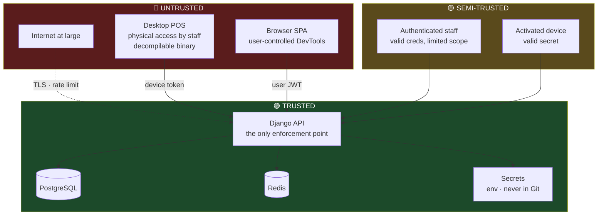

# 09 — Security Threat Model

Covers master prompt section **M**, plus §9, §30, §42.

> **Revised for C11.** The owner monitors the business remotely, so the API and Web Admin are
> internet-facing from Phase 1 rather than LAN-only. There is no soft internal network to fall back
> on: every request arrives from the public internet and is treated that way. The controls below
> reflect that, and the perimeter ones ship in Phases 1–3 instead of Phase 9.

---

## Trust Boundaries



**The Desktop application is untrusted.** It sits on a counter, staff have physical access, and the
binary can be decompiled. Everything it asserts — permissions, prices, totals, timestamps, its own
license validity — is a *claim*, re-verified server-side. Where the Desktop computes something (an
order total for display), the server recomputes it and the server's answer is authoritative.

---

## M. Threat Analysis

STRIDE, scoped to the threats that plausibly apply to a cafe POS. Severity is likelihood × impact
in this specific context, not in the abstract.

### Spoofing

| # | Threat | Sev | Control |
|---|---|:--:|---|
| S1 | Stolen staff password used from outside | **High** | Argon2id; 15-min access tokens; refresh rotation with reuse detection; **MFA mandatory for `SUPER_ADMIN` and `BRANCH_MANAGER` (C11)**; optional `security.admin_ip_allowlist`; new-device login alerts to the owner |
| S2 | Brute-forcing the 4-digit POS PIN | High | PIN only accepted from an activated device; 5 attempts → 15-min device lockout; per-device throttle; PINs never valid on the Web Admin |
| S3 | Copying the device credential to another machine | Med | Credential Manager (DPAPI, user-bound) — not a copyable file; fingerprint change flagged; concurrent use from two IPs alerts |
| S4 | Forging a license key | Low | 80-bit CSPRNG keyspace; HMAC + server-side pepper; rate-limited activation; constant-time compare |
| S5 | Forging an offline license token | Low | Ed25519; private key server-only; public key embedded in the client |
| S6 | Session hijack via a stolen JWT | Med | Short TTL; TLS-only; `device_id` bound into device tokens so a token lifted from one terminal fails from another |

### Tampering

| # | Threat | Sev | Control |
|---|---|:--:|---|
| T1 | Editing the local SQLite to fabricate sales | Med | Local DB is not authoritative. Pushed events are validated server-side: unknown products, impossible prices, and implausible timestamps are rejected and flagged |
| T2 | Patching the `.exe` to bypass the license check | Med | Accepted (see [06](06-licensing.md#what-this-system-actually-guarantees)). The patched client cannot sync, has no catalog, and produces nothing of value |
| T3 | Client sending a manipulated price or total | **High** | **Prices and totals are never accepted from the client.** The server computes from its own catalog. A client-supplied total is ignored, not validated |
| T4 | Modifying an order after payment | High | `PAID` is terminal in the state machine. Changes require a refund, producing two auditable records |
| T5 | Deleting incriminating audit records | High | AuditLog has no delete endpoint; the app DB role lacks `DELETE` on it; off-site backups |
| T6 | Clock rollback to extend offline grace | Med | Monotonic high-water mark + token sequence ratchet + server reconciliation flags |
| T7 | MITM on the cafe's network | Med | TLS 1.2+ only, HSTS, certificate validation with no bypass path in the Desktop |

**T3 is the one to internalize.** The single most common POS vulnerability is trusting a
client-submitted total. Our order payload contains `variant_id` and `quantity` — never a price and
never a total. There is no code path in which a client-supplied monetary value is written to the
database, which makes the entire class of price-manipulation attacks structurally impossible rather
than defended against.

### Repudiation

| # | Threat | Sev | Control |
|---|---|:--:|---|
| R1 | "I never voided that order" | High | AuditLog: actor, device, timestamp, IP, before/after. Order events are immutable and per-actor |
| R2 | Manager denies approving a discount | Med | Step-up approval records both identities; the token names the exact permission and target |
| R3 | Disputed cash variance | Med | Shift Z-report frozen at close; every cash movement individually attributed |

### Information Disclosure

| # | Threat | Sev | Control |
|---|---|:--:|---|
| I1 | Cross-tenant data leak | **High** | Scoped manager + serializer injection + DB constraints + a per-ViewSet cross-tenant test in CI |
| I2 | A cashier reading financial reports | Med | Permission matrix; server-side enforcement; the endpoint 403s regardless of what UI the client renders |
| I3 | Secrets in Git | High | `.env` gitignored; `.env.example` only; pre-commit secret scanning; CI scan |
| I4 | Secrets or PII in logs | Med | Structured logging with a redaction filter on `password`, `pin`, `token`, `secret`, `key`, `authorization` |
| I5 | Stack traces exposed to users | Med | `DEBUG=False` enforced in prod settings; generic `INTERNAL_ERROR` envelope; details to Sentry only |
| I6 | Database reachable from the internet | High | Postgres and Redis on an internal-only Docker network with no published ports |
| I7 | Enumerating valid license keys by response timing | Low | Constant-time compare; uniform latency and response on the miss path |

### Denial of Service

| # | Threat | Sev | Control |
|---|---|:--:|---|
| D0 | **Internet-wide scanning and automated attack traffic** | **High** | Unavoidable consequence of C11. Caddy rate limiting, fail2ban on repeated 4xx, no server banners, admin routes optionally IP-restricted, Cloudflare available as a front if volume warrants |
| D1 | Credential-stuffing the login endpoint | **High** | 5/min/IP + 20/hr/account; progressive lockout; MFA on the accounts worth stuffing |
| D2 | Sync push flood from a compromised device | Med | Per-device throttle; batch size cap (500); the device can be revoked instantly |
| D3 | Expensive report queries | Med | Reports read materialized rollups; anything long-running goes async via Celery; statement timeout on the DB role |
| D4 | Storage exhaustion from event/audit growth | Low | Retention policies; `change_log` pruning; disk-usage alerting |
| D5 | **The cafe cannot sell because the server is down** | **High** | This is the real-world DoS that matters. Answer: offline mode. See [07](07-sync.md) |

D5 is worth naming as a security concern rather than only a reliability one. For this business, the
loss from an hour of not being able to take orders is concrete and immediate, and it dwarfs most of
the confidentiality risks above. The offline architecture is the mitigation.

### Elevation of Privilege

| # | Threat | Sev | Control |
|---|---|:--:|---|
| E1 | Cashier granting themselves permissions | High | `staff.manage_roles` requires step-up; role changes are audited; a user cannot modify their own assignments |
| E2 | Forged step-up approval token | Med | Server-signed, 60s TTL, single-use, bound to permission + target, burned on redemption |
| E3 | IDOR — reaching another branch's object by id | High | UUIDs are unguessable; every queryset is tenant-scoped; the CI cross-tenant test covers every ViewSet |
| E4 | Mass assignment via unexpected fields | Med | Explicit serializer `fields`; `branch`, `organization`, and all price fields are read-only and server-injected |
| E5 | Dependency supply chain | Med | Pinned lockfiles; `pip-audit` and `npm audit` in CI; base images pinned by digest |

---

## Controls by Layer

### Transport
TLS 1.2+ (prefer 1.3), automatic certificates via Caddy, HSTS with a 1-year max-age, and no
certificate-validation bypass in the Desktop — not even behind a debug flag, because debug flags
ship.

### Authentication
Argon2id passwords (`time_cost=3, memory_cost=64MB, parallelism=4`). JWT: 15-min access for web,
60-min for devices, 7/30-day rotating refresh with reuse detection. PIN: Argon2id, device-only,
rate-limited, lockout after 5.

**MFA (TOTP) is mandatory** for the roles listed in `security.require_mfa_for_roles` — defaulting
to `SUPER_ADMIN` and `BRANCH_MANAGER`. This is not optional under C11: an account that can change
prices, void sales, and manage licences is now reachable by anyone on the internet who knows the
domain, and a password alone is not an adequate control for that.

Every timing and threshold here is a setting ([11](11-configuration.md#security--scope-organization)),
so the posture can be tightened per deployment without a release.

### Authorization
The layered chain from [05](05-permissions.md#enforcement-points). Two properties do the heavy
lifting: a ViewSet without a declared permission **raises** rather than defaulting either way, and
a CI test enumerates every route to prove none slipped through.

### Rate limiting

| Endpoint class | Limit |
|---|---|
| `/auth/login/` | 5/min/IP, 20/hr/account |
| `/auth/pos-login/` | 5/min/device |
| `/licensing/activate/` | 5/hr/IP |
| `/sync/push/` | 60/min/device, ≤500 ops per batch |
| Reports | 10/min/user |
| Everything else | 300/min/user |
| Unauthenticated 4xx from one IP | 20 in 5 min → fail2ban block (C11) |

### Data protection
Postgres encrypted at rest at the volume level. Backups encrypted with `age` before leaving the
host. Card data is **never stored, transmitted, or logged** — payments are taken on a separate
terminal and we record only a method and a reference string. This keeps the system entirely out of
PCI-DSS scope, which is a deliberate architectural choice rather than an accident.

### Secrets

```env
DJANGO_SECRET_KEY=          # rotate → invalidates sessions
DATABASE_URL=
REDIS_URL=
JWT_SIGNING_KEY=            # rotate → invalidates all tokens
LICENSE_PEPPER=             # NEVER rotate — would orphan every license key
LICENSE_SIGNING_KEY=        # Ed25519 private; rotation needs a client update
SENTRY_DSN=
BACKUP_ENCRYPTION_KEY=
```

`LICENSE_PEPPER` is called out because rotating it makes every issued key unverifiable, with no
recovery path — the plaintext keys are not stored. It is backed up separately from the database,
because a backup containing both the pepper and the hashes has undone the point of having a pepper.

### Logging (§42)

```jsonc
{ "ts":"2026-08-06T14:32:11.234Z", "level":"INFO", "service":"api",
  "request_id":"01JC…", "user_id":"0193…", "device_id":"0193…",
  "branch_id":"0193…", "action":"orders.void", "entity":"order:1024",
  "ip":"41.x.x.x", "duration_ms":47, "msg":"Order voided" }
```

Never logged: passwords, PINs, tokens, license keys, device secrets, `Authorization` headers.
Enforced by a logging filter plus a CI test that runs a request with known secret values and
asserts none appear in captured output — a policy that is only tested by humans reading code is a
policy that will eventually be violated.

---

## Audited Actions

| Domain | Actions |
|---|---|
| Orders | void item / void order / discount / refund / price override / reopen attempt |
| Payments | payment taken, refund issued, method changed |
| Catalog | price change, product deactivated, recipe changed |
| Inventory | adjustment, waste, count posted, movement reversed |
| Purchasing | PO approved, goods received, supplier payment |
| Shifts | opened, closed, variance recorded, cash movement |
| Staff | user created, role changed, PIN reset, deactivated |
| Licensing | created, activated, suspended, revoked, renewed, device reset |
| System | settings changed, backup triggered, restore performed |
| Auth | login failure (>3), lockout, refresh reuse detected |

Each entry carries actor, device, IP, timestamp, and a before/after JSON diff. Retention: 7 years
for financial actions (Egyptian commercial record-keeping norms), 1 year for the rest.

---

## Backup & Recovery

| Property | Target |
|---|---|
| Frequency | Nightly full `pg_dump` + continuous WAL archiving |
| Retention | 30 daily, 12 monthly |
| Encryption | `age`, applied before leaving the host |
| Off-site | Encrypted push to object storage |
| **RPO** | ≤ 15 min (WAL) |
| **RTO** | ≤ 2 hours |
| Verification | Automated weekly restore into a scratch container + integrity checks |
| Drill | Manual full restore, quarterly, documented and timed |

**Restore is not exposed over HTTP.** It is an operator procedure with a written runbook. A
web-reachable restore button is a single request away from destroying the business, and the
convenience is not worth it.

The weekly automated restore matters more than the backup schedule. An untested backup is a
hypothesis, and the moment you discover it was wrong is the worst possible moment.

---

## Accepted Risks

Stated explicitly, because an unstated accepted risk is indistinguishable from an oversight.

| # | Risk | Why accepted | Compensating control |
|---|---|---|---|
| **AR1** | The Desktop binary can be patched to skip local license checks | Unavoidable for any offline-capable client; obfuscation buys hours and costs weeks | Server holds all value: catalog, sync, reports, numbering |
| **AR2** | Suspend/revoke is not instant for an offline device | Direct consequence of offline capability | Bounded by the grace window (default 72h), configurable per license |
| **AR3** | Staff with physical access can read the local SQLite | It contains today's orders — the same data as the receipts in the drawer | No credentials or card data stored locally; SQLCipher available if a customer requires it |
| **AR4** | A 4-digit PIN is weak in isolation | Speed at the counter is a genuine business requirement | Device-bound, rate-limited, locks out, useless without an activated device |
| **AR5** | Single VPS is a single point of failure | Cost-appropriate for one branch | Offline mode keeps the cafe selling; documented restore; the upgrade path is in [10](10-future.md) |
| **AR6** | No auto-update in v1 | A half-failed silent update leaves a dead till | Version reporting, forced-minimum enforcement, manual installer after close |

---

## Pre-Launch Security Checklist

- [ ] `DEBUG=False`, `ALLOWED_HOSTS` restricted
- [ ] All secrets from env, none in Git, history scanned
- [ ] TLS enforced; HSTS on; security headers verified
- [ ] Postgres and Redis unreachable from outside the Docker network
- [ ] Rate limits verified by test, not by reading config
- [ ] Cross-tenant test green across every ViewSet
- [ ] Every route declares a permission
- [ ] No `FloatField` anywhere in `apps/`
- [ ] Secret-redaction log test green
- [ ] Backup restore drill completed and timed on a clean host
- [ ] Dependency audit clean
- [ ] Default and seed credentials removed from any production path
- [ ] Django admin disabled in production or IP-restricted
- [ ] Sentry receiving events; alerting verified end to end
- [ ] MFA enforced on every account holding an admin role (C11)
- [ ] fail2ban active and verified against a simulated scan
- [ ] External port scan of the host shows only 80/443 open

---

**Next:** [10 — Future Extensions](10-future.md)
