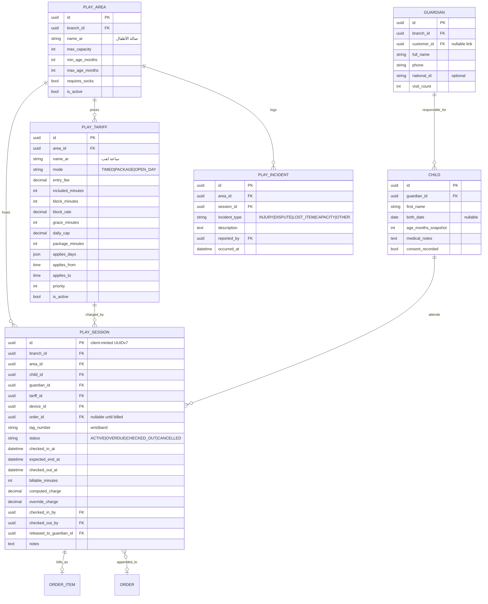
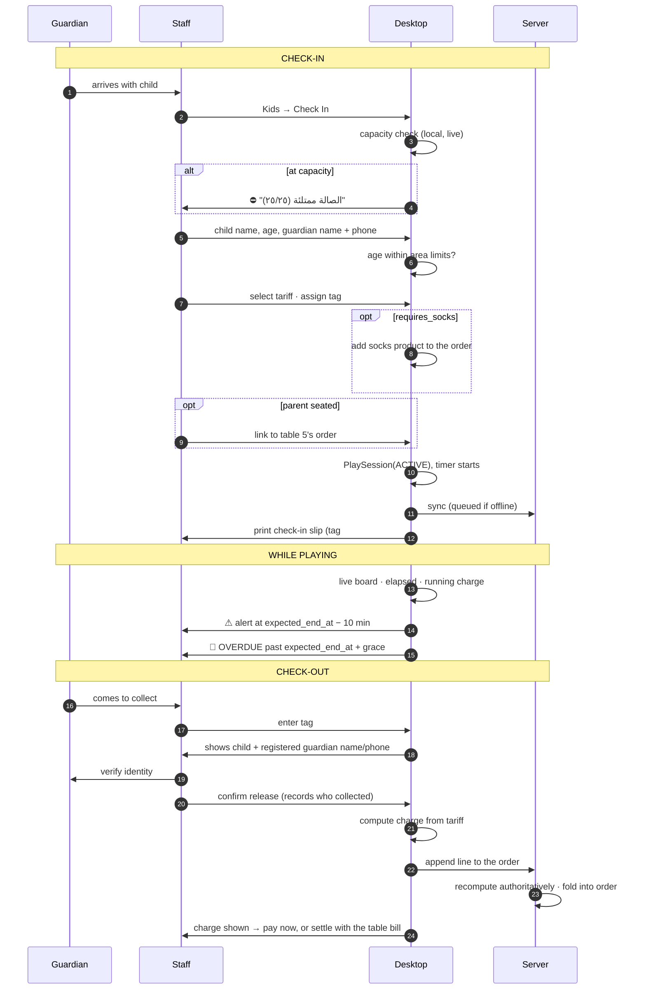

# 12 — Kids Area & Time-Based Billing

> Added after review: the cafe operates a children's play area (صالة الأطفال).

This is not "one more table area". It introduces a **second billing model** to a system that
otherwise assumes `product × quantity = line total`, plus a set of **child-safety obligations** that
have no equivalent anywhere else in the product. Both are addressed here.

---

## Why This Needs Its Own Domain

| Cafe order | Play session |
|---|---|
| Price known when the item is added | Price unknown until the child leaves |
| Quantity is discrete | Duration is continuous and still running |
| No capacity limit beyond seating | Hard capacity limit, legally and physically |
| Anyone can collect their own order | **Only the registered guardian may collect the child** |
| Voiding a line is a financial event | Losing track of a child is not a financial event |

Modelling a play session as an `ORDER_ITEM` with a quantity that keeps changing would fight both
the order state machine and the event model. Instead: a **`PlaySession` is a running meter** that
converts into exactly one order line at checkout. Until then it is not a sale at all.

---

## Data Model



### Notes on the shape

**`GUARDIAN` is separate from `CUSTOMER`.** They overlap but are not the same: a customer buys
coffee; a guardian carries legal responsibility for collecting a specific child. Linking them is
optional (`customer_id`) so a regular gets their loyalty and their kids' history joined up, but the
guardian record exists even for a walk-in who never buys anything.

**`age_months_snapshot`** is stored alongside the nullable `birth_date` because parents frequently
decline to give a birth date but will say "سنتين ونص". The age check must still work, and next
year's session must not silently reuse a stale age.

**`released_to_guardian_id`** records *who actually collected the child*, which may legitimately
differ from the registering guardian (the father drops off, the mother collects). Storing it makes
the handover an auditable fact rather than a memory.

**`override_charge`** is nullable and separate from `computed_charge`. The computed figure is never
overwritten — an override sits beside it, requires a permission and a reason, and both values reach
the report. This is the same principle as `ORDER_ITEM` snapshots: never destroy what the system
calculated in order to record what a human decided.

---

## Tariff Engine

Three modes, all admin-configurable, all evaluated server-side.

### `TIMED` — pay for what you use

```
entry_fee                    covers `included_minutes`
then every `block_minutes`   costs `block_rate`
`grace_minutes`              free overrun before the next block starts
`daily_cap`                  maximum total for one session
```

Worked example — entry 25 EGP covering 30 min, then 15 EGP per 15-min block, 5 min grace, cap 120:

| Duration | Charge | Why |
|---|---|---|
| 22 min | 25 | Within the included period |
| 34 min | 25 | 4 min over — inside the 5-min grace |
| 38 min | 40 | Grace exceeded → one block |
| 52 min | 55 | Two blocks |
| 4 hours | 120 | Capped |

The grace period exists to prevent the fight that otherwise happens at the counter every single
day: a parent who is two minutes late being charged for a full block. It costs almost nothing and
removes a recurring source of disputes.

### `PACKAGE` — flat rate for a fixed duration

`package_minutes` for a flat `entry_fee`. Overrun past `grace_minutes` falls back to
`block_minutes` × `block_rate`. This is the common Egyptian model: "ساعة ٥٠ جنيه، ساعتين ٨٠".

### `OPEN_DAY` — unlimited until closing

Flat fee, no duration limit. `daily_cap` is irrelevant; `expected_end_at` is set to the branch's
closing time.

### Selection

Tariffs carry `applies_days`, `applies_from`/`applies_to`, and `priority`. The engine picks the
highest-priority active tariff matching the check-in moment, and the staff member can override the
selection at check-in (weekend pricing, peak hours, a promotional rate). What was selected is
recorded on the session, so a later tariff change never re-prices a past visit.

### Where the calculation runs

The same rule as everywhere else in this system: **the server computes, the client displays.**

The Desktop caches tariffs and runs the identical algorithm so it can show a live running charge
and complete a checkout offline. On sync the server recomputes from `checked_in_at` /
`checked_out_at` and its own tariff record — and the server's figure is authoritative. Both
implementations are validated against a **shared golden-file fixture**, exactly like the order
money rules in [02](02-data-model.md#money-and-quantity-precision). Edge cases in that fixture:
crossing midnight, crossing a tariff's time window, a session open when the tariff was edited, a
zero-minute session, and one that exceeds the cap.

---

## Check-In / Check-Out Flow



**Step 22 — guardian verification — is not a formality.** It is the one step in this entire system
whose failure is not a financial loss. The screen shows the registered guardian's name and phone,
the staff member confirms, and `released_to_guardian_id` is written. When
`kids.require_guardian_verification` is on (the default), checkout cannot proceed without it, and
releasing to someone other than the registering guardian requires a supervisor's PIN.

**Capacity is enforced at check-in, locally and immediately.** The Desktop knows the live count from
its own sessions and refuses to exceed `max_capacity` even when offline. This is a safety limit, not
a revenue optimization, so it fails closed.

---

## Billing Integration

A play session becomes an order line at checkout, never before. Two routes, chosen by the staff:

| Route | When | Result |
|---|---|---|
| **Append to the parent's table order** *(default)* | Parent is seated in the cafe | One bill at the end — play time appears as a line beside the coffee |
| **Standalone order** | Parent only came for the play area | Its own order, `order_type = DINE_IN`, area = kids |

The resulting `ORDER_ITEM` uses the same snapshot discipline as everything else:

```
اسم الصنف     صالة الأطفال — ساعة لعب
التفاصيل      ١٤:٣٢ → ١٥:٤٨ · ٧٦ دقيقة · تاج #١٤
الكمية        1
السعر         ٥٥.٠٠
```

The line carries `name_snapshot`, the tariff name, and the in/out times, so a reprinted receipt six
months later still explains the charge without joining to a tariff that may since have changed.

Because it lands as an ordinary order line, everything downstream works unmodified: VAT, service
charge, discounts, split payment, refunds, shift reconciliation, and the sales reports. **No
special-casing in the financial core** — which is the whole reason for converting at checkout
rather than inventing a parallel billing path.

Sessions still open at shift close are listed on the Z-report as outstanding liability, with their
running charge. A shift cannot silently close over a child still in the play area.

---

## Screens

### Live Board — the main kids-area screen

```text
┌──────────────────────────────────────────────────────────────────────┐
│ 🧸 صالة الأطفال          السعة ١٨/٢٥        [ + دخول جديد ]  ١٥:٤٨ │
├──────────────────────────────────────────────────────────────────────┤
│ 🔴 #١٤  يوسف · ٥ س     دخول ١٤:٣٢  ⏱ ١:١٦   ٥٥ ج   [ خروج ]      │
│    ولي الأمر: أحمد محمود · ٠١٠٠١٢٣٤٥٦٧      ⚠ تجاوز الوقت         │
├──────────────────────────────────────────────────────────────────────┤
│ 🟡 #١٥  ملك · ٣ س      دخول ١٥:٠٥  ⏱ ٠:٤٣   ٢٥ ج   [ خروج ]      │
│    باقة: ساعة لعب · تنتهي ١٦:٠٥            ⏰ باقي ١٧ د            │
├──────────────────────────────────────────────────────────────────────┤
│ 🟢 #١٦  عمر · ٦ س      دخول ١٥:٣٠  ⏱ ٠:١٨   ٢٥ ج   [ خروج ]      │
│    مرتبط بطاولة ٥                                                    │
└──────────────────────────────────────────────────────────────────────┘
```

Colour follows time state (within / nearing end / overdue), and never carries meaning alone — the
warning text and the countdown say the same thing, for the same reasons as the kitchen display.

### Check-In

Deliberately short. A parent with a restless child will not tolerate a long form.

```text
اسم الطفل      [ يوسف            ]   السن [ ٥ ] سنوات
ولي الأمر      [ أحمد محمود      ]   الهاتف [ ٠١٠٠١٢٣٤٥٦٧ ]
               ⓘ رقم سابق؟ [ بحث ] — يملأ البيانات تلقائياً
التعريفة       [ ساعة لعب — ٥٠ ج  ▾ ]
رقم التاج      [ ١٤ ]      🧦 شراب أطفال [ ☑ ]
ربط بطاولة     [ طاولة ٥   ▾ ] (اختياري)
                        [ بدء الجلسة ]
```

A returning guardian is found by phone in one tap, which turns the second visit into three fields.

### Check-Out

```text
تاج #١٤ — يوسف · ٥ سنوات
ولي الأمر المسجّل:  أحمد محمود · ٠١٠٠١٢٣٤٥٦٧
                    ⚠ تأكد من هوية المستلم قبل التسليم
[ ☑ تم التسليم لولي الأمر المسجّل ]
[ ☐ تم التسليم لشخص آخر — يتطلب موافقة مشرف ]

١٤:٣٢ → ١٥:٤٨ · ٧٦ دقيقة · ساعة لعب + ١٦ د إضافية
المستحق: ٥٥.٠٠ ج
        [ إضافة لطاولة ٥ ]   [ دفع الآن ]
```

### Web Admin

`/kids/sessions` (history + filters) · `/kids/areas` (capacity, age limits, rules) ·
`/kids/tariffs` (the pricing builder with a live worked example) · `/kids/guardians` ·
`/kids/incidents` · `/reports/kids` (revenue, occupancy by hour, average duration, peak days,
revenue per child-hour).

The occupancy-by-hour report is the operationally useful one — it tells the owner when to staff the
area and whether weekend peak pricing is justified.

---

## Permissions

New codes, added to the matrix in [05](05-permissions.md):

| Permission | Kids Staff | Cashier | Branch Manager | Waiter |
|---|:--:|:--:|:--:|:--:|
| `kids.view` | ✅ | ✅ | ✅ | ⚠️ read-only |
| `kids.checkin` | ✅ | ✅ | ✅ | — |
| `kids.checkout` | ✅ | ✅ | ✅ | — |
| `kids.release_to_other` | 🔓 | 🔓 | ✅ | — |
| `kids.override_charge` | — | 🔓 | ✅ | — |
| `kids.extend_session` | ✅ | ✅ | ✅ | — |
| `kids.manage_tariffs` | — | — | ✅ | — |
| `kids.manage_areas` | — | — | ✅ | — |
| `kids.log_incident` | ✅ | ✅ | ✅ | — |
| `kids.view_reports` | — | — | ✅ | — |

**Kids Staff** joins the system roles as an eighth. It is deliberately narrow: the play area, the
incident log, and nothing else — no prices, no stock, no other areas' orders.

---

## Settings

Added to the catalog in [11](11-configuration.md). All admin-editable, per **C10**.

| Key | Default | Notes |
|---|---|---|
| `kids.enabled` | `true` | Turns the whole module off |
| `kids.max_capacity` | `25` | Per area; hard limit |
| `kids.min_age_months` | `12` | |
| `kids.max_age_months` | `144` | 12 years |
| `kids.enforce_age_limits` | `warn` | `off` / `warn` / `block` |
| `kids.require_socks` | `true` | Auto-adds the socks product |
| `kids.socks_product` | — | Which product |
| `kids.require_guardian_phone` | `true` | |
| `kids.require_guardian_verification` | `true` | Blocks checkout without it |
| `kids.release_to_other_requires_approval` | `true` | Supervisor PIN |
| `kids.capture_child_photo` | `false` | **Off by default** — see below |
| `kids.default_tariff` | — | Pre-selected at check-in |
| `kids.grace_minutes` | `5` | Default, per-tariff override |
| `kids.rounding` | `up_to_block` | `up_to_block` / `nearest_block` / `exact_minutes` |
| `kids.warn_before_end_minutes` | `10` | Live-board alert |
| `kids.overdue_alert_minutes` | `5` | After expected end |
| `kids.max_session_hours` | `6` | Alert, never an auto-checkout |
| `kids.auto_link_to_table` | `true` | Suggest the parent's open table |
| `kids.print_checkin_slip` | `true` | |
| `kids.tag_numbers` | `1–30` | Wristband range |
| `kids.allow_charge_override` | `true` | Gated by permission |

Three defaults chosen deliberately rather than for convenience:

- **`capture_child_photo` is off.** Photographs of children are sensitive personal data, and a
  small cafe has no infrastructure to protect them and no clear need for them. The tag number and
  the guardian's phone identify the child adequately. The setting exists because some venues
  require it; the default reflects that the safer choice is not collecting it.
- **`max_session_hours` alerts but never auto-checks-out.** An automatic checkout would mark a
  child as collected when nobody collected them. A long session is a prompt for a staff member to
  go and look, not something for the software to resolve on its own.
- **`enforce_age_limits` defaults to `warn`, not `block`.** Staff can see the child; the software
  is working from a number a parent said out loud. Blocking on it would be overriding the person
  who can actually see the situation.

---

## Offline Behaviour

Per [07](07-sync.md), the play area must keep working during an outage — arguably more than the
cafe does, because a child is physically present.

| Operation | Offline | Notes |
|---|---|---|
| Check in | ✅ | Local; capacity counted from local sessions |
| Live board & running charge | ✅ | Cached tariffs |
| Check out & compute charge | ✅ | Recomputed and confirmed on sync |
| Guardian lookup by phone | ⚠️ | Only guardians already in the local mirror; otherwise register fresh |
| Append to a table order | ✅ | If the table order is on this device |
| Log an incident | ✅ | Queued |
| Tariff changes | ❌ | Server-authoritative, like all pricing |

Sessions sync as events, following C1: `PLAY_CHECKED_IN`, `PLAY_TARIFF_CHANGED`,
`PLAY_EXTENDED`, `PLAY_CHECKED_OUT`, `PLAY_CHARGE_OVERRIDDEN`. Two devices cannot conflict over one
session because a session belongs to the device that opened it, and the tag number makes that
visible to staff.

---

## Roadmap Placement — Phase 6B

Inserted between Phase 6 (Kitchen) and Phase 7 (Offline), so the offline engine covers play
sessions in the same pass rather than needing a second one.

Deliverables: models · tariff engine + golden fixture · check-in/out services with capacity and age
enforcement · order-line conversion · Desktop kids screens · Web tariff builder, session history,
incidents · kids reports · the settings above · the Kids Staff role.

Exit criteria:
- Desktop and server tariff calculations agree across the full golden fixture, including the
  midnight and tariff-window edge cases
- Capacity cannot be exceeded, online or offline
- Checkout is impossible without guardian verification when required
- A session charge appears correctly on a table's combined bill, with VAT and service applied
- An open session at shift close appears on the Z-report as outstanding
- Overriding a charge preserves `computed_charge` and writes an audit entry

---

**Back to:** [Index](README.md)
